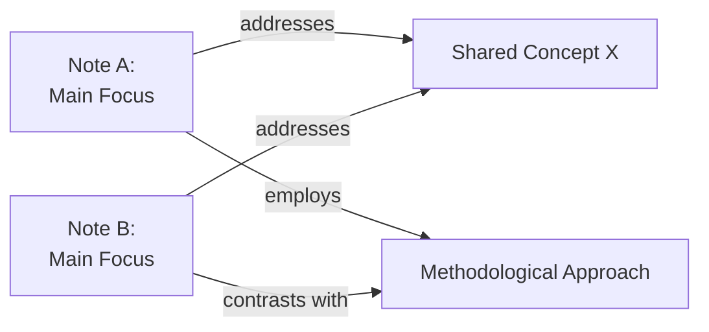

## Purpose

This skill analyzes two related notes or a note and its linked references to uncover deeper relationships. It identifies shared concepts, contradictions, non-obvious connections, and recommends specific wikilinks to strengthen the vault's knowledge graph. Output is a structured analysis ready to integrate into the vault.

## Instructions

### 1. Gather Input Notes

Request the user provide:
- Primary note name or path (the focus note)
- Secondary note name or path (the comparison note), OR a list of linked notes to analyze
- Any specific aspect to emphasize (e.g., methodological, theoretical, practical)

Read both notes fully. Document:
- Primary themes and key concepts in each
- Explicit claims, definitions, and arguments
- Examples, evidence, or cited resources
- Existing wikilinks (internal connections already made)

### 2. Identify Shared Concepts

Compare the notes and list **shared conceptual terrain**:
- Overlapping terminology or frameworks
- Related but differently-named concepts
- Common underlying principles or assumptions
- Shared references or papers cited

Create a table or bullet list showing how each note addresses the shared concept differently.

### 3. Detect Contradictions or Tensions

Scan for potential disagreements:
- Do the notes reach conflicting conclusions on the same topic?
- Do they prioritize different aspects (e.g., theory vs. practice)?
- Are there unstated assumptions in each note that contradict the other?

For each tension found:
- State it clearly and objectively
- Explain the reasoning behind each position
- Assess whether this is a true contradiction or a complementary perspective
- Suggest how both views might be reconciled or nuanced

### 4. Discover Non-Obvious Connections

Look beyond surface-level similarity:
- Does one note provide background context that explains a gap in the other?
- Can concepts from Note A apply as a solution or example in Note B?
- Do the two notes address the same problem from different angles?
- Are there methodological or structural parallels?

Articulate each hidden connection in a short sentence with clear reasoning.

### 5. Suggest Specific Wikilinks

For each connection found, recommend:
- A wikilink to add to the primary note (format: `[[note-name|anchor-text]]`)
- A reciprocal wikilink to add to the secondary note
- Optional: A suggested context phrase where the link should appear

Prioritize links that would:
- Help future readers jump between related ideas
- Fill gaps in the vault's knowledge graph
- Make tacit connections explicit

### 6. Optional: Produce a Mermaid Diagram

If the relationship is complex or multi-faceted, create a Mermaid diagram showing:
- The two main notes as nodes
- Shared concepts as intermediate nodes
- Arrows labeled with the type of relationship (contradicts, extends, applies-to, provides-context-for, etc.)

Use a graph or flowchart format. Keep labels concise.

## Output Format

Structure the analysis as follows:

```
## Connection Analysis: [Note A] ↔ [Note B]

### Shared Conceptual Ground
- [Concept 1]: In [Note A] it means X. In [Note B] it means Y.
- [Concept 2]: Both notes address this, but with different emphasis.

### Tensions or Contradictions
**[Tension Name]**:
- Position from Note A: [summary]
- Position from Note B: [summary]
- Assessment: [reconciliation or nuance]

### Non-Obvious Connections
- **[Connection title]**: [One-sentence explanation with reasoning]

### Recommended Wikilinks

**To add to [Note A]:**
- Add `[[Note B|specific anchor]]` to the [section name] section
- Add `[[Third Note|concept X]]` to connect methodological approach

**To add to [Note B]:**
- Add `[[Note A|specific aspect]]` near the discussion of [topic]

### Relationship Diagram



```

## Style Notes

- Write in third-person, academic tone
- Bold **key concepts** when first introduced in the analysis
- Use `[[wikilinks]]` when referring to vault notes
- Keep explanations concise but complete
- If tensions exist, frame them as productive tensions that enrich understanding
- Avoid jargon; explain specialized terminology

## Common Patterns to Detect

- **Hierarchical**: One note covers theory, another applies it
- **Complementary**: Notes address different facets of the same problem
- **Evolutionary**: One note extends or updates insights from another
- **Contradictory**: Notes reach opposing conclusions; worth investigating why
- **Methodological**: Different approaches to the same question (e.g., theoretical vs. empirical)
- **Domain Transfer**: A pattern from one field applies unexpectedly to another

## Edge Cases

- If notes are loosely related, acknowledge this and explain why connection is still valuable
- If no significant connections exist, state this clearly and explain why the notes are distinct
- If the user specifies two notes that should already be linked but aren't, flag this as a vault maintenance opportunity

---

#### Tags
connect_ideas, vault_maintenance, knowledge_graph, cross_reference, analysis_tool
