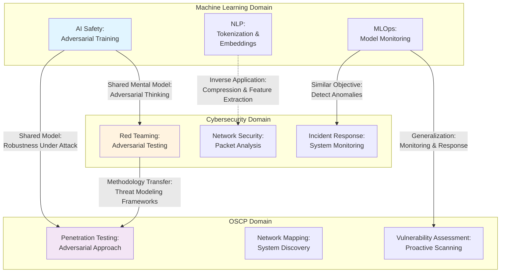

## Purpose

This skill identifies shared patterns, mental models, techniques, and principles that appear across seemingly unrelated domains in the vault (e.g., Cybersecurity ↔ ML Safety, NLP ↔ Computer Vision, MLOps ↔ OSCP). By recognizing these hidden similarities, it exposes opportunities to transfer knowledge between fields, enrich the vault's interconnectedness, and suggest new synthetic notes that bridge domains. Output includes specific wikilink recommendations and a Mermaid diagram of cross-domain connections.

## Instructions

### 1. Define the Scope and Domains

Request the user provide:
- A specific note or concept to analyze for cross-domain applications, OR
- Two or more domains to compare (e.g., "AI Safety and Cybersecurity")
- Desired depth: "surface-level patterns" vs. "deep structural similarities"
- Any constraints (e.g., "focus on practical applications" vs. "include theoretical frameworks")

If a single note is provided, identify its primary domain, then scan the vault for notes in other domains that might share underlying patterns.

If domains are provided, scan broadly within each domain's folder structure.

### 2. Scan for Shared Patterns

Look for:

**Methodological Parallels**:
- Do different domains use similar problem-solving approaches? (e.g., adversarial thinking in both red-teaming and penetration testing)
- Do they employ comparable frameworks or taxonomies? (e.g., threat modeling in both cybersecurity and AI safety)
- Are there shared data structures, algorithms, or architectural patterns? (e.g., graph-based representations in both knowledge graphs and network security)

**Conceptual Overlaps**:
- Do domains use different terminology for the same underlying idea? (e.g., "prompt injection" in LLMs ≈ "code injection" in cybersecurity)
- Are there shared risk categories? (e.g., supply chain attacks in both software security and ML)
- Do domains address similar trade-offs? (e.g., interpretability vs. performance in ML mirrors transparency vs. security in systems)

**Technique Transfer Opportunities**:
- Could a technique from Domain A solve a problem in Domain B?
  - Example: Adversarial training from ML might strengthen red team assessments in cybersecurity
  - Example: OWASP threat modeling from cybersecurity could be adapted to AI safety scenarios
- Are there tools, metrics, or evaluation frameworks that generalize? (e.g., ROC curves in ML and detection systems in cybersecurity)

**Mental Model Abstractions**:
- What abstract problem structure appears in both domains?
  - Example: Resource allocation under constraints (MLOps > Agentic Systems meets Cybersecurity > Incident Response)
  - Example: Detecting anomalies (Computer Vision > Segmentation meets Cybersecurity > Intrusion Detection)
- What principles or heuristics generalize? (e.g., "defense in depth" in cybersecurity applies to model robustness in AI Safety)

### 3. Document Specific Parallels

For each cross-domain connection discovered, create an entry with:

**Pattern Name**: A clear, memorable name for the shared concept or approach
- Example: "Adversarial Thinking" or "Supply Chain Risk" or "Defense in Depth"

**Domain A Expression**: How this pattern manifests in the first domain
- Cite specific vault notes, techniques, or literature
- Use format: `[[note-name]]` for internal references

**Domain B Expression**: How the same pattern manifests in the second domain
- Provide equal detail; avoid making one domain's version seem more "primary"

**Similarity Assessment**: Why are these genuinely parallel?
- List 3-4 structural or functional similarities
- Acknowledge any differences that complicate the analogy

**Transfer Potential**: Could practitioners move knowledge from one domain to the other?
- What would need to adapt (terminology, tools, constraints)?
- What would transfer directly?
- Are there documented examples of this transfer already? (Cite them.)

### 4. Identify Non-Obvious Connections

Move beyond direct analogies. Look for:

**Inverse Applications**: Domain A solves problem X; could the solution strategy apply to problem -X (the opposite) in Domain B?
- Example: Data augmentation in ML (creating synthetic training data) has an inverse in cybersecurity (creating deceptive decoy systems)

**Complementary Approaches**: Do domains use different strategies for the same underlying goal, and could combining them be fruitful?
- Example: NLP uses tokenization and embeddings for text; Computer Vision uses convolutional filters and pooling for images—both are form-preserving compressions with different structures

**Meta-Level Patterns**: What are the domains doing at a higher level of abstraction?
- Example: Both [[LLM-security]] and [[network-security]] are trying to distinguish authorized from unauthorized behavior; the mechanisms differ but the meta-problem is shared

### 5. Create a Mermaid Diagram

Visualize the cross-domain landscape:



Use:
- **Solid arrows** for direct parallels
- **Dashed arrows** for indirect or inverse relationships
- **Color-coding** to distinguish domains
- **Brief labels** on arrows describing the relationship type

### 6. Suggest Bridge Notes

For significant cross-domain connections, propose new synthetic notes:

**Bridge Note Proposal**:
- **Title**: A name capturing the shared pattern (e.g., "Adversarial Thinking: AI and Cybersecurity")
- **Purpose**: Why synthesize this? What reader need does it serve?
- **Structure**:
  - Brief introduction to the shared abstract pattern
  - Section A: How Domain X addresses this
  - Section B: How Domain Y addresses this
  - Section C: Mutual lessons and transfer opportunities
  - References and wikilinks to domain-specific notes
- **Suggested File Location**: Determine appropriate folder (e.g., a new "Cross-Domain" folder or under the more theoretical domain)

Example proposal:
```
**Bridge Note: "Adversarial Thinking in AI Safety and Penetration Testing"**
- Location: Machine Learning/AI Safety/ or a new shared folder
- Would synthesize: [[Adversarial Training]], [[Red Teaming]], [[OSCP-Penetration Testing]]
- Value: Readers in one domain see how the adversarial mindset applies elsewhere
```

### 7. Recommend Wikilinks to Add

Provide specific wikilink suggestions:

**Bidirectional Links**:
- In `[[AI Safety]]` notes, add: "The adversarial thinking methodology parallels approaches in [[penetration-testing-mindset]]."
- In `[[Penetration Testing]]` notes, add: "Similar threat modeling appears in [[AI-safety-robustness]]."

**Hub Notes** (if they exist):
- If a note on a shared pattern already exists (e.g., "Threat Modeling"), suggest adding a "Cross-Domain Applications" section with wikilinks

**Hierarchical Linking**:
- If a bridge note is created, link it from both domain-specific hub notes

## Output Format

Present the analysis as:

```
## Cross-Domain Analysis: [Primary Domain/Concept] Across the Vault

### Executive Summary
This analysis identifies [N] significant patterns shared across [domain list]. These connections reveal opportunities for knowledge transfer and suggest [X] new bridge notes to enrich the vault.

---

### Pattern 1: [Pattern Name]

**Domain A Expression** (`[[domain-a-note]]`):
[Description of how this pattern appears in Domain A. Include specific techniques, frameworks, or examples.]

**Domain B Expression** (`[[domain-b-note]]`):
[Description of how this pattern appears in Domain B. Maintain equal detail and rigor as Domain A section.]

**Why They're Parallel**:
- [Similarity 1]
- [Similarity 2]
- [Similarity 3]

**Transfer Potential**: [High / Medium / Low]
- Practitioners could apply [technique/principle from A] to [problem in B] by adapting [specific aspect]
- Example: [[documented-transfer-or-analogy]]
- Caution: [Any differences that complicate transfer]

---

### Pattern 2: [Pattern Name]

[Same structure]

---

### Cross-Domain Diagram

```mermaid
[Mermaid visualization]
```

---

### Proposed Bridge Notes

**Note 1: [Title]**
- **Purpose**: Synthesizes approaches to [abstract pattern] across [[Domain A]] and [[Domain B]]
- **Structure**: [Brief outline of sections]
- **Suggested Location**: [Folder path]
- **Recommended Wikilinks**: Link from [[hub-note-A]] and [[hub-note-B]]

---

### Wikilink Additions

**To add to [[existing-note-A]]**:
- Near discussion of [topic]: "See also [[domain-b-parallel]] for similar approaches in [[Domain B]]."

**To add to [[existing-note-B]]**:
- Near discussion of [topic]: "The principle of [[cross-domain-concept]] also appears in [[Domain A]] contexts via [[domain-a-note]]."

---

## Scanning Strategy

**Broad Vault Scan**:
1. List all major topic folders: Machine Learning, Cybersecurity, Papers, Miscellaneous
2. Identify sub-domains: AI Safety, NLP, Agentic AI; Network Security, OSCP, etc.
3. Sample 3-5 notes from each sub-domain (focusing on foundational or frequently-linked notes)
4. Note their core patterns, methodologies, and terminology
5. Compare patterns across sub-domains

**Focused Scan** (if user specifies a note):
1. Read the specified note thoroughly
2. Extract its core pattern or methodology
3. Search the vault (mentally or via grep) for analogous patterns
4. Find notes that might express the same pattern in different terminology or domain

## Pattern Detection Questions

When examining each domain, ask:

1. **What problems are they solving?** (Abstract level)
2. **What methodologies do they use?** (Approaches and frameworks)
3. **What are their core risk categories or failure modes?**
4. **What metrics or evaluation criteria matter most?**
5. **Are there shared mental models or heuristics?** (e.g., "defense in depth," "assume breach," "zero trust")
6. **What tools or artifacts are central?** (e.g., models, threat models, vulnerability reports)
7. **What does success look like?** (Robust models vs. secure systems—both pursuit robustness)
8. **What are the trade-offs?** (Performance vs. security, interpretability vs. accuracy—pattern recognition here)

## Avoiding False Analogies

Be critical:
- **Surface similarity ≠ deep parallelism**: Ensure structural similarity, not just terminology.
- **Scope mismatch**: A technique that works for small networks may not scale to distributed systems; acknowledge this.
- **Context dependency**: A mental model might apply only under specific assumptions. Flag these.
- **Oversimplification**: Avoid claiming "X from Domain A solves Y in Domain B" without nuance. What would need to change?

---

#### Tags
cross_domain_connector, pattern_recognition, knowledge_transfer, interdisciplinary, vault_synthesis, lateral_thinking
