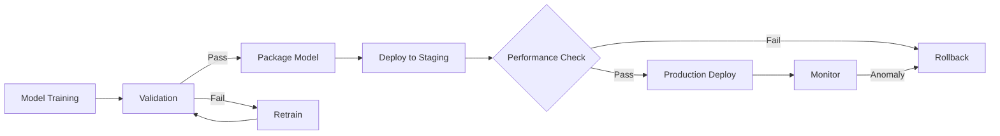
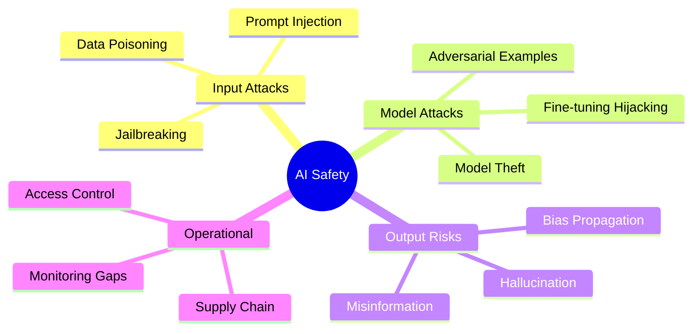
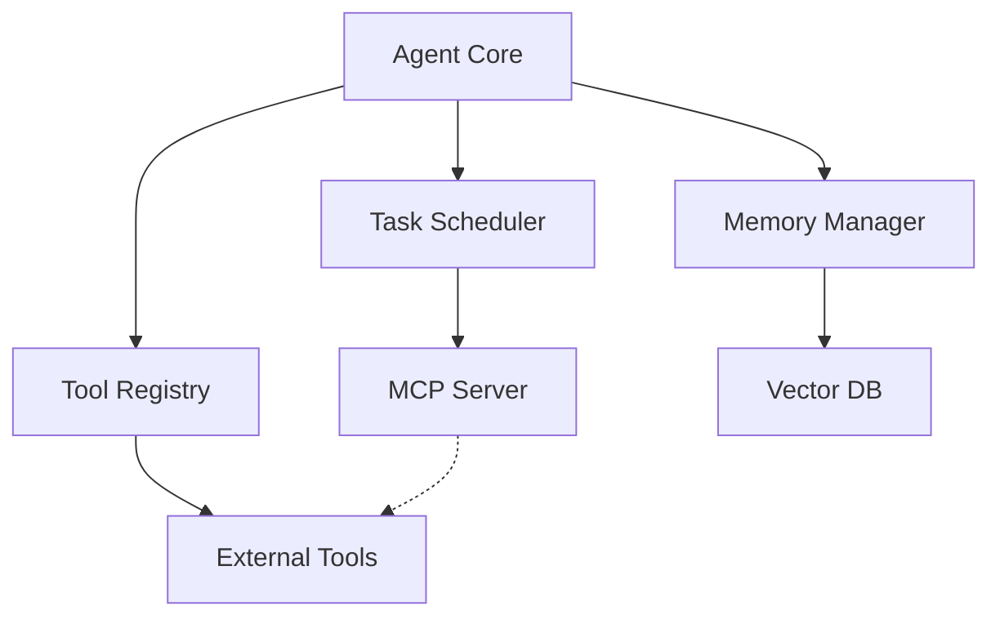
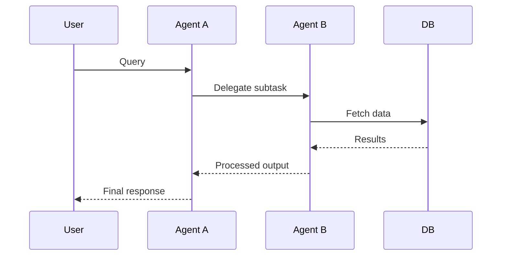
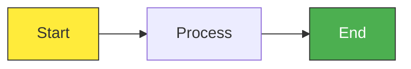

## Overview

This skill transforms text-heavy vault notes into clear, scannable Mermaid diagrams that expose structure, relationships, and flows at a glance. The agent analyzes content, selects appropriate diagram types, and generates publication-ready visual representations suitable for inclusion in notes or standalone reference.

## Diagram Types & When to Use

| Diagram Type | Best For | Example Notes |
|---|---|---|
| **Flowchart** (graph LR/TD) | Processes, pipelines, decision flows | MLOps deployment pipeline, attack vector chains, algorithm steps |
| **Sequence Diagram** | Interactions between actors/components over time | Client-server flows, multi-agent communication, API request chains |
| **Class Diagram** | Object relationships, inheritance, data structures | LLM architecture layers, security framework components |
| **State Diagram** | State transitions, finite state machines | Model lifecycle (training → validation → deployment), threat escalation phases |
| **Mindmap** | Concept clustering, hierarchical topics | Machine learning taxonomy, cybersecurity domains, vault structure |
| **Entity Relationship** | Data relationships and cardinality | Database schemas, knowledge graph structure |

## Selection Criteria

**Choose Flowchart** if:
- Note describes a process, pipeline, or workflow
- Contains decision points or conditional steps
- Has sequential or iterative phases
- Example: `[[MLOps/Model Deployment]]` → deployment pipeline flowchart

**Choose Sequence Diagram** if:
- Note involves multiple actors/systems interacting
- Emphasizes temporal order or request-response patterns
- Contains negotiation or handoff between components
- Example: `[[Agentic AI/Multi-Agent Systems]]` → agent coordination diagram

**Choose Mindmap** if:
- Note is conceptual or taxonomic (no procedural flow)
- Organizes ideas into hierarchies
- Suitable as quick-reference structure
- Example: `[[Machine Learning/AI Safety]]` → mindmap of threat categories

**Choose Class Diagram** if:
- Note describes architectural or structural relationships
- Contains inheritance or composition relationships
- Suitable for software/system design notes
- Example: `[[MLOps/Agentic Systems]]` → architecture component relationships

**Choose State Diagram** if:
- Note focuses on state transitions or lifecycle phases
- Contains distinct states and conditions for moving between them
- Example: `[[Cybersecurity/OSCP]]` → vulnerability exploitation phases

**Default to Simplicity**: One clear, focused diagram beats multiple cluttered ones

## Workflow

### 1. Note Analysis
- Read entire note and identify primary topic
- Look for: processes (→ flowchart), interactions (→ sequence), hierarchies (→ mindmap), structures (→ class/entity)
- Identify **key concepts, actors, steps, or relationships**
- Note any unclear or implicit connections that visualization could clarify

### 2. Scope Definition
- Decide what to visualize (entire note? single section? specific workflow?)
- Target **5–12 nodes** maximum for clarity; larger notes may need multiple diagrams
- If note is very complex, create **2–3 focused diagrams** rather than one dense one
- Define clear entry/exit points or scope boundaries

### 3. Diagram Type Selection
- Apply selection criteria from table above
- Consider: What is the note's **primary message**? What visual structure reveals it?
- Example: A note on LLM security might need both a **process diagram** (attack chain) and a **mindmap** (threat taxonomy)

### 4. Content Extraction
- List all nodes/concepts to include (keep below 12)
- Identify connections: causality, dependency, sequence, hierarchy, composition
- Note any labels that clarify relationships (e.g., "requires", "triggers", "inherits from")
- Identify decision points or branches in flows

### 5. Mermaid Code Generation
- Write clean, readable Mermaid syntax
- Use clear, descriptive labels (3–5 words per node)
- Maintain consistent formatting and indentation
- Test logic: Can a reader follow the diagram without the original note?

### 6. Integration & Output
- Option A: Embed diagram in original note (with brief caption)
- Option B: Create standalone visual note linked from original
- Option C: Provide diagram code for copy-paste
- Offer revisions: "Simplify further?", "Add different perspective?"

## Example Workflows

### Example 1: Process Diagram

**Input Note**: `[[MLOps/ML Models Deployment]]` (explains model serving pipeline)

**Agent Selects**: Flowchart (pipeline with decision points)

**Output** (Mermaid):


**Caption**: "Standard ML deployment pipeline with validation gates and rollback safeguards."

---

### Example 2: Concept Hierarchy

**Input Note**: `[[Machine Learning/AI Safety]]` (covers threat landscape)

**Agent Selects**: Mindmap (taxonomic structure)

**Output** (Mermaid):


**Caption**: "Taxonomy of AI security threats organized by attack surface."

---

### Example 3: Architecture Relationships

**Input Note**: `[[MLOps/Agentic Systems]]` (describes system components)

**Agent Selects**: Class Diagram (component relationships)

**Output** (Mermaid):


**Caption**: "Agentic system architecture showing core components and tool integration."

---

### Example 4: Sequential Interaction

**Input Note**: `[[Agentic AI/Multi-Agent Systems]]` (agents coordinating)

**Agent Selects**: Sequence Diagram (multi-actor flow)

**Output** (Mermaid):


**Caption**: "Multi-agent coordination for complex query resolution."

---

## Mermaid Best Practices

**Readability**:
- Keep node labels **3–5 words** max ("LLM Fine-tuning" not "The process of fine-tuning language models")
- Use **clear, brief connectors** ("requires", "triggers", "inherits from", "produces")
- Avoid **crossing lines**; rearrange nodes for clarity

**Structure**:
- Flowchart: Use `graph LR` (left-to-right) for processes, `graph TD` (top-down) for hierarchies
- Mindmap: Root node centered; expand radially outward
- Sequence: Vertical flow; label each interaction clearly

**Styling** (optional but enhances readability):


**Size Limits**:
- Aim for **5–12 nodes** per diagram
- If exceeding 15 nodes, split into multiple focused diagrams
- Prefer multiple simple diagrams over one complex one

## Output Formats

### Format A: Embed in Existing Note
Add to relevant section (e.g., new `## Visualization` subsection):
```markdown
## Architecture Visualization

[Brief caption explaining diagram]

\`\`\`mermaid
[diagram code]
\`\`\`

See detailed explanations in [[related note]] for each component.
```

### Format B: Standalone Visual Note
Create new `#note` or `#quicknote`:
```
Created: 2026-02-20 14:30
#quicknote

## [Concept] Architecture

[Caption paragraph]

\`\`\`mermaid
[diagram code]
\`\`\`

Detailed discussion: [[Original Note Title]]

#### Tags
#visualization, #architecture, inherited-tags
```

### Format C: Diagram Code Block
Standalone markdown for copy-paste:
````
Mermaid Diagram: [Concept Title]
Source Note: [[Original Note]]

\`\`\`mermaid
[diagram code]
\`\`\`
````

## Quality Checklist

- [ ] Diagram type is **optimal** for concept (process? hierarchy? interaction?)
- [ ] **5–12 nodes** maximum (or multiple diagrams if larger)
- [ ] Node labels are **clear and concise** (3–5 words)
- [ ] All **key relationships** from note are represented
- [ ] Diagram is **intelligible without the original note**
- [ ] No **crossing connectors** (or minimal, if unavoidable)
- [ ] Consistent **styling and formatting**
- [ ] **Caption provided** explaining purpose and key takeaway
- [ ] Related vault notes are **cross-linked** where applicable

## Common Pitfalls to Avoid

- **Too many nodes**: Reduces clarity; split into multiple diagrams instead
- **Vague labels**: "Thing A", "Process", "Data" unhelpful; be specific
- **Missing relationships**: Diagram should expose the note's structure, not hide it
- **Wrong diagram type**: Forcing a mindmap for a process, or vice versa
- **Over-decorated**: Colored nodes and arrows are optional; clarity comes first
- **No caption**: Diagram without context loses impact; always provide 1–2 sentence explanation

## Revision Suggestions

After generating diagram, offer:
- "Should I simplify this further (fewer nodes)?"
- "Would a different diagram type (flowchart vs mindmap) work better?"
- "Should I split this into 2 diagrams for clarity?"
- "Would adding decision points or conditions help?"
- "Should I highlight a specific subset of relationships?"
