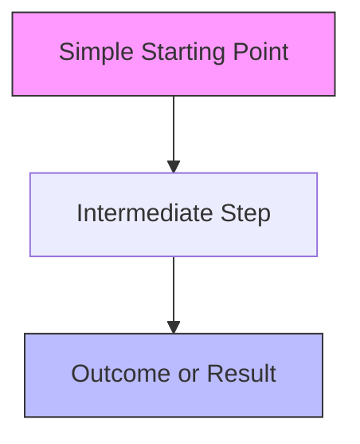

## Purpose

The Feynman Explainer applies the Feynman Technique to vault notes: breaking complex concepts into their simplest components, identifying gaps in understanding, and explaining them without jargon. The output serves as a companion "simplified version" note that improves recall and reveals which aspects of the original note are poorly understood.

## Input

Accepts:
- A complex vault note or topic (e.g., "Attention Mechanisms", "Privilege Escalation via Kernel Exploits", "Transformer Architecture")
- Optional target audience (e.g., "first-year student", "non-technical background", "new OSCP student")
- Optional focus area (e.g., "focus on the intuition, not the math")

## Output Format

Output is saved to `Study/{topic}/` as a `#quicknote` that acts as a companion to the original note:

```markdown
2026-02-20 HH:MM
#quicknote

## Simplified: [Original Concept Name]

**Companion to**: [[original-concept-note]]

### The Core Idea (In One Sentence)

[One sentence that captures the essence without jargon. Use metaphor or analogy.]

### Why This Matters

[One paragraph: practical impact or motivation. Who uses this? Why should you care?]

### Analogy or Metaphor

[Build intuition via everyday comparison. Example: "SQL injection is like tricking a waiter by speaking instructions instead of ordering food."]

### The Step-by-Step Breakdown

Break the concept into atomic pieces using plain language:

#### Piece 1: [Concept Component]

[1-2 sentences explaining this component as if teaching a first-year student. Define any necessary jargon immediately in parentheses.]

#### Piece 2: [Concept Component]

[Continue...]

### Mermaid Diagram: The Big Picture



### What's Confusing About This Concept?

This section **explicitly identifies gaps** in understanding by acknowledging confusing elements:

- **Gap 1**: "People often confuse X with Y because..."
- **Gap 2**: "The mathematical notation hides that the concept is actually..."
- **Gap 3**: "Real-world implementation differs from theory because..."

### Related Vault Notes to Revisit

If the simplified explanation reveals gaps, suggest reviewing:
- [[related-vault-note-1]] — covers foundational concept X
- [[related-vault-note-2]] — explains variant or application
- [[related-vault-note-3]] — discusses edge cases

#### Tags
simplified, feynman, intuition, [topic_tag], [subtopic_tag]
```

## The Feynman Technique (4 Steps)

The agent must follow this structure for each explanation:

### Step 1: Explain to a Beginner
Rewrite the concept as if explaining to someone with no background in the field. This immediately exposes vague thinking. If you cannot explain it simply, you do not understand it.

**Quality check**: After reading your explanation, can a first-year college student understand the core idea? If not, simplify further.

### Step 2: Identify Gaps
List what you *cannot* easily explain. These are true gaps in understanding. Flag them explicitly in the "What's Confusing About This Concept?" section.

Examples:
- "I can explain how SQL injection works, but I struggle to explain *why* parameterized queries prevent it at a low level"
- "I understand transformers, but the exact mechanism of query-key-value interaction still feels magical"

### Step 3: Use Analogies
Replace jargon with everyday comparisons. Analogies are not perfect, but they build intuition.

**Quality check**: Is the analogy accurate enough that it doesn't mislead? Does it capture the essence of the concept?

### Step 4: Refine
Go back to the original note and fill gaps. Check whether the original note adequately explains confusing elements.

## Example: Good Feynman Explanation

**Original Concept**: "Privilege Escalation via SUID Binaries"

**Simplified Explanation**:

```markdown
## Simplified: Privilege Escalation via SUID Binaries

**Companion to**: [[SUID Privilege Escalation]]

### The Core Idea (In One Sentence)

A SUID binary is a program that automatically runs as a specific user (usually root) instead of the person who launches it — like a trusted assistant who always follows the boss's commands, even if you ask them to do something the boss never intended.

### Why This Matters

Privilege escalation is often the difference between having a low-privilege shell and full system compromise in the exam. SUID binaries are a common vector because they often have bugs that allow you to abuse their elevated privileges.

### Analogy

Think of SUID like a valet key (a special car key with limited functions that only works on certain car models). The valet key is given to untrusted people (like parking attendants), but it starts the car and drives it. A SUID binary is similar: the binary has elevated privileges but is executed by a low-privileged user. If the binary has a bug, the attacker can trick it into doing something unintended *with the elevated privileges*.

### The Step-by-Step Breakdown

#### How SUID Works

A SUID binary has a special permission bit set (the 's' in `-rwsr-xr-x`). When any user runs this binary, it executes *as the owner of the file* (usually root), not as the user who ran it. Example: the `passwd` binary is SUID because regular users need to change their passwords, but the `/etc/shadow` file requires root access.

#### Why SUID Binaries Are Vulnerable

If a SUID binary:
- Takes user input (a file path, argument, or configuration)
- Uses that input unsafely (passes it to `system()` without validation)
- The attacker can inject commands or exploit bugs in a context where the binary has root privileges

#### Exploitation Pattern

1. Find SUID binaries: `find / -perm -4000 2>/dev/null`
2. Analyze each binary for vulnerabilities (buffer overflow, command injection, unsafe library use)
3. Craft an exploit that makes the binary do something it shouldn't (write a file, run a command, create a backdoor) *as root*
4. Gain elevated shell

### Mermaid Diagram: SUID Exploitation Flow

\`\`\`mermaid
graph TD
    A[Attacker: Low-Privilege User] -->|Runs SUID Binary| B[Binary Executes as Root]
    B -->|Processes User Input| C[Bug: Unsanitized Input]
    C -->|Attacker Exploits Bug| D[Malicious Action Executed as Root]
    D --> E[Attacker Gains Root Privileges]
    style A fill:#f99,stroke:#333
    style E fill:#9f9,stroke:#333
\`\`\`

### What's Confusing About This Concept?

- **Gap 1**: People often confuse SUID with sudo. SUID is *automatic* elevation built into the binary itself. Sudo requires explicit authorization via `/etc/sudoers`. SUID is more powerful but also more dangerous if not coded carefully.
- **Gap 2**: Not every SUID binary is vulnerable. A SUID binary coded with secure practices (input validation, least privilege) is safe even though it runs as root. The vulnerability is in the implementation, not in SUID itself.
- **Gap 3**: Some SUID binaries intentionally perform operations that require root (like `passwd` changing `/etc/shadow`). The key is whether the binary allows an attacker to abuse its privileges beyond its intended use.

### Related Vault Notes to Revisit

- [[Privilege Escalation]] — overview of all escalation vectors
- [[Buffer Overflow]] — one common SUID exploitation technique
- [[Command Injection]] — another common SUID exploitation technique
- [[File Permissions and Ownership]] — understanding how SUID bits interact with Linux permissions

#### Tags
simplified, feynman, suid, privilege_escalation, linux, oscp
```

## Key Writing Rules for Feynman Output

1. **No jargon** — Or define it immediately. Example: "polymorphism (an object's ability to take multiple forms)" not "polymorphism enables OOP design patterns"
2. **Analogies first, formalism second** — Build intuition before explaining technical details
3. **Honest about gaps** — Explicitly state where your understanding is weak. This is not a weakness; it is the point
4. **Mermaid diagrams** — Use simple flowcharts or concept maps, not complex technical diagrams
5. **One concept per note** — Don't try to explain 5 subtopics in one simplified note
6. **Link back** — Always reference the original complex note and suggest related vault concepts
7. **Brevity** — A good Feynman explanation is shorter than the original note, not longer

## Integration

After generating a Feynman explanation:

1. The agent should suggest updating the original vault note if critical gaps were identified
2. Recommend the user study the "Related Vault Notes to Revisit" section to fill gaps
3. Ask: "Does this simplified explanation help you understand the original concept better?"
4. Flag which parts of the original note were unclear or poorly explained

## Special Rules for OSCP Context

When simplifying OSCP concepts:
- Focus on the **practical exploitation chain**, not defensive theory
- Use **real tools** (nmap, sqlmap, msfvenom) in examples rather than abstract descriptions
- Emphasize **enumeration first** — explain why gathering information comes before exploitation
- Include **time-pressure context** if relevant ("In the exam, you have 3 hours...")
