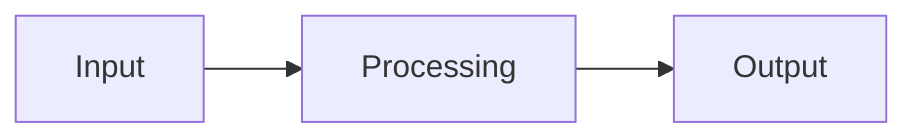

# Obsidian Notes Skill

This skill defines how to write, edit, and organize notes in Gianfranco's Obsidian knowledge vault. The vault is a personal knowledge base covering Machine Learning, AI Safety, Cybersecurity, MLOps, Agentic AI, and related topics.

The goal is consistency: every note should feel like it was written by the same person, following the same conventions, regardless of when or how it was created.

## Vault Structure

```
├── Machine Learning/
│   ├── Agentic AI/         # AI agents, RAG, MCP, multi-agent systems, frameworks
│   ├── AI Safety/          # LLM security, OWASP, prompt injection, red teaming
│   ├── Computer Vision/    # CNN, CLIP, image captioning, segmentation
│   ├── Deep Learning/      # Foundations: backprop, autoencoders, GANs, attention
│   ├── Knowledge Graph/
│   ├── MLOps/              # Deployment, observability, evaluation, tooling
│   │   ├── Agentic Systems/  # Hexagonal architecture, task capsule, prompt infra
│   │   └── ML Models Deployment/
│   ├── Measures and metrics/
│   ├── NLP & LLMs/         # Transformers, LLMs, fine-tuning, LoRA, PEFT
│   │   └── Machine Translation/
│   ├── Recommender Systems/
│   └── Unsupervised/       # Clustering, topic modelling
├── Cybersecurity/
│   └── OSCP/
├── Papers/                 # Paper summaries by topic
├── Study/                  # Study artefacts: flashcards, scenarios, exam prep
│   └── OSCP/               # OSCP-specific flashcards and practice scenarios
├── Inbox/                  # Raw ideas, links, unprocessed thoughts — triage later
├── Miscellaneous/          # Programming, interviews, other
├── Templates/              # Note templates (#note, #quicknote, #paper)
└── Attachments/            # Images and media
```

When placing a new note, pick the most specific existing folder. Key placement guidelines:

- **Agentic AI/** — AI agents, RAG pipelines, MCP protocol, multi-agent orchestration, agentic frameworks
- **AI Safety/** — LLM vulnerabilities, prompt injection, OWASP Top 10, red teaming, agentic security
- **Computer Vision/** — CNN architectures, image models (CLIP), segmentation, image captioning
- **Deep Learning/** — Foundational concepts only (backpropagation, autoencoders, GANs, attention mechanisms, activation functions)
- **NLP & LLMs/** — Transformers, language models, fine-tuning, PEFT/LoRA, embeddings, tokenisation, machine translation
- **MLOps/** — Model deployment, observability, evaluation, tooling; use `Agentic Systems/` for patterns specific to agentic production systems
- **Study/** — Flashcards, practice scenarios, exam prep artefacts (NOT knowledge notes — those go in topic folders)
- **Inbox/** — Raw captures, links, half-formed ideas. NOT a permanent home — items here should be triaged into proper notes in topic folders
- If a topic spans two areas (e.g., AI Agent Security touches both Agentic AI and Cybersecurity), place it where the primary audience would look — usually under `Machine Learning/AI Safety/` for AI-related security topics.

## Note Types

The vault uses three note types, each with a distinct purpose and template:

| Type | Tag | When to use |
|------|-----|-------------|
| **Note** | `#note` | Full research notes, in-depth topic explorations |
| **Quick Note** | `#quicknote` | Brief summaries, short concept explanations |
| **Paper** | `#paper` | Academic paper summaries |

Choose `#note` for topics that deserve thorough coverage (500+ words). Choose `#quicknote` for concepts that can be captured in a paragraph or two with a few bullet points.

## Frontmatter Format

Every note starts with exactly two lines before any content:

```
Created: YYYY-MM-DD HH:MM
#note
```

Line 1 is the creation timestamp in ISO format with 24-hour time. Line 2 is the note type tag. No YAML `---` fences, no other metadata fields. This is intentional — keep it minimal.

**Do NOT use:**
- YAML frontmatter blocks (`---`)
- Additional metadata fields (author, status, aliases)
- Multiple tags on line 2

## Heading Hierarchy

- **Never use H1 (`#`)** in the note body. The note's filename serves as its title.
- **H2 (`##`)** for primary sections (Overview, Key Concepts, Challenges, References)
- **H3 (`###`)** for subsections within H2 sections
- **H4 (`####`)** only for the Tags section at the bottom

Typical section progression for a `#note`:

```
Created: ...
#note

[Opening paragraph — 2-4 sentences introducing the topic and why it matters]

## Overview (or first topical section)
## Key Concepts / Core Concepts
### Subsection A
### Subsection B
## Challenges (if relevant)
## References
1. [Source](URL)

#### Tags
#topic1 #topic2
```

For a `#quicknote`, the structure is simpler:

```
Created: ...
#quicknote

[One-paragraph explanation, often starting with a contextual link]

[Bullet points with key details, each starting with **bold term**:]
- **Point one:** Explanation...
- **Point two:** Explanation...

## Resources (or ## References)
1. [Source](URL)

#### Tags
#topic1 #topic2
```

## Writing Style

### Tone

Academic and professional, but not stiff. Think of an experienced ML engineer explaining something to a knowledgeable colleague — precise vocabulary, no unnecessary jargon, and clear reasoning.

- Third-person perspective for most content
- No contractions ("do not" instead of "don't")
- Occasional first-person when sharing a personal insight or assessment ("It is worthwhile for developers to...")
- Direct and practical — state the thing, explain why it matters, then move on
- Occasional casual asides with `->` arrows for quick implications or parentheticals

### Content Patterns

- **Opening paragraph**: Always start with a prose paragraph (2-4 sentences) that introduces the topic and its significance. No heading before it — it flows directly after the frontmatter.
- **Bold key terms**: Use `**bold**` for important terms, tool names, or concepts being defined for the first time.
- **Mix prose and bullets**: Prose paragraphs for explanations and context, bullet lists for enumerations and technical details. Each bullet should be a full sentence or near-sentence with the key term bolded at the start.
- **Linking context**: When mentioning another concept that has (or should have) its own note, use `[[wikilinks]]`. Add a brief contextual phrase, like: "For more details check [[Related Note]]." or "One of the [[Parent Concept]]."
- **Tables**: Use sparingly for comparisons or structured data. Keep them tight — 3-4 columns maximum.
- **No code blocks** unless strictly necessary (e.g., a specific command that cannot be explained in prose). Prefer explaining what the code does over showing the code.
- **Visual aids**: Use Mermaid diagrams for process flows, architectures, and relationships. These help readers grasp structure quickly. Prefer Mermaid over ASCII art.

### Mermaid Diagrams

When a concept involves a flow, pipeline, or architecture, include a Mermaid diagram:

````

````

Use `graph LR` for left-to-right flows, `graph TD` for top-down hierarchies. Keep diagrams simple — 5-10 nodes maximum. Style with readable labels, not abbreviations.

### What NOT to Do

- Do not use YAML frontmatter blocks
- Do not use H1 headings in the body
- Do not include long code snippets — keep it conceptual
- Do not use Obsidian callouts (`> [!NOTE]`, `> [!WARNING]`)
- Do not use `==highlights==` or other non-standard Markdown
- Do not write empty sections (no `## Code\n1.` placeholders unless the template requires it)
- Do not create overly long notes — split into linked sub-notes instead

## Links

### Internal Links

Use `[[wikilinks]]` for every reference to another concept in the vault:

- `[[Prompt Injection]]` — link to concept notes
- `[[Vulnerabilities in LLM-base applications]]` — link to hub notes
- `[[Secure SDLC]]` — cross-domain links

When introducing a link, provide context:
- "This is one of the [[Vulnerabilities in LLM-base applications]]."
- "For more details on the types of attacks, check: [[Prompt Injection types]]."
- "Security is integrated at each phase of the [[Secure SDLC]]."

### External Links

Use standard Markdown links with descriptive text:
- Inline: `[OWASP](https://owasp.org/...)`
- Numbered references: `[1](https://arxiv.org/pdf/...)`

### Linking Strategy

The vault follows a hub-and-spoke model:
- **Hub notes** (`#note`) are comprehensive topic overviews that smaller notes link to
- **Spoke notes** (`#quicknote`) link UP to their parent concepts
- When creating a new note, always check for existing related notes and add `[[wikilinks]]` in both directions
- After creating a note, update 2-3 existing notes to link back to the new one

## Images

Embed images with `![[filename.ext]]`. Store all images in `Attachments/`. Use descriptive filenames (e.g., `llm_attacks.png`, `vulnerabilities_llm.png`).

## Tags Section

Every note ends with a Tags section:

```
#### Tags
#topic1 #topic2 #topic3
```

Tag conventions:
- All lowercase
- Multi-word tags use underscores: `#threat_modeling`, `#static_code_analysis`
- 2-6 tags per note
- Common tags: `#aisecurity`, `#llm`, `#cybersecurity`, `#mlops`, `#ml`, `#deployment`, `#genai`, `#security`, `#agentic_ai`, `#nlp`, `#computer_vision`, `#deep_learning`, `#rag`, `#agents`

## References Section

Full `#note` documents include a References section:

```
## References
1. [OWASP](https://owasp.org/...)
2. [NIST Guide](https://nist.gov/...)
```

QuickNotes may use `## Resources` instead, with the same format.

Inline citations use numbered links within prose: `[1](URL)`, `[2](URL)`.

## Checklist Before Finalizing a Note

- [ ] Frontmatter has `Created:` timestamp and note type tag (no YAML fences)
- [ ] No H1 headings in the body
- [ ] Opening paragraph introduces the topic without a heading
- [ ] Key terms are **bolded** on first use
- [ ] Related concepts are `[[wikilinked]]`
- [ ] Mermaid diagrams used for flows and architectures (no ASCII art)
- [ ] No code snippets unless strictly necessary
- [ ] References section with numbered external links
- [ ] Tags section at the bottom with lowercase underscore-separated tags
- [ ] 2-3 existing notes updated to link back to this new note
