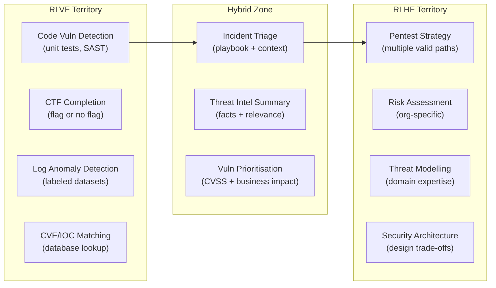

Created: 2026-03-03 11:00
#note

The intersection of LLM fine-tuning and cybersecurity is maturing rapidly, with specialised models, benchmarks, and training datasets emerging across offensive and defensive domains. However, the field sits on a fundamental tension: some cybersecurity tasks have **deterministic, verifiable ground truth** (code vulnerabilities, CTF flags, log anomalies) while others depend on **organisational context and expert judgement** (risk assessment, threat prioritisation, incident response strategy). This distinction — which maps directly onto the [[RLVF - Reinforcement Learning from Verifiable Feedback]] vs [[RLHF - Reinforcement Learning from Human Feedback]] boundary — has deep strategic implications for where specialised cybersecurity AI creates lasting value versus where it will be commoditised by frontier model providers. Part of the broader [[LLM Training and Alignment Evolution]].

## The Verifiability Spectrum in Cybersecurity

The most useful lens for understanding where fine-tuning creates defensible value is the **verifiability spectrum** — how easily a task's correctness can be checked automatically.

### Clearly Verifiable (RLVF-ready)

Tasks with deterministic ground truth that automated verifiers can check:

- **Code vulnerability detection** — execute against test suites, match known CWEs via static analysis. SecureFalcon achieves 96% classification accuracy. GRPO-based RL training (2025) shows improvements over SFT alone
- **CTF challenge completion** — binary success/failure. CTFAgent achieves 88% fully automated, 94% with human-in-the-loop
- **Log anomaly detection** — labeled normal/anomalous sequences. F1 up to 0.998 with DistilRoBERTa + ReFT on multi-source logs
- **Phishing/spam detection** — labeled corpora provide clear ground truth. 95%+ F1 on standard benchmarks
- **CVE/IOC matching** — deterministic string matching against NVD, MITRE ATT&CK

### Partially Verifiable (Hybrid Zone)

Tasks where some components are checkable but the overall quality depends on context:

- **Incident response triage** — alert classification is verifiable against playbooks, but prioritisation depends on org-specific risk tolerance and asset criticality
- **Threat intelligence summarisation** — factual accuracy is checkable (claims match sources), but relevance and actionability are org-dependent
- **Vulnerability prioritisation** — CVSS computation is deterministic, but business impact assessment requires organisational context that no external model can learn

### Largely Non-Verifiable (RLHF-dependent)

Tasks requiring expert judgement with multiple valid approaches:

- **Penetration testing strategy** — no single correct path; success depends on target environment, time constraints, and tester creativity
- **Risk assessment and threat modelling** — inherently subjective, depends on org's threat model, risk appetite, and regulatory environment
- **Security architecture decisions** — design trade-offs between security, usability, and cost with no objectively optimal solution
- **Explanation and justification quality** — multiple valid explanations for why a vulnerability exists or why a detection fired

## Existing Cybersecurity LLMs

| Model | Parameters | Training | Target Task | Performance |
|-------|-----------|----------|-------------|-------------|
| **PentestGPT** | GPT-4 based | Prompt engineering + agentic | Pen testing | 228% improvement over GPT-3.5 |
| **SecureFalcon** | 121M (Falcon) | Partial param fine-tuning | Code vuln classification | 96% accuracy |
| **HackMentor** | Llama/Vicuna | LoRA on 44k examples | Cybersec knowledge | General assistant |
| **VulnLLM-R** | Various | Agent scaffold + reasoning | Vuln detection | Step-by-step reasoning |

**Note:** Most existing models use SFT or prompt engineering. Very few use RL-based training — this is an open gap.

## Key Datasets and Benchmarks (2024–2025)

- **Primus (2025)** — first comprehensive open-source cybersecurity LLM training dataset suite (pretraining + instruction fine-tuning + reasoning distillation). 15.9% improvement in aggregate security tasks
- **CyberBench (AAAI-24)** — 10 datasets covering NER, summarisation, multiple choice, text classification. Selected as First Prize in CAIS SafeBench competition
- **Cybench** — 40 professional-level CTF challenges with verifiable completion
- **CTIBench (NeurIPS 2024)** — cyber threat intelligence evaluation covering CISSP-level concepts
- **CyberLLMInstruct (2025)** — analyses safety trade-offs when fine-tuning on cybersec data. Key finding: domain specialisation may reduce general safety alignment
- **ExCyTIn-Bench** — evaluates LLM agents on cyber threat investigation tasks with verifiable rewards for intermediate investigation steps

## Big Provider Landscape

- **Microsoft Security Copilot** — 40+ agents, 84 trillion signals/day, 550% faster phishing detection. Covers alert triage, threat intelligence, incident response at massive scale
- **Google Sec-PaLM** — fine-tuned PaLM + Mandiant intelligence for SOC augmentation
- **CrowdStrike Charlotte AI** — generative AI analyst on top of Falcon's telemetry data

These providers have advantages in **data volume** (telemetry from millions of endpoints), **compute** (can run RLVF at scale), and **distribution** (built into existing security stacks). They will likely commoditise tasks on the verifiable end of the spectrum.

## Strategic Analysis — Where Defensible Value Lives

### What Big Providers Will Commoditise

Tasks that are verifiable, data-rich, and benefit from scale:

- **Generic code vulnerability detection** — frontier models + RLVF + massive code datasets → will be a feature, not a product
- **Log parsing and anomaly detection** — telemetry providers (Microsoft, CrowdStrike, Elastic) have the data moat
- **Phishing detection** — already commoditised, email providers handle this
- **Generic threat intelligence NER** — extracting IOCs from text is a solved problem at scale

### Where Specialised Fine-Tuning Creates Lasting Value

The **hybrid zone** — tasks that require both technical verification AND organisational context — is where defensible AI products live. Big providers cannot access your organisation's:

- **Internal threat model** and risk appetite
- **Asset criticality** mappings and business context
- **Security architecture** constraints and tech stack specifics
- **Compliance requirements** and regulatory context
- **Incident history** and institutional knowledge
- **Team expertise** distribution and escalation patterns

This maps to a training strategy: **SFT + DPO/RLHF with organisation-specific expert feedback** on tasks where context matters, layered on top of frontier model capabilities for the verifiable parts.

### The Evaluation Gap — A High-Impact Opportunity

One area where big providers are weak and specialised work has outsized impact: **cybersecurity-specific model evaluation**. The field lacks consensus benchmarks, standardised evaluation frameworks, and reliable ways to measure whether a security AI system is actually improving defensive posture. [[LLM Evaluation]] frameworks for general LLMs do not capture cybersecurity-specific failure modes. Building evaluation infrastructure — benchmarks, red-team methodologies, safety-performance trade-off measurement — is high-leverage work that shapes the entire field.

### The Safety-Performance Trade-Off

CyberLLMInstruct (2025) found that fine-tuning on cybersecurity data **improves task accuracy but may reduce general safety alignment**. This is a critical research direction: how to specialise models for security tasks without making them more susceptible to misuse. [[Constitutional AI]] principles adapted for cybersecurity ("be helpful for defenders, refuse to assist attackers") could address this.

## Connection to Training Methods

| Cybersecurity Domain | Best Training Approach | Why |
|---------------------|----------------------|-----|
| Code vuln detection | [[RLVF - Reinforcement Learning from Verifiable Feedback]] + [[GRPO - Group Relative Policy Optimization]] | Deterministic verification via test execution |
| CTF / pen testing | RLVF for mechanics + [[RLHF - Reinforcement Learning from Human Feedback]] for strategy | Mixed verifiability |
| Incident response | [[DPO - Direct Preference Optimization]] with expert preferences | Context-dependent, multiple valid approaches |
| Threat intelligence | SFT on curated reports + DPO | Factual accuracy is checkable, relevance is not |
| Risk assessment | RLHF with org-specific experts | Fully context-dependent |
| Security evaluation | Custom benchmarks + [[RLVF - Reinforcement Learning from Verifiable Feedback]] | Need verifiable metrics for AI security systems |

## References

1. [PentestGPT — USENIX Security 2024](https://arxiv.org/html/2308.06782v2)
2. [SecureFalcon — IEEE 2024](https://arxiv.org/pdf/2307.06616v1)
3. [Primus Cybersecurity Dataset Suite (2025)](https://arxiv.org/abs/2502.11191)
4. [CyberLLMInstruct — Safety Analysis (2025)](https://arxiv.org/html/2503.09334v2)
5. [CyberBench — AAAI 2024](https://github.com/jpmorganchase/CyberBench)
6. [CTIBench — NeurIPS 2024](https://proceedings.neurips.cc/paper_files/paper/2024/file/5acd3c628aa1819fbf07c39ef73e7285-Paper-Datasets_and_Benchmarks_Track.pdf)
7. [ExCyTIn-Bench — Verifiable Rewards for Threat Investigation](https://arxiv.org/pdf/2507.14201)
8. [GRPO for Vulnerability Detection (2025)](https://arxiv.org/pdf/2507.03051)
9. [Microsoft Security Copilot (2025)](https://www.microsoft.com/en-us/security/blog/2025/03/24/microsoft-unveils-microsoft-security-copilot-agents-and-new-protections-for-ai/)
10. [Awesome LLM4Cybersecurity — Survey](https://github.com/tmylla/Awesome-LLM4Cybersecurity)

#### Tags
#aisecurity #llm #fine_tuning #cybersecurity #training #rlhf #rlvf #alignment
