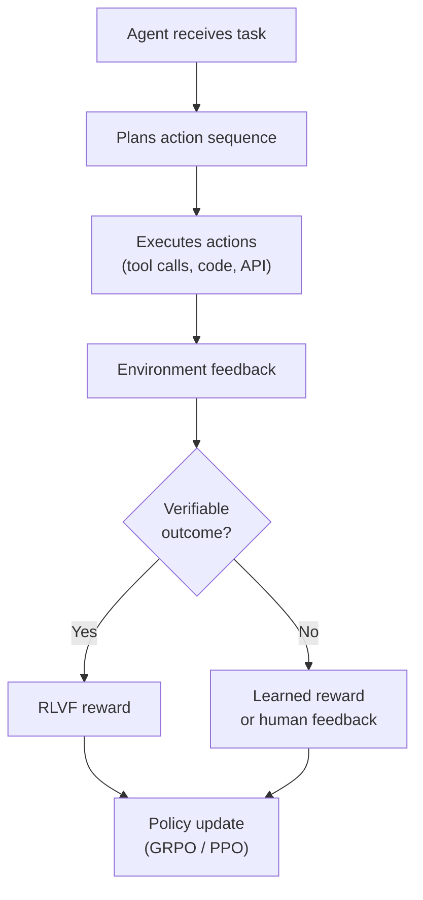

Created: 2026-03-03 10:22
#note

Training [[Large Language Models (LLMs)]] for agentic capabilities — tool use, multi-step reasoning, planning, and environment interaction — requires techniques that go beyond standard alignment. While [[RLHF - Reinforcement Learning from Human Feedback]] and [[DPO - Direct Preference Optimization]] optimise single-turn quality, agent training must handle **trajectory-level rewards**, long-horizon credit assignment, and verification of multi-step action sequences. The field has evolved rapidly since 2024, with frameworks like FireAct, AgentTuning, and Agent-R1 pushing toward scalable agentic RL. This note covers the training and fine-tuning landscape for LLM-based agents. Part of the broader [[LLM Training and Alignment Evolution]].

## Training Approaches

### Supervised Agent Fine-Tuning

The simplest approach: generate high-quality agent trajectories (tool calls, reasoning chains, action sequences) and fine-tune the model on them.

- **FireAct (2024)** — generates synthetic agent trajectories using GPT-4, then fine-tunes smaller models (Llama-2 7B). 500 trajectories achieved 77% improvement on HotpotQA. Key insight: quality of trajectories matters far more than quantity
- **Toolformer (Meta, 2023)** — self-supervised approach where the model learns to insert API calls into its own text by predicting where tools would reduce perplexity
- **Gorilla (Berkeley, 2023)** — fine-tuned on API documentation to generate accurate tool calls, with retrieval-augmented training to stay current with API changes
- **AgentTuning (2024)** — curates diverse agent interaction traces across multiple environments (web browsing, code execution, database queries) for generalised agent SFT

### Reinforcement Learning for Agents

RL-based training uses trajectory-level rewards to optimise agent behaviour end-to-end.

- **Agent-R1 (November 2025)** — multi-turn trajectory optimisation framework extending [[RLVF - Reinforcement Learning from Verifiable Feedback]] to agentic settings. Uses turn-level advantage estimation and environment feedback (code execution, API responses) as reward signals
- **CodeAct paradigm** — agents execute code in sandboxed environments, receiving direct execution feedback as the reward signal. Connects to RLVF: if the code runs and produces the correct output, reward = 1
- **CARD framework** — uses LLMs to design reward functions for agent training, enabling reward specification for complex tasks without manual engineering

### Credit Assignment in Long Trajectories

The central challenge: when an agent takes 10+ steps to complete a task, which steps contributed to success or failure?

- **Entropy-Modulated Policy Gradients (EMPG)** — weights gradient updates by the entropy of each action, focusing learning on high-uncertainty decision points
- **Turn-level advantage estimators** — compute advantages at each turn rather than only at the trajectory end, providing denser learning signal
- **Group-in-Group Policy Optimization (GiGPO)** — extends [[GRPO - Group Relative Policy Optimization]] to multi-turn settings by grouping at both the trajectory level and the turn level
- **Process Reward Models** — step-level verification (as in [[RLVF - Reinforcement Learning from Verifiable Feedback]]) applied to agent reasoning steps

## Industry Approaches (2024–2025)

- **Anthropic** — Claude's agent capabilities trained with a combination of SFT on curated tool-use traces and RL with environment feedback. Emphasis on safe agentic behaviour through [[Constitutional AI]] principles applied to agent actions
- **OpenAI** — Operator and agent-mode capabilities leveraging RLVF with code execution and web browsing verification
- **Google** — Project Mariner for browser-based agents, with training on web interaction trajectories

## Training with Environment Feedback

A defining feature of agent training is that the environment itself provides feedback:

- **Code execution** — compiler errors, test results, runtime exceptions
- **API responses** — success/failure codes, returned data validation
- **Web browsing** — page load success, element interaction results, task completion verification
- **Database queries** — result set validation, query execution success

This naturally connects to [[RLVF - Reinforcement Learning from Verifiable Feedback]] — the environment acts as the verifier.

## Open Problems

- **Credit assignment** remains the hardest problem: attributing trajectory-level success to individual decisions in 10–50 step sequences
- **Exploration vs exploitation** — agents need to explore diverse strategies during training but exploit reliable patterns at deployment
- **Offline RL scaling** — training on logged agent trajectories (offline) without environment interaction is cheaper but introduces distribution shift
- **Reward signal combination** — how to combine verifiable rewards (code ran correctly), learned rewards (plan quality), and safety constraints (no harmful actions) into a coherent training signal
- **Generalisation** — agents trained on specific tool sets and environments struggle to transfer to new ones

## References

1. [FireAct — arXiv](https://arxiv.org/abs/2310.05915)
2. [Toolformer — arXiv](https://arxiv.org/abs/2302.04761)
3. [Gorilla — arXiv](https://arxiv.org/abs/2305.15334)
4. [AgentTuning — arXiv](https://arxiv.org/abs/2310.12823)
5. [Agent-R1 Framework (2025)](https://github.com/THU-KEG/Agentic-Reward-Modeling)
6. [CARD — LLM-Driven Reward Design](https://arxiv.org/abs/2406.04615)
7. [Sebastian Raschka — State of LLM Reasoning (2025)](https://magazine.sebastianraschka.com/p/the-state-of-llm-reasoning-model-training)

#### Tags
#agentic_ai #agents #training #reinforcement_learning #fine_tuning #tool_use #rlvf
