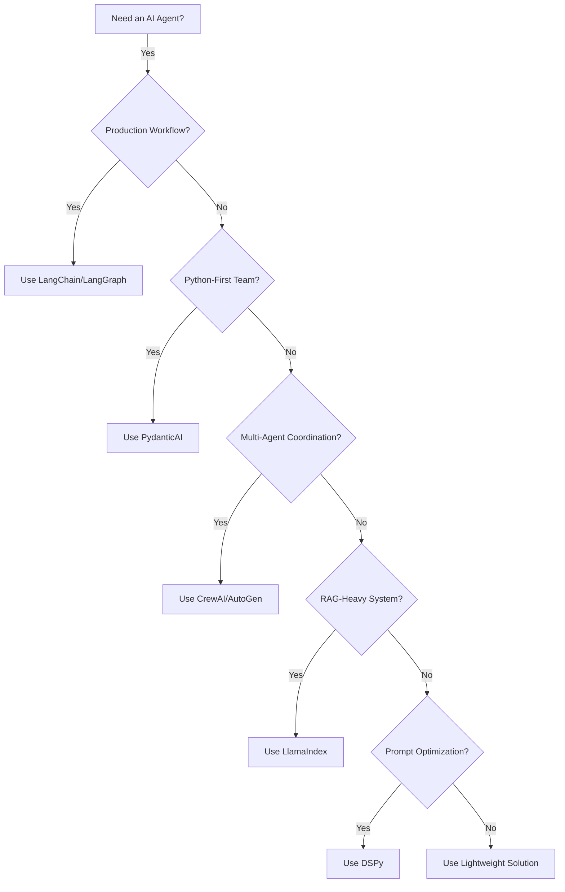

Created: 2026-02-20 10:00
#note

The agentic AI framework ecosystem has matured significantly, with multiple production-ready libraries emerging to accelerate development of **LLM-powered applications** and [[AI Agents]]. Framework selection profoundly impacts developer velocity, system reliability, and ease of maintenance. Organizations must weigh trade-offs between abstraction levels, type safety, extensibility, and specific use cases such as [[Retrieval-Augmented Generation|RAG]] or [[Multi-Agent Systems]].

## Framework Comparison

| Framework | Strengths | Weaknesses | Best For |
|-----------|-----------|-----------|----------|
| **LangChain** | Mature, extensive ecosystem, runnable interface, LCEL | Verbose chains, high abstraction overhead | Complex workflows, production systems |
| **LangGraph** | Stateful agent graphs, cycle support, built on LangChain | Steeper learning curve | Multi-step reasoning, agent loops |
| **PydanticAI** | Type-safe, minimal boilerplate, excellent IDE support | Smaller ecosystem, newer | Python-first teams, rapid prototyping |
| **DSPy** | Systematic prompt optimization, composable modules | Requires evaluation data, less intuitive | Prompt engineering at scale |
| **LlamaIndex** | RAG-optimized, document loaders, query engines | Feature-creep, steep learning curve | Information retrieval systems |
| **CrewAI** | High-level multi-agent abstractions, task-oriented | Less flexibility, opinionated design | Collaborative multi-agent workflows |
| **AutoGen** | Heterogeneous agent teams, conversation-based | Complex configuration, debugging difficulty | Research, dynamic agent coordination |

## LangChain and LangGraph

**LangChain** provides the foundational building blocks for **chain** construction—composable units that orchestrate LLM calls, tools, and business logic. The **Language Chain Expression Language** (LCEL) enables declarative specification of complex pipelines using Python operators. **LangGraph** extends this paradigm by introducing stateful, cyclic graphs that support agent reasoning loops, tool use with branching, and human-in-the-loop workflows. Unlike linear chains, graphs explicitly model control flow, enabling agents to iteratively refine outputs and handle error recovery. Both frameworks integrate seamlessly with **tool calling**, memory management, and observability infrastructure.

## PydanticAI

Developed by the **Pydantic** team, PydanticAI prioritizes developer ergonomics through **type safety** and minimal scaffolding. All inputs, outputs, and agent dependencies are typed at the Python level, enabling static analysis and intelligent IDE autocomplete. This contrasts with LangChain's more loosely-typed abstractions. PydanticAI reduces boilerplate by embedding validation and serialization directly in agent definitions. The framework encourages structured outputs using **Pydantic models**, making downstream integration with business systems more reliable.

## DSPy

DSPy inverts the typical prompt-engineering workflow by treating **prompts as learnable parameters** rather than static templates. The framework enables systematic **prompt optimization** through evaluation metrics and training data. Practitioners define computational graphs using DSPy modules, then optimize prompt parameters against labeled examples. This approach proves valuable for teams managing hundreds of prompt variants or facing distribution shifts in production data.

## Selection Criteria

Framework selection depends on architectural requirements: production workflows with stateful loops favor **LangChain** and **LangGraph**; Python-native teams prioritizing type safety benefit from **PydanticAI**; information retrieval systems warrant **LlamaIndex**; systematic prompt optimization points toward **DSPy**; and collaborative **multi-agent** scenarios suit **CrewAI** or **AutoGen**.

## Framework-Agnostic Patterns

Mature agent systems decouple business logic from framework specifics using **ports and adapters** (see [[Hexagonal Architecture]]). Define domain models and orchestration rules independently, then implement framework-specific adapters as thin integration layers. This pattern simplifies migration between frameworks, enables testing without framework dependencies, and makes code more maintainable as library APIs evolve.

## References

- [LangChain Documentation](https://python.langchain.com/docs/)
- [PydanticAI Documentation](https://ai.pydantic.dev/)
- [DSPy Documentation](https://dspy.ai/)
- [LlamaIndex Documentation](https://docs.llamaindex.ai/)

#### Tags: #llm #ai_agents #frameworks #langchain #genai #multi_agent_systems #rag