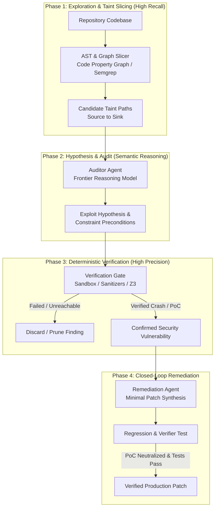

Created: 2026-10-03 16:15
#note

The integration of Large Language Models (LLMs) into security auditing has highlighted a fundamental operational challenge: **the False Positive Dilemma**. While frontier reasoning models exhibit remarkable intuition for identifying complex semantic and business-logic flaws that evade traditional static analysis (SAST), standalone LLMs prompted over raw source code suffer from false positive rates frequently exceeding 60% to 80%. When deployed in enterprise pipelines, this volume of hallucinations destroys developer trust and exhausts security engineering bandwidth.

To transform LLMs from speculative code reviewers into authoritative security discovery systems, modern architectures decouple the generative model from raw classification, embedding it within an **agentic harness governed by deterministic verification gates**. By combining backward taint slicing, formal constraint formulation, and containerized runtime verification (such as compiler sanitizers, dynamic debuggers, and automated Proof-of-Concept execution), agentic harnesses systematically drive false positives toward zero.

---

## The Anatomy of False Positives in Generative Code Auditing

Generative models in isolation fail at security auditing not due to a lack of semantic comprehension, but because of structural limitations inherent to autoregressive text generation:

1. **Path-Feasibility Blindness:** Models readily observe a sensitive sink (such as `system()` or an unparameterized database query) and locate an untrusted source within the same function or file. However, they frequently hallucinate that the data path is executable, failing to account for upstream sanitization middleware, invariant assertions, or mutually exclusive control-flow guards.
2. **Context Horizon and Broken Call Chains:** Because language models operate over truncated context windows rather than whole-program call graphs, they make speculative assumptions regarding function arguments across inter-procedural boundaries, confusing sanitized parameters with raw user input.
3. **Trigger-Keyword Bias:** Models exhibit strong associative priors. Words like `memcpy`, `strcpy`, `crypto`, `auth`, or `exec` trigger vulnerability heuristics regardless of whether the target buffer has compile-time bounded size or whether credentials are cryptographically scrubbed.
4. **Self-Critique Hallucination:** Prompting a model to review its own findings (*"Are you sure this is a vulnerability?"*) rarely eliminates false positives; models routinely construct elaborate, convincing rationalizations for invalid execution flows.

These failure modes underscore the core axiom of modern [[Harness Engineering]]: **an LLM should never be the judge of its own output**. Deterministic properties require deterministic verifiers.

---

## The 4-Tier Agentic Verification Architecture

State-of-the-art vulnerability discovery systems—such as Google's PageBreak, Project Naptime / Big Sleep, and Semgrep's Mythos-Bench harness—replace flat prompt-and-classify workflows with a multi-tier pipeline separating hypothesis generation from environmental validation.

### Tier 1: AST-Aware Slicing and Surface Mapping
Rather than feeding entire source files into an LLM context, the harness relies on fast, deterministic program analysis (e.g. Tree-sitter, Abstract Syntax Trees, or Code Property Graphs) to extract candidate dataflow subgraphs.
* **Backward Taint Slicing:** From every known dangerous sink (e.g., deserialization points, raw memory copies, shell executions, SQL queries), the harness extracts only the reaching definitions and dependent call paths back to external input surfaces.
* **Context Pruning:** This preserves precious LLM reasoning tokens and eliminates distracting, irrelevant code blocks, guaranteeing that the auditor model evaluates only the exact slices relevant to [[Precision Concepts in Static Analysis]].

### Tier 2: Hypothesis Formulation (The Auditor Agent)
The frontier reasoning model is assigned a constrained, formal objective: it is not asked to generate a final vulnerability verdict, but rather to construct an **exploit precondition hypothesis**.
* **Precondition Definition:** The model must articulate the algebraic and environmental constraints required to trigger the defect (e.g., `"Input length must exceed 256 bytes, HTTP header X-Admin must be present, and the integer offset must wrap to negative"`).
* **Payload Hypothesis:** The model outputs a minimal test input designed to satisfy those constraints.

### Tier 3: Deterministic Verification Gates
The harness receives the payload hypothesis and executes it inside an isolated, disposable sandbox (e.g. Linux Bubblewrap container, gVisor runtime, or ephemeral microVM).
* **Memory Corruption and Undefined Behavior:** The target binary is compiled with compiler sanitizers (AddressSanitizer, UndefinedBehaviorSanitizer, MemorySanitizer). The finding is confirmed if and only if the runtime halts with a verified SIGSEGV, heap-buffer-overflow, or use-after-free crash trace.
* **Web and Logic Vulnerabilities:** For vulnerabilities like Insecure Direct Object References (IDOR), SQL Injection, or Authentication Bypass, the harness runs the payload against a localized test instance (using headless Chromium or mock HTTP servers) and verifies whether unauthorized state mutations or data exfiltration occurred.
* **Formal Verification / SMT Solvers:** For numeric overflows or logic bounds, path constraints can be dispatched to SMT solvers (e.g., Z3) to formally verify path satisfiability without full binary execution.

If the verification gate fails to trigger the expected fault, the finding is discarded or fed back into the agent loop for hypothesis refinement. It is **never** presented to human security analysts as a confirmed bug.

### Tier 4: Automated Closed-Loop Remediation
When an exploit hypothesis produces a verified, reproducible failure, that Proof-of-Concept (PoC) automatically serves as a **deterministic test oracle** for remediation:
1. The remediation agent analyzes the crash trace and proposes a surgical source code patch.
2. The harness recompiles the codebase and executes the exact same PoC.
3. If the PoC fails to trigger the vulnerability *and* all pre-existing regression test suites pass, the patch is statistically validated.

This closes the loop between offensive discovery and defensive mitigation, moving security remediation from subjective code review into the domain of [[RLVF - Reinforcement Learning from Verifiable Feedback]].

---

## Comparative Analysis: Industry Implementations

The shift toward verification-centric harnesses is reflected across leading research initiatives in 2025 and 2026:

| System / Framework | Verification Mechanism | Target Scope | Key Innovation |
| :--- | :--- | :--- | :--- |
| **Google PageBreak / Big Sleep** | Containerized dynamic execution with ASan/UBSan & GDB | C/C++ Open Source (e.g. SQLite zero-days) | Refuses to report findings without a reproducible crash trace in an isolated sandbox. |
| **Semgrep Mythos-Bench** | AST-guided tool-calling harness with automated build/test runs | Polyglot enterprise codebases | Compares API models against agentic CLI harnesses; shows tool feedback cuts hallucination by over 70%. |
| **AgentFlow (Liu et al., 2026)** | Typed graph DSL with runtime signal diagnostic loop | Large-scale C/C++ (Chrome, 10 zero-days) | Uses compilation errors and runtime execution signals to optimize the harness topology itself. |
| **AikidoSec `altar-1`** | Small-weight foundation model fine-tuned on verified CWE corpora | Multi-language SAST | Replaces speculative prompting with narrow-domain classification calibrated against known false-positive corpuses. |

---

## Engineering Design Principles for High-Precision Security Harnesses

For engineers building automated security agents, the literature and empirical benchmarks establish four non-negotiable architectural principles:

### 1. Enforce Asymmetric Separation of Concerns
Exploration requires **high recall** (casting a wide net across candidate surfaces); verification requires **high precision** (zero tolerance for unverified alerts). Never use the same agent prompt or temperature setting for both stages. Use broad, cost-effective models (or System 1 classifiers) for surface tagging, and reserve expensive reasoning models for deep constraint formulation and verification analysis.

### 2. Treat the Harness as the Ground Truth Boundary
The LLM provides probabilistic linguistic and semantic reasoning; the harness provides deterministic physics. A finding does not exist because a model asserts it exists; it exists because an external verifier (an exit code, a sanitizer crash log, a unit test assertion) recorded an anomalous state.

### 3. Maintain Immutable Execution Traces
Every tool call, compilation step, and debugger output must be persisted in an append-only ledger (e.g., JSONL transcripts). If a verifier triggers an error, the complete execution trace must be passed back to the model as diagnostic telemetry, enabling backtracking and hypothesis revision rather than restarting from scratch.

### 4. Sandbox All Verifier Executions
Because automated vulnerability verification involves executing potentially untrusted code and synthesised exploit payloads, verifiers must run within hard isolation boundaries (kernel namespaces, read-only root filesystems, blocked outbound network interfaces) to prevent lateral compromise of the host environment. See [[AI Agent Security]] and [[Negative Space Architecture]].

---

## References

1. [Google Bug Hunters — PageBreak Project & Real-World Findings (2026)](https://bughunters.google.com/blog/pagebreak-real-world-findings)
2. [Google Cloud / Mandiant — Staying Ahead of Adversarial AI Through Agentic Source Code Review (2026)](https://cloud.google.com/blog/topics/threat-intelligence/staying-ahead-of-adversarial-ai-through-agentic-source-code-review)
3. [Semgrep — Mythos-Bench: Jagged Frontier in Agentic Vulnerability Detection (2026)](https://github.com/semgrep/mythos-bench)
4. [Liu et al. — Synthesizing Multi-Agent Harnesses for Vulnerability Discovery (arXiv:2604.20801)](https://arxiv.org/abs/2604.20801)
5. [Dreadnode — AIRTBench: AI Red Teaming Benchmark (2025)](https://github.com/dreadnode/airtbench)
6. [Cybench — A Benchmark for Evaluating LLMs on Professional CTFs (2024)](https://arxiv.org/abs/2406.12718)

---

## Related Topics

[[Harness Engineering]], [[Synthesizing Multi-Agent Harnesses for Vulnerability Discovery]], [[Precision Concepts in Static Analysis]], [[Static Code Analysis]], [[The Code-Understanding Ladder]], [[Taint Analysis]], [[Fine-Tuning LLMs for Cybersecurity]], [[RLVF - Reinforcement Learning from Verifiable Feedback]], [[AI Agent Security]], [[Building an Agent Harness from Scratch]]

#### Tags

#agentic_ai #harness_engineering #vulnerability_discovery #security_auditing #static_analysis #sast #dynamic_analysis #precision #false_positives #sanitizers #rlvf
