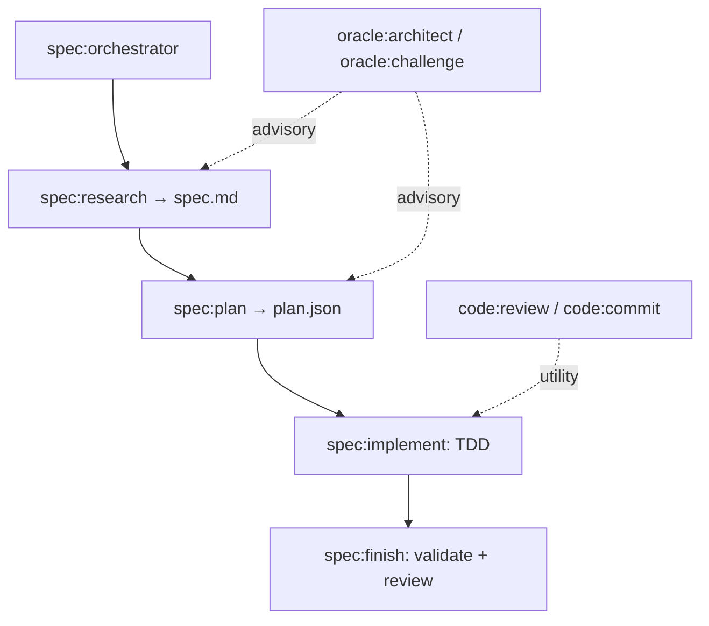

Created: 2026-06-02 09:12
#note

**Atelier** is Martin C. Richards's open-source [[Harness Engineering|agent harness]] for Claude Code, and a useful concrete example of how a harness is composed from modular skills. An *atelier* is a workshop where a master and assistants work together: the agent is the assistant, the codebase is the workshop, and the skills encode how the engineer likes things done. It is installable via `npx skills add martinffx/atelier`.

## Three Namespaces

Atelier comprises **34 skills** organised into three namespaces. The central design insight is that different kinds of knowledge should behave differently in an agentic context, so collapsing them into a single format would lose meaningful distinctions.

| Namespace | Type | Invocation | Output | Flexibility |
|-----------|------|------------|--------|-------------|
| `spec:` | Workflow | User or previous skill | Artifact | Follow exactly |
| `oracle:` | Thinking | Context-driven | Guidance | Adapt to context |
| `code:` | Utility | User | Result | Use as needed |

The **`spec:`** skills are sequential and artifact-producing, implementing the [[Research-Plan-Implement Loop]]: `spec:research` explores the codebase and produces `spec.md`; `spec:plan` breaks that into tasks as `plan.json`; `spec:implement` executes with TDD; `spec:finish` validates and runs a review pass; and `spec:orchestrator` routes between them. The **`oracle:`** skills are advisory and adapt to context: `oracle:architect` applies domain-driven design patterns, while `oracle:challenge` deliberately pokes holes in the proposed approach. The **`code:`** skills are utilities such as review and commit helpers, reached for as needed. Atelier also ships language-specific skills (Drizzle, Fastify, FastAPI, SQLAlchemy, and others) that auto-activate based on the technology in use.

## How It Evolved

Atelier's history illustrates why [[Agentic AI Frameworks|skills]] matter. The first version (August 2025) was a rigid sub-agent chain in a waterfall style — context-reader feeds requirements-gatherer feeds spec-writer — which could not handle the back-and-forth real development requires. An intermediate version (January 2026) used a living `spec.md` with delta markers (`ADDED`, `MODIFIED`, `REMOVED`) for brownfield changes, but remained too ceremonial. The current version dropped the ceremony because skills let knowledge be captured in a form the agent discovers on its own by context, removing the need for the human to act as the orchestrator. Each iteration taught a lesson: the rigid version showed that backflow matters; the ceremonial one, that process should be invisible until needed.

## The Broader Lesson

Richards's explicit recommendation is *not* to adopt Atelier wholesale. His TypeScript opinions and architecture preferences are his own. The value is in the idea that an agent's harness should be engineered with the same care as the software it produces. The advice is to build one's own harness, starting from the RPI loop, and to add skills for how one writes code, tests, and thinks about design.

## References
1. [Atelier (GitHub repository) — Martin Richards](https://github.com/martinffx/atelier)
2. [Building Your Own Agent Harness — Martin C. Richards](https://www.martinrichards.me/post/building_your_own_agent_harness/)

#### Tags
#harness_engineering #agentic_ai #ai_agents #claude_code #skills #spec_driven_development
