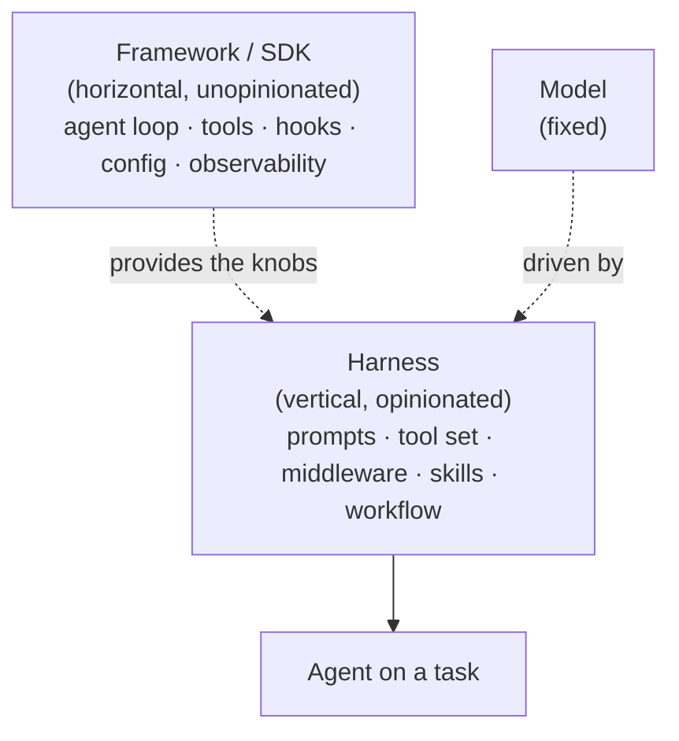
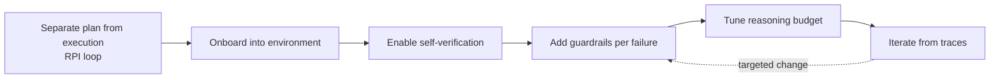

Created: 2026-06-09 10:30
#note

This note is a practical companion to [[Harness Engineering]]: where the hub note defines *what* a harness is and *why* it matters, this note addresses *how* one is built from nothing. It assembles the bootstrapping sequence, the conceptual boundary between a harness and the framework it sits on, and the failure modes that recur when teams attempt to engineer one. The guidance is deliberately framework-neutral; the same method applies whether the underlying agent loop is driven by Claude Code, Pydantic AI, a deep-agents stack, or a bespoke loop.

## Harness Versus Framework

A recurring source of confusion is the relationship between an agent **harness** and an agent **framework** or **SDK**. The two occupy different layers, and conflating them leads either to bloated frameworks that smuggle in opinions or to harnesses that reinvent plumbing.

A framework or SDK is **horizontal and unopinionated**. It is the library one builds *with*: it supplies the agent loop, the tool-invocation protocol (frequently the [[MCP Protocol]]), message streaming, hook points, configuration, and observability hooks. It does not encode how any particular task should be approached.

A harness is **vertical and opinionated**. It is the scaffolding assembled around *one model* for *one task domain*: the system prompts, the curated tool set, the deterministic middleware, the [[Agentic AI Frameworks|skills]], and the workflow such as the [[Research-Plan-Implement Loop]]. It encodes how a particular engineer or team builds a particular kind of agent. [[Atelier (Agent Harness)|Atelier]] is a harness; a productised [[Managed Agent Harness (Bedrock AgentCore)|managed harness]] wraps the same idea behind configuration.

The cleanest formulation borrows the `agent = model + harness` equation: the framework provides the *knobs* and the instrumentation around them, while the harness is a specific, domain-tuned *setting* of those knobs together with a workflow and a skill set. A harness can exist without a heavyweight framework — a directory of skills over a CLI agent is already a harness — but a framework without a harness is an undifferentiated agent loop. The engineering leverage lives in the harness; the framework merely makes it cheaper to express.

## Why Build One at All

The economic argument is the same one that motivates [[Harness Engineering]] generally: the gap between frontier models narrows with each release, so *how* a model is used dominates *which* model is used. A harness converts unpredictable, spiky model behaviour into a process where success is the likely outcome rather than the lucky one. It pursues two goals — raising the probability that the agent is correct on the first attempt, and providing a feedback loop that self-corrects before output reaches a human. Both goals are engineering problems, addressable incrementally, which is precisely why a harness can be built from scratch rather than purchased.

## The Bootstrapping Sequence

A harness is best grown, not designed up front. The following sequence reflects the convergent practice of multiple practitioners; each step is independently useful, so the harness delivers value before it is complete.

**Start with the workflow, not the tooling.** The single highest-leverage move is to separate planning from execution — the [[Research-Plan-Implement Loop]]. Before any middleware or custom tool exists, instruct the agent to research the environment, produce a plan as an inspectable artefact, and only then implement. Treating the plan as shared, mutable state that a human can correct inline (the [[Plan Annotation Cycle]]) closes most of the gap on the first iteration without writing a line of code.

**Onboard the agent into its environment.** Agents waste effort on error-prone discovery. A start-up step that maps the working directory, locates available tooling, and states the conventions in force performs context engineering *on behalf of* the agent. This is the proactive form of harness building: teaching the agent how the engineer thinks before it makes a mistake.

**Give the agent a way to verify itself.** The most common silent failure is an agent that writes a solution, re-reads its own work, judges it acceptable, and stops. The remedy pairs a prompt instruction — verify against the task specification rather than against one's own code — with a deterministic check that intercepts the agent before it exits and forces a verification pass. Fast, programmatic feedback (filtered test runs, screenshot scripts, linters) is what lets the agent self-correct rather than declare premature victory.

**Add guardrails reactively, one observed failure at a time.** This is the reactive definition of harness engineering: every time the agent makes a mistake, engineer a solution so it never makes that mistake again. A guardrail that detects repeated edits to the same file and nudges the agent to reconsider its approach (loop detection) is a typical example. Such guardrails are engineered around *today's* model weaknesses and should be expected to dissolve as models improve; they are debt to be retired, not permanent architecture.

**Tune the reasoning budget.** Reasoning compute is itself a tunable resource. A useful default is high reasoning for planning, lower reasoning during the bulk of implementation, and high reasoning again for verification. Running everything at maximum reasoning can score *worse* because of timeouts, so the allocation matters.

**Iterate from traces, not intuition.** The improvement loop is itself a process: collect execution traces, analyse the failures, and translate each into a targeted harness change. This is analogous to boosting — each iteration focuses on the mistakes of the previous run. Observability is therefore not a reporting afterthought but the feedback signal that drives the whole discipline.

## Design Tensions to Hold

Two tensions recur and are worth naming explicitly.

The first is **scaffold the harness, not the model's reasoning path**. Long staged checklists and heavy prompt scaffolding can backfire on capable models, which pattern-match the scaffold instead of reasoning. The skill is to constrain the *environment and process* while leaving the *reasoning* free. Harness components that micromanage how the model thinks tend to age badly.

The second is **per-model tailoring**. A harness iterated for one model often underperforms on another, because different models respond to different prompting. A harness should therefore keep its model-specific assumptions isolated and selectable rather than baked into shared scaffolding, so that swapping the model does not silently degrade quality.

## When Not to Build One

Harness engineering is a late stage of maturity. It is reached only after a team has stopped treating the agent as a chatbot, has reproduced enough of its own manual work to know what good looks like, and has learned when *not* to reach for an agent at all. Building elaborate scaffolding before that understanding exists produces a harness that encodes the wrong process. The honest starting point is a minimal RPI loop with one fast feedback mechanism; everything else is added only once a real failure justifies it.

## Significance

Building a harness from scratch reframes agent quality as an engineering discipline rather than a property inherited from the model. The transferable method is small: separate planning from execution, onboard the agent into its environment, give it fast feedback so it can self-verify, add guardrails reactively while expecting them to dissolve, tune reasoning as a resource, and let traces drive every subsequent change. The specific tools matter less than the discipline that selects them.

## References

1. [Harness Engineering — Birgitta Böckeler, Martin Fowler / Thoughtworks](https://martinfowler.com/articles/exploring-gen-ai/harness-engineering.html)
2. [Building Your Own Agent Harness — Martin C. Richards](https://www.martinrichards.me/post/building_your_own_agent_harness/)
3. [Improving Deep Agents with Harness Engineering — LangChain](https://blog.langchain.com/improving-deep-agents-with-harness-engineering/)
4. [My AI Adoption Journey — Mitchell Hashimoto](https://mitchellh.com/writing/my-ai-adoption-journey)

## Related Topics

[[Harness Engineering]], [[Research-Plan-Implement Loop]], [[Plan Annotation Cycle]], [[Harness Middleware Techniques]], [[Atelier (Agent Harness)]], [[Managed Agent Harness (Bedrock AgentCore)]], [[Agentic AI Frameworks]], [[AI Agents]], [[Context Constraints for AI Agents]], [[MCP Protocol]]

#### Tags
#harness_engineering #agentic_ai #ai_agents #agent_harness #context_engineering #middleware #mlops #llm_tooling
