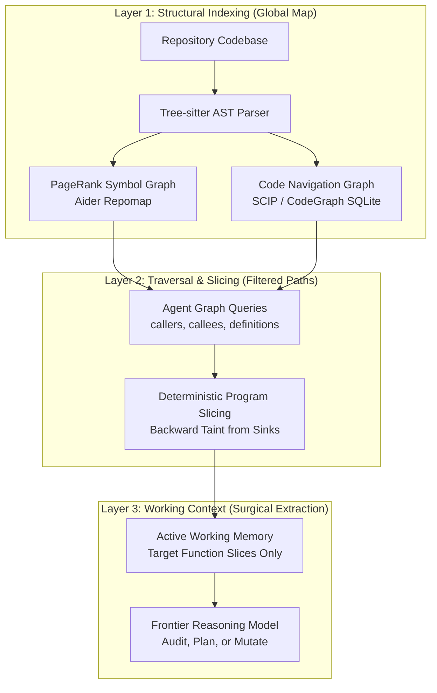

Created: 2026-10-03 16:35
#note

The rapid expansion of foundation model context windows (reaching 1M to 2M tokens in frontier architectures) has fostered a persistent misconception: that coding agents should ingest entire codebases directly into their prompt contexts. Empirical research and production implementations demonstrate the opposite: **brute-force codebase ingestion degrades reasoning quality, inflates inference latency, and accelerates hallucination**.

As documented in [[Context Constraints for AI Agents]], the relationship between provided context and agent performance follows an **inverted U-curve** (Gloaguen et al., 2026). Ingesting thousands of lines of irrelevant implementation code triggers the "lost-in-the-middle" attention phenomenon, disperses the model's focus across extraneous modules, and induces false-positive associations. 

To achieve repository-scale code understanding without context saturation, modern agent harnesses operate under a foundational design axiom: **"Give the agent a map, not the territory."** Rather than reading raw source code end-to-end, agents employ a multi-layered hierarchy combining structural indexing, deterministic program slicing, and on-demand graph navigation.



---

## 1. Deterministic Program Slicing (Backward Taint Traversal)

For auditing, debugging, and vulnerability discovery, the most token-efficient exploration technique is **program slicing**. Slicing extracts only the subset of program statements that directly or indirectly influence the state of a specific variable at a given point of interest (the "slicing criterion").

* **Backward Slicing:** Originating in classical compiler analysis (Weiser, 1981), backward slicing traces computation backwards from a critical destination (e.g. an unparameterized database query, a memory copy, or an external system call).
* **Token Reduction:** A 100,000-line service containing thousands of functions is reduced to a 100-to-200 line executable slice containing exclusively the statements that govern data reaching the sink.
* **Application in Vulnerability Discovery:** In security harnesses, exploration does not begin by browsing random files. It begins by deterministically identifying known dangerous sinks and extracting their backward dataflow graphs. The reasoning agent is presented only with the candidate slice, bypassing 99% of the repository. See [[Vulnerabilities Are Data Paths]] and [[Taint Analysis]].

---

## 2. Code Navigation Graphs (AST++ over MCP)

As detailed in [[Code Navigation Graphs]], code navigation graphs sit at Rung 2 of [[The Code-Understanding Ladder]]: they model cross-file syntactic relationships rather than raw execution dataflow.

* **Underlying Engine:** Systems like **CodeGraph**, Sourcegraph **SCIP** (System for Cross-Language Information Processing), and GitHub **stack-graphs** parse the repository using Tree-sitter and compile cross-file relationships into a lightweight local index (typically SQLite).
* **The On-Demand Interface:** Instead of using brute-force tools like `grep` or reading entire source trees, the agent interacts through specialized graph primitives exposed over the [[MCP Protocol]]:
  * `definitions(symbol_name)`: Resolves where a type, function, or interface is declared.
  * `callers(function_name)`: Identifies every call site that invokes the target function across the codebase.
  * `callees(function_name)`: Enumerates all sub-routines executed by the target function.
  * `impact(symbol_name)`: Estimates the blast radius of modifying a specific signature.
* **Architectural Advantage:** The agent hops across references with zero token consumption for intermediate file contents, retrieving full source code only after it has mathematically localized the relevant functions.

---

## 3. Repomaps and AST Skeletons (The Aider Architecture)

Pioneered by Paul Gauthier in **Aider**, the **Repomap** (Repository Map) provides an agent with global architectural awareness for a token budget of approximately 1,000 to 2,000 tokens.

### The Construction Algorithm
1. **Tree-sitter Parsing:** Every source file in the repository is parsed into an Abstract Syntax Tree (AST).
2. **Implementation Stripping:** The harness strips away all implementation bodies, loops, and variable assignments, retaining only structural skeletons:
   * Module imports and exports
   * Class declarations and inheritance hierarchies
   * Function signatures, parameter names, type annotations, and docstrings
3. **Graph Construction and PageRank:** A directed graph is constructed where nodes are code symbols (classes, functions) and edges represent reference occurrences (function calls, type usages). The harness executes **PageRank** over this graph to score the relative centrality of every symbol.
4. **Token-Budget Packing:** Given a target token budget (e.g. 1,024 tokens), the harness greedily selects the highest-scoring symbols and formats them into a compact tree representation.

```python
# Conceptual Aider Repomap Snippet (Cost: ~80 tokens)
# auth/service.py:
#   class AuthService:
#     def authenticate(username: str, token: str) -> AuthContext: ...
#     def revoke_session(session_id: UUID) -> bool: ...
# db/connection.py:
#   class DatabasePool:
#     def execute_query(query: str, params: tuple) -> ResultSet: ...
```

By reading this skeletal map, the agent understands where responsibilities reside, knows exact type signatures, and can explicitly issue targeted read requests for only the files required to solve its task.

---

## 4. Syntax-Aware Chunking and Hybrid Retrieval

Traditional document-oriented Retrieval-Augmented Generation (RAG) fails when applied to software repositories because **naive fixed-window chunking** (e.g. 500-token chunks with 50-token overlap) arbitrarily splits functions in half, separates signatures from their docstrings, and breaks variable scoping.

Modern code indexing combines three structural techniques:

* **AST-Boundary Chunking:** Chunks are defined strictly by syntax units. Tree-sitter identifies logical AST boundaries (a complete function, an entire class definition, or a standalone interface declaration). A chunk never bisects a logical block.
* **Hybrid Search (Dense + Sparse):**
  * **Sparse (BM25 / Exact Keyword):** Software engineering heavily relies on exact identifier names (`JWT_SECRET_KEY`, `handle_auth_callback`). Vector embeddings struggle with precise variable name matching; BM25 or ripgrep ensures exact symbol discovery.
  * **Dense (Neural Embeddings):** Captures conceptual intent when the exact function name is unknown (e.g., query: *"where do we handle session expiration timeouts?"*).
* **Metadata Enrichment:** Each chunk is prefixed with its fully-qualified hierarchical path (e.g. `repo/services/auth/oauth.py :: OAuthManager :: refresh_access_token`) so that the embedding model maintains structural context even when viewing an isolated method.

---

## 5. Multi-Agent Exploration Funnels (Scout-Worker Pattern)

When exploring expansive enterprise repositories, single-agent loops frequently suffer from context pollution: exploratory terminal commands (e.g. long `find`, `ls -R`, or verbose compiler outputs) fill the context window with navigational noise, degrading the model's capacity for downstream reasoning.

To preserve context purity, advanced harnesses implement a **two-tier multi-agent exploration funnel**:

| Agent Role | Model Tier | Purpose | Context Environment |
| :--- | :--- | :--- | :--- |
| **Scout Agent** | Lightweight / Fast (e.g. System 1 classifier, Flash model) | Broad exploration, directory traversal, identifier grepping, filtering 5,000 files to 3 candidates. | Disposable scratchpad; context is discarded after candidate selection. |
| **Worker Agent** | Frontier Reasoning (e.g. Claude 3.7 Sonnet, o3, Gemini Pro) | Deep semantic analysis, constraint solving, surgical patching, unit test verification. | Pristine context window containing exclusively the target file slices and structural repomap. |

This asymmetric design guarantees that the high-capacity reasoning model never expends its cognitive budget on navigational bookkeeping.

---

## Tailoring Exploration for Vulnerability Discovery Harnesses

In general coding agents, exploration is driven by developer intent (*"add a new payment endpoint"*). In automated security auditing, exploration must be **inversion-driven**:

1. **Sink-Oriented Indexing:** Instead of indexing the repository top-down, the security harness creates an inverted index mapping from known dangerous APIs (CWE sinks) outward.
2. **Call-Graph Inversion:** The harness queries backwards: *"Which public entry points can route untrusted HTTP parameters into this unconstrained memory buffer?"*
3. **Negative Space Filtering:** As detailed in [[Miscellaneous/Negative Space Architecture]], the harness prioritizes code paths that *lack* validation middleware over paths that already incorporate robust verification gates.
4. **Coupling with Deterministic Verifiers:** Once candidate paths are isolated, the harness avoids speculative reading by immediately dispatching exploit hypotheses to dynamic compiler sanitizers and sandbox execution gates. See [[Agentic Vulnerability Discovery - Eliminating False Positives with Deterministic Verification]].

---

## References

1. [Weiser, M. — Program Slicing (IEEE Transactions on Software Engineering, 1984)](https://ieeexplore.ieee.org/document/1702098)
2. [Aider Documentation — Building a Better Repository Map with Tree-Sitter and PageRank](https://aider.chat/docs/repomap.html)
3. [Gloaguen et al. — Evaluating AGENTS.md: Are Repository-Level Context Files Helpful for Coding Agents? (2026)](https://arxiv.org/abs/2602.12345)
4. [Sourcegraph — SCIP: A Better Code Indexing Format](https://github.com/sourcegraph/scip)
5. [Tree-sitter — An Incremental Parsing System for Programming Tools](https://tree-sitter.github.io/tree-sitter/)
6. [Liu et al. — Synthesizing Multi-Agent Harnesses for Vulnerability Discovery (arXiv:2604.20801)](https://arxiv.org/abs/2604.20801)

---

## Related Topics

[[Code Navigation Graphs]], [[Context Constraints for AI Agents]], [[The Code-Understanding Ladder]], [[Taint Analysis]], [[Vulnerabilities Are Data Paths]], [[Harness Engineering]], [[Building an Agent Harness from Scratch]], [[Synthesizing Multi-Agent Harnesses for Vulnerability Discovery]], [[Agentic Vulnerability Discovery - Eliminating False Positives with Deterministic Verification]]

#### Tags

#agentic_ai #codebase_exploration #repomap #ast #tree_sitter #program_slicing #static_analysis #context_management #harness_engineering #code_navigation
