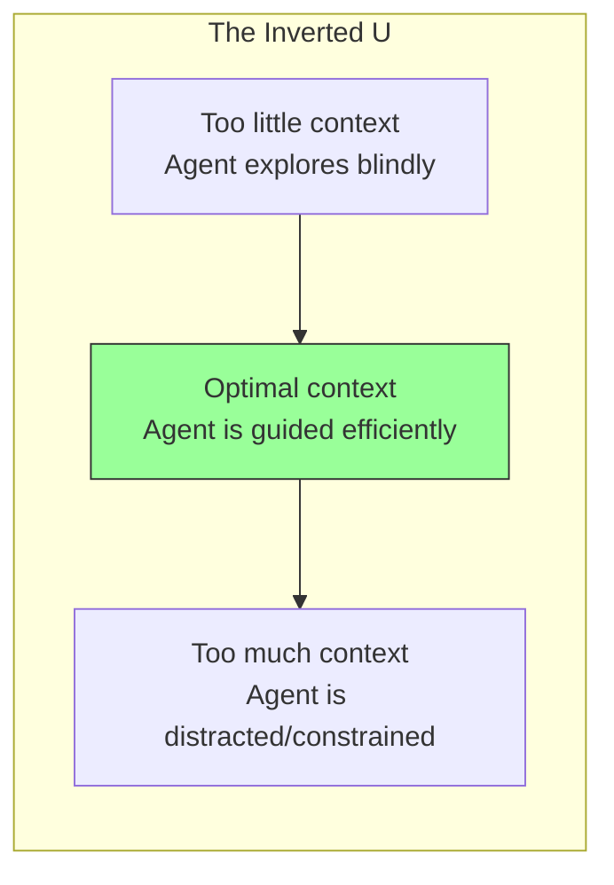
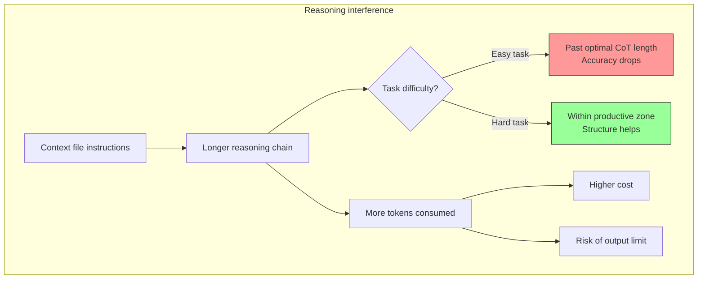

Created: 2026-02-24 16:00
#note

Providing AI agents with repository-level or project-level context files (AGENTS.md, CLAUDE.md, skills) is a widespread practice encouraged by vendors. The assumption is that more context = better performance. Recent research challenges this: [[Evaluating AGENTS.md - Are Repository-Level Context Files Helpful for Coding Agents|Gloaguen et al. (2026)]] found that context files **reduce task success rates** while increasing cost by 20%+. This connects to a broader pattern: **more information is not always more useful, and the cost of processing it is non-zero**.

The relationship between "amount of context/instruction provided" and "agent performance" follows an **inverted U-curve** — some context helps, too much hurts, and the optimal amount depends on task difficulty, model capability, and whether the information replaces genuine exploration or just adds overhead.

## The inverted U-curve of context

This pattern appears at multiple levels:

- **Context window** — the [[Oolong - Evaluating Long Context Reasoning and Aggregation Capabilities|Oolong]] benchmark shows 20-30 point accuracy drops from 55K to 175K tokens. Models degrade on aggregation tasks as context grows
- **Chain-of-thought length** — Wu et al. (2025) found accuracy follows an inverted U with CoT length. Early decomposition helps, longer chains accumulate errors. More capable models favour *shorter* chains
- **Task instructions** — Gloaguen et al. found coding agents become more "thorough" with context files (more exploration, more tool calls) but solve fewer tasks. The extra instructions delay the agent from getting to the actual fix
- **Reasoning tokens** — 22% more reasoning tokens with context files (GPT-5.2), 14% more (GPT-5.1 Mini). More thinking, worse results

This is essentially the [[Bias-Variance Tradeoff]] applied to agent behaviour. Constraints reduce variance (less random exploration) but introduce bias (systematic errors when the constraint doesn't fit the specific task).

## Types of constraints

Not all constraints are equal. Three categories with different cost/benefit profiles:

**Structural constraints** tell the agent where things are. "Tests are in tests/, we use poetry, the vault has an Inbox/ folder." These are almost always helpful because they replace exploration with direct knowledge -> giving someone a map instead of making them wander. Low risk of bias because they describe facts, not prescribe behaviour.

**Behavioural constraints** tell the agent how to act. "Always run linting before committing. Use `[[wikilinks]]` for internal references. Add 2-3 cross-links." Each one adds a step the agent must perform regardless of whether it is relevant to the current task. This is where the inverted U bites -> the constraint helps when relevant, hurts when the agent wastes time satisfying irrelevant requirements.

**Stylistic constraints** define how output should look. "Academic tone, no contractions, Mermaid diagrams." For coding agents these are mostly noise — the code either works or it doesn't. For note-writing agents they are the actual requirement. The value of a constraint is highly context-dependent.

## Where constraints should live

There are currently multiple competing formats (AGENTS.md, CLAUDE.md, .cursorrules, skills) with no single standard. The fragmentation guarantees maintenance drift when using multiple tools.

A useful separation:

| Layer | Contains | Changes how often | Examples |
|-------|----------|-------------------|----------|
| **CLAUDE.md / AGENTS.md** | Environment description: what this project is, how it is structured, non-obvious conventions | Rarely | Folder structure, owner context, Inbox workflow |
| **Skills** | Task-specific procedures: how to perform a specific operation | Occasionally | "How to write a #paper note", "How to generate flashcards" |
| **Nothing** | Things the agent can cheaply discover from the code/files itself | N/A | Test framework, directory layout, language/tooling |

The third row is the key insight from Gloaguen et al.: **the optimal context file omits everything the agent can derive on its own**. Restating discoverable information adds tokens without adding knowledge.

### Derivable vs declarative constraints

An alternative to static context files is **derivable constraints** — rules that query the actual state rather than hardcoding it. Instead of "we use pytest," write "check what test framework the repo uses." The constraint is self-updating because it reads the environment. The tradeoff: derivable constraints cost more tokens per invocation (the agent has to explore) but they never go stale.

Static/declarative constraints are cheaper per invocation but rot over time -> if the codebase evolves and the AGENTS.md does not, the agent follows outdated instructions. This is the maintenance problem: **constraints are documentation, and documentation rots**.

## Reasoning interference

The interaction between context files and model reasoning is non-trivial.

Wu et al. (2025) showed that CoT accuracy follows an inverted U-curve with length. The optimal CoT length **increases with task difficulty** but **decreases with model capability** -> more capable models prefer shorter reasoning chains. This means:

- Context files that force additional reasoning steps push the model past the optimal CoT length for easy tasks (typo fix -> why is the agent running the full test suite?)
- For hard tasks, the structure provided by context files might keep the model within the productive reasoning zone
- As models improve, the optimal amount of instruction shrinks -> today's useful context file might become tomorrow's overhead

The "overthinking" phenomenon (Kang et al., 2025) identifies two phases in reasoning: an **active phase** (making progress) and a **converged phase** (redundant tokens). RL training rewards longer reasoning during training, so models are incentivised to overthink at inference. Context files with behavioural instructions ("always check X, always run Y") essentially force the model into the converged phase for tasks where the answer was already reachable.

The Gemini failure in the [[Oolong - Evaluating Long Context Reasoning and Aggregation Capabilities|Oolong]] benchmark is an extreme case: the model exceeded output token limits during reasoning and returned nothing. Context files that trigger more thorough exploration push reasoning models closer to these limits.

## Vendor incentives

Vendors (Anthropic, OpenAI, Google) actively promote context files. The incentive alignment is worth noting:

- Context files increase input tokens (prepended to every request), reasoning tokens (+22%), and total cost (+20%)
- At ~$100-200/developer/month for Claude Code, 20% overhead = $20-40/month additional revenue per user
- Vendors see that power users (who spend the most) tend to have detailed context files -> conclude "context files = better outcomes" without controlling for user skill (selection bias)

More likely than a deliberate strategy is a **feature-complexity spiral**: vendors ship context file support as a natural feature -> users report issues -> vendors write guides recommending more detailed files -> token usage increases -> revenue increases. Nobody planned it; it emerged from the interaction between product incentives and user behaviour.

The Gloaguen paper was the first to control for this properly, and found the opposite of what vendors suggest. The optimal context file is much shorter than recommended — and "shorter" means fewer tokens, which means less revenue.

**Note:** Lulla et al. (2026) found AGENTS.md *reduces* runtime by 29% and output tokens by 17%. But they measured efficiency, not correctness. The two papers together suggest context files make agents **faster but less accurate** -> they constrain the search space (faster convergence) but sometimes in the wrong direction. An agent that finishes faster is not necessarily an agent that produces correct solutions.

## Practical implications

For designing context files and skills:

- **Keep it minimal** — only include information the agent cannot cheaply discover from the project itself. If the code is well-organised, the agent does not need a map
- **Separate environment from procedure** — CLAUDE.md for "what is this", skills for "how to do X"
- **Prefer structural over behavioural constraints** — telling the agent where things are is almost always helpful, telling it how to behave is a bet that the instruction fits the task
- **Watch for staleness** — context files are documentation, documentation rots. Consider derivable constraints for fast-changing aspects
- **Task-difficulty awareness** — detailed instructions help for complex tasks, hurt for simple ones. A one-size-fits-all context file is a compromise that serves neither well
- **Measure what matters** — efficiency (speed, token count) and correctness (task success) can move in opposite directions. Optimising for one may degrade the other

## References
1. [Gloaguen et al. — Evaluating AGENTS.md (2026)](https://arxiv.org/abs/2602.11988)
2. [Lulla et al. — On the Impact of AGENTS.md Files (2026)](https://arxiv.org/abs/2601.20404)
3. [Wu et al. — When More is Less: Understanding Chain-of-Thought Length in LLMs (2025)](https://arxiv.org/abs/2502.07266)
4. [Bertsch et al. — Oolong: Evaluating Long Context Reasoning and Aggregation (2025)](https://arxiv.org/abs/2511.02817)
5. [A Complete Guide to AGENTS.md](https://www.aihero.dev/a-complete-guide-to-agents-md)

#### Tags
#agentic_ai #agents #llm #evaluation #context_window #reasoning #bias_variance #mlops
