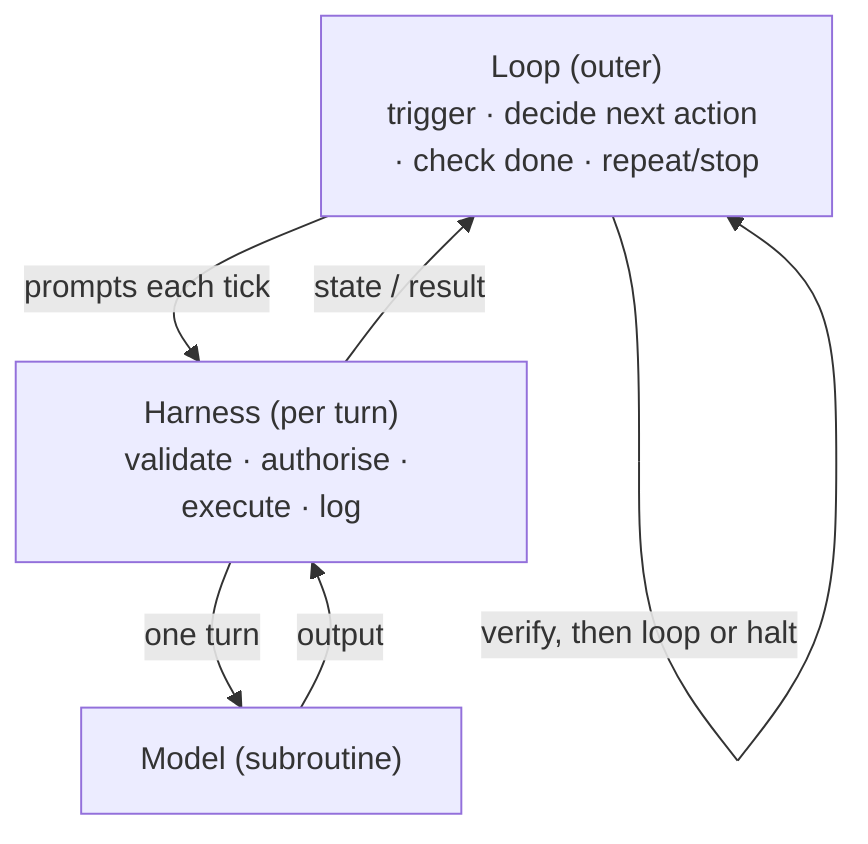

Created: 2026-06-09 11:45
#note

**Loop engineering** is the practice of designing the autonomous control loop that drives an agent — the program that prompts the model, reads its output, decides whether the goal is met, and either repeats or stops — rather than prompting the agent by hand turn by turn. It is the next rung in the lineage this vault tracks under [[Harness Engineering]]: **prompt → context → harness → loop**. Where harness engineering optimises the scaffolding that wraps a single model turn, loop engineering optimises the outer system that decides whether and how to take the *next* turn. The slogan that crystallised the idea is that one should no longer prompt agents, but design the loops that prompt them; the model becomes a subroutine and the engineer becomes the author of the loop.

## Origin

The term entered mainstream practitioner discourse in June 2026, when Peter Steinberger (creator of the OpenClaw harness) posted that builders should stop prompting coding agents and instead design loops that prompt the agents for them. Days earlier, Boris Cherny, creator of Claude Code, had given the cleaner formulation: he no longer prompts the model directly but writes loops that run continuously, prompt the model, and decide what to do; his job, he said, is to write loops. The framing is a maturity claim — a move "up one altitude" from operating an agent to authoring the system that operates it. As with much early discourse the concept is partly hype, and a fair skeptical camp dismisses it as "cron jobs with funny re-branding"; the defensible core, however, is genuine and is set out below.

## Lineage of the Loop

Loop engineering is best understood through the evolution of the agentic loop itself, from an academic pattern to multi-agent orchestration.

| Stage | What it added |
|-------|---------------|
| **ReAct** (2022) | Interleave reasoning and action: reason → act → observe → repeat. One model, one loop, a human watching. |
| **AutoGPT** (2023) | Goal-driven self-prompting. Famous for spinning forever, which seeded years of "agents are a toy" skepticism. |
| **Ralph loop** (2025) | "Ralph is a bash loop": `while :; do cat PROMPT.md \| agent; done`. The innovation was discipline, not orchestration — reset context to fixed anchor files each iteration, keep progress on disk and in git rather than a growing conversation, do one discrete unit of work per tick. |
| **Productised `/goal`** (spring 2026) | A command that runs until a validator confirms the task is done; turn-tracking built in. |
| **Orchestration loops** (2026) | A loop supervising many parallel sub-agents, scheduled on cron, with git-backed durability so work survives a crash. The current meaning of "loop engineering." |

The key distinction within the lineage is that single-agent loops (Ralph and `/goal`) are now considered baseline, while continuous *orchestration* loops that dispatch and supervise other agents are the new engineering surface.

## Harness Versus Loop

The two concepts are adjacent and complementary. A [[Harness Engineering|harness]] is the deterministic runtime that wraps a model for a single turn — it validates, authorises, executes, and logs each action the model proposes. A loop is the outer layer that decides whether and how to run the *next* turn. The most quotable definition is that a loop is "cron plus a decision-maker in the body": a cron job runs a fixed script and takes the same branches every tick, whereas a loop runs a model that reads current state, decides the next action, can self-correct, and can dispatch other agents. Harness engineering and loop engineering are therefore two altitudes of the same discipline — the harness governs one turn, the loop governs the sequence of turns.

## Anatomy of a Well-Engineered Loop

A poorly designed loop wastes tokens, runs forever, or hallucinates progress; a well-designed one is efficient, terminates correctly, and produces reliable output. The recurring ingredients are a clear goal with **testable termination conditions**, a real **tool set** so the agent can act on and observe its environment, **context management** (summarise, prune, or reset each tick to avoid overflow), explicit **termination logic** (success, failure, and escalation paths), and **genuine error adaptation** rather than retrying the same failed action. A useful template for the loop's contract names six fields: trigger, scope, action, budget, stop condition, and report.

Two themes dominate serious treatments.

**Verification is half the discipline.** The sharpest formulation from the discourse is that designing the loop is only half the work; the other half is putting something inside it that can say *no* — a test, a type check, a real error. A loop with nothing to push back is simply the agent agreeing with itself on repeat. An open loop that writes until it declares itself done is a demo; a closed loop that writes, runs, reads the result, and corrects is what works in production. This is the same self-verification insight developed in [[Harness Middleware Techniques]], lifted to the loop level.

**Cost moves to managing the loop.** Once the model writes code cheaply, the expensive part becomes running the loop around it. The failure mode everyone in production fears is infinite loops and billing surprises orders of magnitude over budget; one widely cited example is an organisation capping per-engineer tool spend after exhausting its annual AI budget in four months. The three hard stops that every mature treatment converges on are a maximum iteration count, no-progress detection (halt when the same error or empty diff recurs N times), and a token or dollar budget ceiling.

## Anchor Files and Compounding Skills

Loops depend on persistent, on-disk context so each tick does not re-derive intent. A common arrangement uses a vision file as the north star (product direction and what "done" looks like), agent-rule files for operating constraints per tick, a prompt file for the instruction piped in each iteration, and tests or type checks as the mechanism that says "no." Alongside this, repeated work is turned into named [[Agentic AI Frameworks|skills]] the loop calls: a loop that invokes sharp, tested skills compounds and gets cheaper over time, whereas a loop that re-derives everything from scratch keeps burning tokens. This mirrors the [[Research-Plan-Implement Loop]] and [[Atelier (Agent Harness)|Atelier]] philosophy of capturing knowledge as reusable, discoverable units.

## Significance

Loop engineering reframes the human role once more: from prompt author, to context curator, to harness builder, and finally to loop author who decides *what* to build while the loop decides *how* and *when* to act. It is not a claim that engineering is obsolete — someone must still define the goal, supply the verification that says "no," and set the budget that makes the loop halt. The transferable lessons are compact: a loop is cron plus a decision-maker; feedback inside the loop is what makes it trustworthy; cost has shifted from generation to loop management; and skills compound while one-off prompts burn. Read alongside [[Meta-Harness - End-to-End Optimization of Model Harnesses]], [[Self-Harness - Harnesses That Improve Themselves]] and [[Synthesizing Multi-Agent Harnesses for Vulnerability Discovery|AgentFlow]], it completes a picture where the loop and the harness around the model, not the model itself, are where the engineering leverage now lives. Self-Harness is the clearest case of the "up one altitude" move: the loop stops just prompting the model and starts rewriting the scaffolding the model runs inside. [[HarnessX (Harness Foundry)|HarnessX]] packages that as a runnable harness-and-model co-evolution loop.

## References

1. [What Is Loop Engineering? The New Meta for AI Coding Agents — MindStudio](https://www.mindstudio.ai/blog/what-is-loop-engineering-ai-coding-agents)
2. [Loop Engineering: How to Design Coding Agent Loops That Run While You Sleep — explainx.ai](https://explainx.ai/blog/loop-engineering-coding-agents-claude-code-guide-2026)
3. [Agentic Loops: From ReAct to Loop Engineering (2026 Guide) — Data Science Dojo](https://datasciencedojo.com/blog/agentic-loops-explained-from-react-to-loop-engineering-2026-guide/)
4. [The Ralph Wiggum loop — Geoffrey Huntley](https://ghuntley.com/ralph/)
5. [ReAct: Synergizing Reasoning and Acting in Language Models — arXiv:2210.03629](https://arxiv.org/abs/2210.03629)
6. [Loop Engineering — Cobus Greyling](https://cobusgreyling.substack.com/p/loop-engineering)

## Related Topics

[[Harness Engineering]], [[Building an Agent Harness from Scratch]], [[Harness Middleware Techniques]], [[Research-Plan-Implement Loop]], [[Atelier (Agent Harness)]], [[HarnessX (Harness Foundry)]], [[Harness Engineering Resources]], [[Meta-Harness - End-to-End Optimization of Model Harnesses]], [[Self-Harness - Harnesses That Improve Themselves]], [[AI Agents]], [[Context Constraints for AI Agents]], [[Agentic AI Frameworks]], [[MCP Protocol]]

#### Tags
#loop_engineering #harness_engineering #agentic_ai #ai_agents #agent_harness #context_engineering #mlops #llm_tooling
