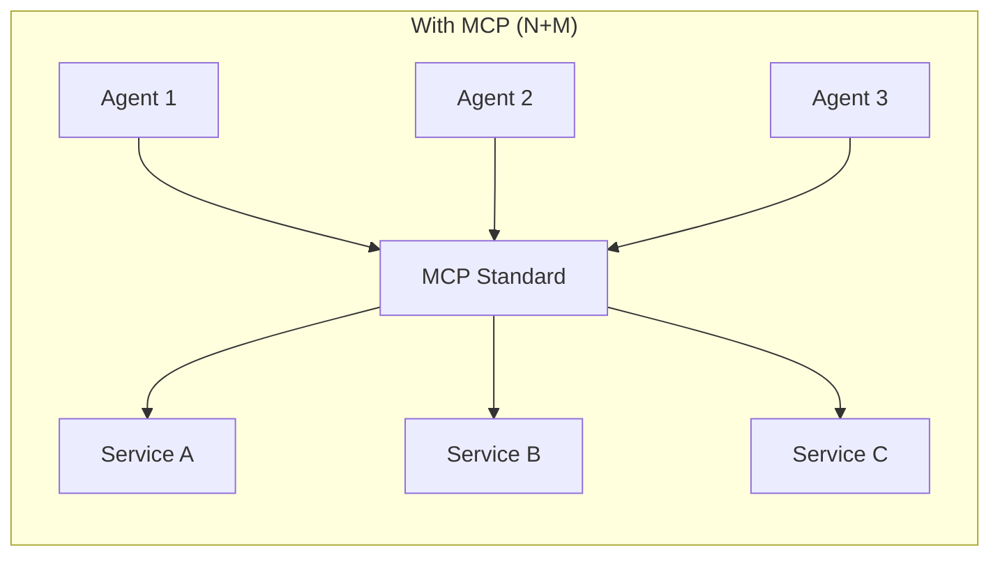
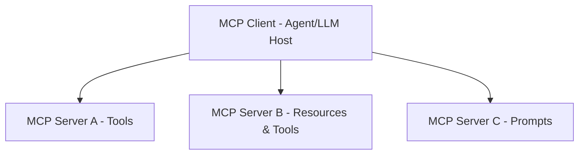

Created: 2026-02-20 10:00
#note

The **Model Context Protocol (MCP)** is an open standard developed by Anthropic for connecting large language models and AI agents to external tools, data sources, and services. It addresses the critical challenge of integrating LLMs with diverse external systems in a standardized, scalable manner. MCP has emerged as a foundational technology in the agentic AI ecosystem, enabling seamless tool integration for both local and remote use cases.

## The Integration Problem

Before MCP, organizations faced the N×M integration problem: each of N different LLMs and agents needed custom integrations with each of M external services. This resulted in duplicated effort, maintenance overhead, and incompatibility across platforms.

MCP transforms this into an N+M problem. By establishing a universal standard, each LLM implementation requires only one integration point, and each external service needs only one MCP server implementation. The diagram below illustrates this architectural shift:

## Architecture

The MCP architecture follows a client-server model. An **MCP Client** (typically an LLM application or agent host) initiates connections to multiple **MCP Servers**, each representing a different external capability or data source.

## Core Primitives

MCP defines three primary capabilities that servers expose to clients:

**Tools** are executable functions that LLMs can invoke. Tools take structured input parameters and return results. They enable agents to perform actions such as querying databases, making API calls, or executing computations.

**Resources** represent data or files that LLMs can read and analyze. Resources provide a way to expose persistent information such as file contents, database records, or configuration data without requiring the LLM to execute code.

**Prompts** are reusable, parameterized templates that encapsulate domain-specific instructions or context. They allow servers to define sophisticated multi-turn conversation patterns that agents can leverage without reimplementing the logic.

## Transport Options

MCP supports multiple transport mechanisms optimized for different deployment scenarios:

**Standard Input/Output (stdio)** provides local, bidirectional communication ideal for single-machine deployments where the client and server operate on the same host. Stdio offers simplicity and performance for tightly integrated systems.

**HTTP with Server-Sent Events (SSE)** enables remote communication across networks. The client establishes an HTTP connection and receives server messages via SSE streaming, supporting distributed architectures where servers may be geographically separated from clients.

## MCP vs Other Approaches

| Approach | Integration Effort | Standardization | Ecosystem | Remote Support |
|----------|------------------|-----------------|-----------|----------------|
| **MCP** | Low (N+M) | High (universal standard) | 1000+ servers | Native |
| **Function Calling** | Medium (per-LLM) | Low (LLM-specific) | Limited | Varies |
| **LangChain Tools** | Medium (framework-dependent) | Medium (within ecosystem) | Moderate | Framework-limited |
| **OpenAPI** | Medium (explicit spec) | High (industry standard) | Large | Native |

## Ecosystem

The MCP ecosystem has grown substantially since its introduction. The **MCP Servers Registry** hosts over 1,000 pre-built server implementations covering domains such as database connectors, API clients, file system access, and specialized services. Official repositories maintained by Anthropic provide reference implementations and best practices for server development.

## Agent-to-Agent Protocol Relationship

Google's **Agent-to-Agent Protocol** addresses a distinct but complementary problem space. While MCP focuses on connecting agents to external tools and resources, A2A protocols define how agents communicate with other agents. The architectural paradigm differs: MCP operates on a hierarchical client-server model, whereas A2A protocols enable peer-to-peer agent interactions. Organizations may employ both technologies in sophisticated multi-agent systems where individual agents leverage MCP-connected tools while coordinating through A2A communication patterns.

## References

- [MCP Official Documentation](https://modelcontextprotocol.io/)
- [Anthropic - Introducing MCP](https://www.anthropic.com/news/model-context-protocol)
- [MCP Servers Registry](https://github.com/modelcontextprotocol/servers)

#### Tags
#llm #mcp #tools #ai_agents #genai

**Related Notes:** [[AI Agents]], [[Agentic AI Frameworks]], [[Multi-Agent Systems]]
