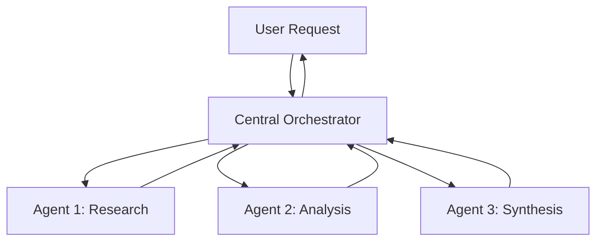
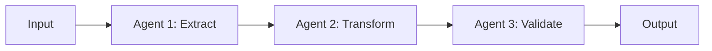
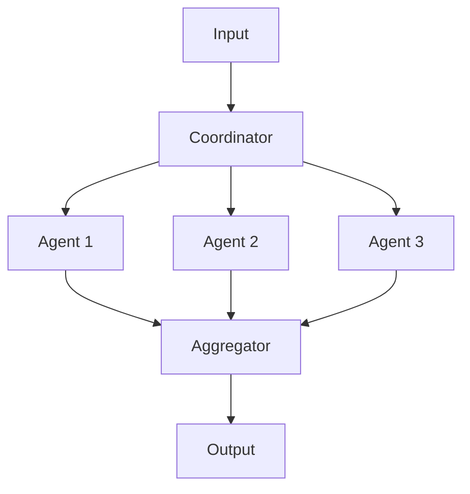

Created: 2026-02-20 10:00
#note

**Multi-agent systems** represent a paradigm shift in artificial intelligence where multiple [[AI Agents]] with specialized capabilities collaborate to solve complex problems. As tasks grow in complexity and scale, monolithic single-agent approaches prove insufficient. Multi-agent architectures enable **decomposition** of problems into manageable subtasks, **parallel processing** across distributed agents, and **resilience** through redundancy and specialization. These systems are becoming increasingly important in enterprise applications, research automation, and real-time decision-making systems.

## Motivations

**Specialization** allows individual agents to be optimized for specific domains and tasks, reducing cognitive load and improving performance on narrowly-scoped problems. An agent designed for web research operates fundamentally differently from one designed for mathematical computation.

**Parallelism** enables concurrent execution of independent tasks, significantly reducing total execution time compared to sequential processing. Multiple agents working simultaneously can accelerate complex workflows.

**Context limits** present a hard constraint on single-agent systems. By distributing work across agents with focused scopes, systems avoid exceeding token budgets and maintain higher-quality reasoning.

**Modularity** facilitates maintenance, testing, and evolution of AI systems. Individual agents can be updated, replaced, or scaled independently without restructuring the entire architecture.

## Orchestration Topologies

### Hub-and-Spoke (Hierarchical)

A **central orchestrator** routes requests to specialized worker agents and aggregates results. This pattern suits command-and-control scenarios and ensures consistent coordination.



### Pipeline (Sequential)

Output from one agent serves as input to the next, enabling **staged processing**. Each agent refines or transforms the work product.



### Peer-to-Peer (Collaborative)

Agents communicate **directly** with one another, enabling negotiation and consensus-building. This pattern supports democratic decision-making and emergent solutions.

```mermaid
graph TB
    A1[Agent 1]
    A2[Agent 2]
    A3[Agent 3]
    A4[Agent 4]

    A1 ↔ A2
    A2 ↔ A3
    A3 ↔ A4
    A4 ↔ A1
    A1 ↔ A3
    A2 ↔ A4
```

### Scatter-Gather (Fan-out/Fan-in)

A **coordinator** distributes work in parallel to multiple agents, collects results, and combines them. Ideal for **embarrassingly parallel** problems.



## Communication Protocols

Agents exchange information through multiple channels. **MCP** (Machine Controller Protocol) handles **agent-to-tool** communication, standardizing how agents invoke external resources. **A2A** (agent-to-agent) protocols enable structured message passing between agents, often using JSON schemas for type safety. **Direct function calls** provide low-latency communication within a single runtime process. See [[MCP Protocol]] for detailed specifications.

## State Management

Persistent coordination requires careful **state handling**. **Shared memory** permits agents to read and modify common data structures. **Central databases** provide durability and consistency guarantees. **Message queues** implement asynchronous handoffs and decouple agent dependencies. The **blackboard pattern** creates a central workspace where agents post partial solutions, enabling collaborative problem-solving.

## Failure Handling

Robust multi-agent systems must handle **agent failures** gracefully. **Timeouts** prevent indefinite waiting. **Retry logic** recovers from transient failures with exponential backoff. **Fallback agents** provide alternative execution paths when primary agents fail. **Dead letter queues** capture failed messages for later inspection. **Write-Ahead Logs (WAL)** ensure state consistency across agent boundaries. See [[Task Capsule Pattern]] for encapsulation strategies.

## Key Patterns

The **Critic pattern** designates an agent to evaluate other agents' outputs for quality and correctness, providing feedback loops. The **Debate pattern** structures multi-agent disagreement as a formal process where agents present arguments and counter-arguments, reaching consensus through structured dialogue. The **Supervisor pattern** assigns one agent to monitor and direct others, intervening when performance metrics degrade.

## Observability

Effective debugging and monitoring requires **cross-agent tracing**. Single execution traces must span multiple agents, capturing handoffs, latencies, and failures. Correlating logs across independent agents demands centralized collection and structured identifiers. See [[LLM Observability]] for observability frameworks.

## References

- [AutoGen - Multi-Agent Conversation](https://microsoft.github.io/autogen/)
- [CrewAI Documentation](https://docs.crewai.com/)
- [LangGraph Multi-Agent](https://langchain-ai.github.io/langgraph/)

#### Tags: #llm #ai_agents #multi_agent #orchestration #genai
