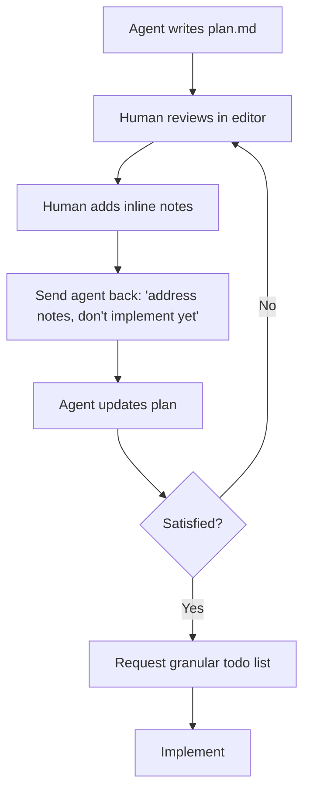

Created: 2026-06-02 09:11
#note

The **plan annotation cycle** is Boris Tane's contribution to [[Harness Engineering]] and the most distinctive part of his coding-agent workflow. It treats the plan document as **shared mutable state** between human and agent: rather than steering implementation through chat messages, the human annotates a structured plan that can be reviewed holistically and corrected precisely.

## The Cycle

After the agent writes a `plan.md` (the planning phase of the [[Research-Plan-Implement Loop]]), the human opens it and adds **inline notes directly into the document**. These notes correct assumptions, reject approaches, add constraints, or supply domain knowledge the agent lacks. The notes vary in length from two words ("not optional") to a paragraph explaining a business constraint or pasting the expected data shape.

The cycle repeats **one to six times**, guarded by an explicit *"don't implement yet"* instruction. Without that guard, the agent jumps to code the moment it judges the plan good enough — which it is not until the human says so.

## Representative Annotations

The character of the cycle is best conveyed by example notes Tane describes adding:

- *"use drizzle:generate for migrations, not raw SQL"* — domain knowledge the agent lacks.
- *"no — this should be a PATCH, not a PUT"* — correcting a wrong assumption.
- *"remove this section entirely, we don't need caching here"* — rejecting a proposed approach.
- *"the queue consumer already handles retries, so this retry logic is redundant"* — explaining why something should change.
- *"the visibility field needs to be on the list itself, not on individual items … restructure the schema section accordingly"* — redirecting an entire section.

## Why It Works

The markdown plan is a structured, complete specification that can be reviewed all at once, whereas a chat conversation must be scrolled through to reconstruct decisions. The human can think at their own pace, annotate exactly where something is wrong, and re-engage without losing context. Three rounds of annotation can transform a generic plan into one that fits perfectly into the existing system, because this is the point at which the human injects judgement the agent cannot have — product priorities, user pain points, and acceptable engineering trade-offs.

The downstream consequence is that **implementation becomes boring**: the creative work happened in the annotation cycles, so execution can run uninterrupted ("implement it all … do not stop until all tasks are completed"). The human's role shifts from architect to supervisor, and corrections during implementation become terse single sentences rather than paragraphs.

## References
1. [How I Use Claude Code — Boris Tane](https://boristane.com/blog/how-i-use-claude-code/)
2. [Building Your Own Agent Harness — Martin C. Richards](https://www.martinrichards.me/post/building_your_own_agent_harness/)

#### Tags
#harness_engineering #agentic_ai #ai_agents #claude_code #workflow #planning
