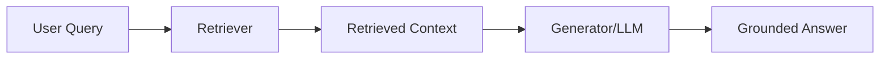
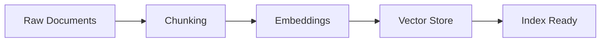
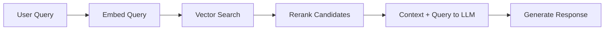

Created: 2026-02-20 10:00
#note

**Retrieval-Augmented Generation (RAG)** is a pattern that augments **LLM** generation with retrieved context from an external knowledge base. By retrieving relevant documents before generation, RAG significantly reduces hallucinations, enables knowledge beyond the model's training cutoff, and provides grounded, verifiable answers. This makes it essential for applications requiring up-to-date or domain-specific information.

## Core Flow

## Indexing Pipeline

## Query Pipeline

## Key Components

| Component | Purpose | Example |
|-----------|---------|---------|
| **Embeddings** | Convert text to vector representations | OpenAI, Cohere, all-MiniLM |
| **Vector DB** | Store and retrieve embeddings at scale | Pinecone, Weaviate, Chroma |
| **Chunker** | Split documents into retrievable units | Token-based, semantic boundaries |
| **Reranker** | Rank retrieved docs by relevance | Cross-encoder models |
| **LLM** | Generate final answer from context | GPT-4, Claude, Llama |

## Chunking Strategies

| Strategy | How It Works | Best For |
|----------|-------------|----------|
| **Fixed-size** | Split at token/word count (e.g., 512 tokens) | Simple, uniform documents |
| **Recursive** | Split by delimiters (headers, paragraphs) | Markdown, structured text |
| **Semantic** | Split at semantic boundaries | Long-form, coherent passages |
| **Document-aware** | Preserve document structure (tables, lists) | Complex layouts, mixed content |

## Vector Databases

| Database | Deployment | Hosting | Scalability | Key Strength |
|----------|-----------|---------|------------|--------------|
| **Pinecone** | Managed | Cloud-only | Multi-region | Simple, production-ready |
| **Weaviate** | Self-hosted or cloud | Both | Excellent | GraphQL API, flexible |
| **Chroma** | Lightweight | Local/cloud | Small-medium | Embedded, developer-friendly |
| **pgvector** | Self-hosted | PostgreSQL | Good | Integration with SQL |
| **FAISS** | Library | Local | CPU-optimized | High-speed similarity search |
| **Qdrant** | Self-hosted or cloud | Both | Excellent | Fast, filtering-rich |

## Retrieval Strategies

- **Dense retrieval**: Use embeddings for semantic similarity
- **Sparse retrieval**: BM25, keyword-based matching
- **Hybrid**: Combine dense and sparse (better coverage)
- **Multi-query**: Generate multiple query reformulations, retrieve for each
- **HyDE**: Hypothetical Document Embeddings (generate likely answers, embed, retrieve similar)
- **Parent-child**: Retrieve child chunks, return parent context for larger context window

## Evaluation

The **RAG Triad** measures RAG system quality:

- **Context Relevance**: Is retrieved context relevant to the query?
- **Groundedness**: Is the answer supported by the context (not hallucinated)?
- **Answer Relevance**: Does the answer address the user's query?

See [[LLM Evaluation]] for detailed evaluation frameworks and metrics.

## Common Failure Modes

| Issue | Cause | Fix |
|-------|-------|-----|
| Missing relevant documents | Poor chunking, query-document mismatch | Refine chunking, use multi-query retrieval |
| Irrelevant context retrieved | Weak embeddings, semantic gap | Use domain-tuned embeddings, reranking |
| Hallucinations despite context | Model ignores context | Few-shot prompts, stricter system instructions |
| Low latency | Large retrieval set, slow reranking | Limit retrieved docs, optimize vector DB |
| Outdated knowledge | Stale index | Implement incremental indexing, scheduled refresh |

## Advanced Patterns

**Multi-hop RAG**: Chain multiple retrieval steps to answer complex questions requiring reasoning across documents.

**Agentic RAG**: Combine RAG with agents that decide when to retrieve, what queries to run, and how to synthesize results. See [[AI Agents]], [[Agentic AI Frameworks]].

**Graph RAG**: Represent documents as knowledge graphs; retrieve via graph traversal for structured reasoning.

**Corrective RAG**: Evaluate retrieved context quality and dynamically adjust retrieval strategy if confidence is low.

## References
1. [LangChain RAG docs](https://python.langchain.com/docs/tutorials/rag/)
2. [LlamaIndex RAG guide](https://docs.llamaindex.ai/en/stable/)
3. [Pinecone - What is RAG?](https://www.pinecone.io/learn/retrieval-augmented-generation/)

#### Tags
#llm #rag #retrieval #embeddings #genai