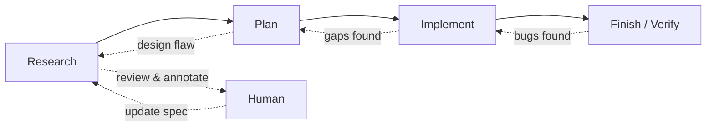

Created: 2026-06-02 09:10
#note

The **Research → Plan → Implement loop** (abbreviated **RPI**, a name coined by the HumanLayer project) is the foundational workflow pattern of [[Harness Engineering]]. Its governing principle, stated directly by Boris Tane, is that the agent must never write code until a written plan has been reviewed and approved. The pattern separates *thinking* from *typing*: architectural decisions are made and validated in a plan artifact before any implementation begins.

## The Three Phases

**Research** directs the agent to read the relevant codebase deeply and to write its findings into a persistent markdown file rather than producing only a verbal summary in chat. This artifact becomes the human's review surface, allowing misunderstandings to be corrected before they propagate. The most expensive failure mode in AI-assisted coding is not bad syntax but an implementation that works in isolation while breaking the surrounding system; the research phase exists to prevent it.

**Plan** takes the research and produces a detailed specification — approach, code snippets, file paths to be modified, and trade-offs. The plan is then refined through the [[Plan Annotation Cycle]] until it is correct.

**Implement** executes the approved plan, ideally with test-driven development, marking tasks complete as it proceeds. Because every decision was made upfront, implementation becomes deliberately mechanical rather than creative.

## Backflow Is Expected

The defining feature of RPI is that it is *not* waterfall. Backflow between phases is normal and expected: planning may reveal a design flaw and return to research; implementation may surface missing tasks and return to planning; verification may find bugs and return to implementation. This tolerance for iteration is what distinguishes RPI from rigid spec-driven development, which breaks the moment reality diverges from the specification.

## Convergent Evolution

A notable observation is that multiple practitioners arrived at this pattern independently. HumanLayer named it RPI; Jesse Vincent's *Superpowers* framework landed on the same shape; Martin Richards's [[Atelier (Agent Harness)|Atelier]] is another instance; and Boris Tane's workflow follows the same structure. The convergence suggests the value lies in the discipline itself rather than in any single implementation — the harness just encodes that discipline so the engineer does not have to remember it each time.

## References
1. [Building Your Own Agent Harness — Martin C. Richards](https://www.martinrichards.me/post/building_your_own_agent_harness/)
2. [How I Use Claude Code — Boris Tane](https://boristane.com/blog/how-i-use-claude-code/)
3. [HumanLayer (GitHub)](https://github.com/humanlayer/humanlayer)
4. [Superpowers — Jesse Vincent (GitHub)](https://github.com/obra/superpowers)

#### Tags
#harness_engineering #agentic_ai #rpi #spec_driven_development #ai_agents #workflow
