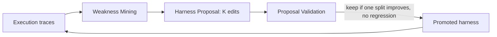

Created: 2026-07-07 10:44
#paper

## Summary

- **Self-Harness** (Zhang et al., 2026, Shanghai AI Laboratory) is a paradigm where an LLM agent improves its own [[Harness Engineering|harness]], with no human engineer and no stronger external agent guiding it.
- It builds on the premise of [[Harness Engineering]]: performance depends on the model *and* the harness, and since different models fail in different ways, good harness design is model-specific. Hand-engineering scales badly as models multiply and change fast.
- The paper frames three ways to improve a harness: human engineering (people revise it by hand), [[Meta-Harness - End-to-End Optimization of Model Harnesses|Meta-Harness]] style (a stronger external agent guides a weaker target), and Self-Harness (the agent tailors the harness to its own base model).
- On Terminal-Bench-2.0 it improves 3 models from different families, with absolute gains up to 21.4 points and relative gains up to 138%, the model kept frozen.

The paper also gives the most complete harness definition in this vault: the prompts, tools, runtime policies, memory, verification rules, parsers, permissions and recovery procedures that let a fixed model act in an environment. Self-Harness only edits this surface, never the weights.

## Main idea

Self-Harness is an iterative loop over a fixed base model, with three stages:

1. **Weakness Mining** -> cluster execution traces from past runs to find model-specific failure patterns, instead of reacting to single errors.
2. **Harness Proposal** -> from the mined evidence, generate `K` distinct proposal bundles in parallel. Diversity is pushed *across* branches (each branch can target a different failure mechanism, harness surface, or hypothesis), minimality is enforced *within* a branch (each edit touches only the surface it needs, keeps unrelated behaviour, and avoids rewriting the control architecture).
3. **Proposal Validation** -> regression test the candidates and keep an edit only if it improves at least one split without degrading the other. This gate is what stops the loop from overfitting to the traces it saw.

## In deep

The contrast with [[Meta-Harness - End-to-End Optimization of Model Harnesses|Meta-Harness]] is the useful part. Meta-Harness gives an external proposer full read access to all prior code, scores and traces, then searches harness *code*. Self-Harness has the target agent turn its *own* clustered failures into bounded, validated edits to its *own* harness. Both drop coarse pass/fail feedback and treat the harness as the design variable. They differ in who does the improving.

This also closes the loop on [[Harness Engineering]]. Hashimoto's reactive definition is: every time the agent makes a mistake, engineer the harness so it never repeats it. Self-Harness automates that reactive step. The bet is that a model's own failure traces carry enough signal to repair the harness for that model, and that a regression gate is enough to keep the repairs honest.

## Experiments

Benchmark: Terminal-Bench-2.0 (terminal interaction in containers). Every run starts from the same minimal DeepAgent-based harness. Base models: MiniMax M2.5, Qwen3.5-35B-A3B, GLM-5. Held-in tasks expose their traces to the loop, held-out tasks never do.

| Model | Held-in | Held-out |
|-------|---------|----------|
| MiniMax M2.5 | 43.0% -> 50.0% | 40.5% -> 61.9% |
| Qwen3.5-35B-A3B | 15.1% -> 36.0% | 23.8% -> 38.1% |
| GLM-5 | 47.7% -> 57.0% | 42.9% -> 57.1% |

Notes:

- The retained edits are model-specific: different models keep different harness changes. This is the direct evidence for the model-specific claim.
- Held-out gains are as large or larger than held-in for MiniMax and GLM-5, so the loop is fixing real model traits, not memorising tasks.
- The weakest base model (Qwen) gets the biggest relative lift, more than doubling its held-in pass rate.

## Limits

- Weakness Mining needs informative, clusterable traces. Opaque or poorly instrumented tasks starve it. This is the same telemetry dependence noted for [[Meta-Harness - End-to-End Optimization of Model Harnesses|Meta-Harness]], and the [[Harness Middleware Techniques]] / [[LLM Observability|observability]] point that traces are the feedback signal for harness improvement.
- The cost of the loop is not accounted for: tokens spent in mining and validation per point of gain.
- Results are Terminal-Bench-2.0 deltas only, with no human-effort baseline to say how much hand-engineering the discovered edits replace.

## Ideas for future works

- Self and Meta as a spectrum rather than a choice: the agent mines its own weaknesses (Self) while a stronger proposer drafts the edits (Meta).
- A runtime version already exists: [[HarnessX (Harness Foundry)|HarnessX]] ships a `MetaHarness` component that runs this self-observation-and-edit loop as code.
- Tie the validation gate back to [[Loop Engineering]], where "something in the loop that can say no" is half the discipline.

## References
1. [Paper (arXiv:2606.09498)](https://arxiv.org/abs/2606.09498)
2. [HTML version](https://arxiv.org/html/2606.09498v1)
3. Authors: Hangfan Zhang, Shao Zhang, et al. (Shanghai AI Laboratory, submitted 8 Jun 2026)
4. [Terminal-Bench leaderboard](https://www.tbench.ai/)

## Related Topics
[[Harness Engineering]], [[Meta-Harness - End-to-End Optimization of Model Harnesses]], [[Synthesizing Multi-Agent Harnesses for Vulnerability Discovery]], [[Loop Engineering]], [[HarnessX (Harness Foundry)]], [[Harness Middleware Techniques]], [[Harness Engineering Resources]], [[LLM Observability]], [[Context Constraints for AI Agents]]

#### Tags
#paper #agentic_ai #agents #harness_engineering #harness_synthesis #self_improving_agents #llm #mlops
