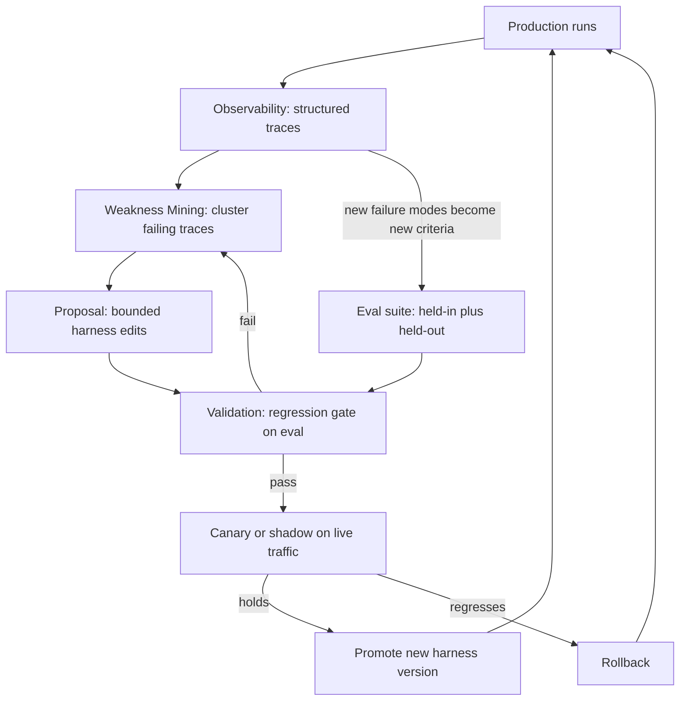
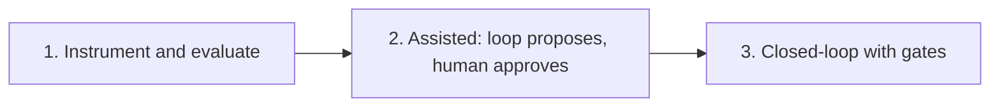

Created: 2026-07-07 10:45
#note

Design notes for a production-ready **self-improving harness** tuned to a single goal or project. It ties together the concepts already in this vault: [[Harness Engineering]], [[Loop Engineering]], [[Self-Harness - Harnesses That Improve Themselves|Self-Harness]], [[Meta-Harness - End-to-End Optimization of Model Harnesses|Meta-Harness]] and the [[HarnessX (Harness Foundry)|HarnessX]] runtime.

Target, stated mechanically: an agent whose harness ingests its own production traces, scores them, surfaces failure patterns, proposes bounded edits, and ships the edits that pass a regression gate, with the base model frozen. The loop is the product, not the model. A good sanity check from the discourse: "self-improving" only means something if the loop has a **target**, a **measurement surface** and a **stop rule**. Without those three the agent just optimises inside whatever blind spots the harness failed to name.

## Is this just MLOps?

Mostly yes, and the field already has a name for the branch: **AgentOps**. The lineage is DevOps -> MLOps -> LLMOps -> AgentOps. Each layer inherits the one below and adds a concern:

- **MLOps**: manage a model's lifecycle, fight accuracy drift as data changes.
- **LLMOps**: a subset of MLOps for LLMs. Manage prompts, non-deterministic outputs, LLM-judge evaluation, token cost.
- **AgentOps**: manage autonomy. Trace multi-step reasoning, debug tool-call chains, enforce budgets and guardrails, add human-in-the-loop checkpoints.

So the honest framing is: this is AgentOps, a descendant of MLOps, but with the **harness** as the trained artifact. Three things break the classic MLOps mental model:

1. **The artifact under CI/CD is the harness, not the weights.** You version and promote prompts, tools, policies, verifiers, memory and permissions. The model is often a frozen third-party API.
2. **The model is not stable and is model-specific.** It drifts under you. A tracked study saw a fixed model fall from 84% to 51% on the same task over three months, same prompt, same input. And [[Self-Harness - Harnesses That Improve Themselves|Self-Harness]] shows the right harness depends on the model, so a vendor upgrade can force a re-tune. This is concept drift, except the drift is in your dependency, not your data.
3. **The optimizer is itself an agent editing the thing that governs an agent.** That is recursive and needs containment. Classic MLOps never promoted a change that could quietly widen a model's tool permissions or spending authority.

Mapping the vocabulary:

| MLOps concept | Self-improving harness equivalent |
|---|---|
| Model weights (the shipped artifact) | Harness config: prompts, tools, policies, verifiers, memory, permissions |
| Training data | Project eval suite plus production traces |
| Gradient descent / training loop | Weakness Mining -> Proposal -> Validation, a search over harness edits |
| Model registry and versioning | Versioned harness-config registry |
| CI/CD | Promote edits behind eval gates, canary, rollback |
| Data / concept drift | Model-version drift (vendor upgrades under you) plus eval drift |
| Ground-truth labels | Programmatic verifiers and tests, where the goal is verifiable |
| Model monitoring | Trace observability plus live eval and drift detectors |
| Feature store | Skill / tool registry and memory |

## Architecture: five pillars

A working harness is usually described as five layers: instructions, tools, retrieval, orchestration, evaluators. For a production self-improving system it helps to read them as five operational pillars, roughly in dependency order.

1. **Composable harness (the artifact).** Everything as versioned, diffable config, like [[HarnessX (Harness Foundry)|HarnessX]]'s processor pipeline. Rule of thumb: if an edit is not a reviewable diff with a clean rollback, it should not be automated.
2. **Observability.** Structured traces of every run: decisions, tool calls, errors, tokens, cost, latency. This is the substrate the loop feeds on. The [[Meta-Harness - End-to-End Optimization of Model Harnesses|Meta-Harness]] lesson applies: do not compress the feedback, keep the raw traces. See [[LLM Observability]] and [[Langfuse]]. Build this before any self-improvement.
3. **Evaluation.** A project-specific task suite with verifiers, split into held-in and held-out, LLM judges where exact match does not fit, and statistical gates to survive noise. This is the layer that closes the loop and the single highest-return investment. See [[LLM Evaluation]].
4. **Improvement loop.** Weakness Mining (cluster failing traces) -> Proposal (bounded, minimal edits) -> Validation (regression gate). This is [[Self-Harness - Harnesses That Improve Themselves|Self-Harness]]'s structure.
5. **Promotion and containment.** Shadow or canary the new harness, gate on the held-out eval, keep human approval for edits that touch permissions or budgets, version everything for instant rollback, and cap the spend of the loop itself.

Ownership splits cleanly and the seam is where things fail. Product owns the **criteria** (what "good" means for this goal). Engineering owns **orchestration and tools**. The dangerous seam is instructions and retrieval, where prompts ship without product review and retrieval ships without testing against the criteria.

## The loop

## What is genuinely new versus MLOps

- The feedback signal is raw execution traces, not a scalar loss.
- The training signal is a verifier you have to build per goal, not a labelled dataset you already own.
- The optimizer is an agent editing governance, so promotion is a safety event, not just an accuracy event.
- You version config, not weights, so CI is fast and cheap. The catch is that all the trust moves into the eval.

## Risks and where it breaks

- **The eval is the whole game.** A weak eval does not make the agent better, it Goodharts it into looking better. Keep a held-out gold set the optimizer never sees, and grow the eval from real production failures, or the agent hits a ceiling set by test coverage rather than its actual capability.
- **Overfitting to the eval.** Same fix: held-out plus periodic refresh.
- **Noise.** Non-determinism makes single-run regression tests lie. Use multiple samples and a statistical gate, not one pass or fail. Resource configuration alone can swing benchmark scores by several points.
- **Cost of the outer loop.** Track tokens per point of gain, or the optimizer becomes the biggest line item.
- **Model drift under you.** A vendor upgrade can undo a tuned harness. Treat a model-version change as a trigger to re-run the eval.
- **Containment.** The meta-agent must not be able to promote an edit that expands autonomy, permissions or budget without a human.

## A maturity path

Do not start at closed-loop autonomy. It is the last rung.

1. **Instrument and evaluate.** Get trustworthy traces and a real eval, and measure the current harness. This alone is worth it.
2. **Assisted improvement.** The loop mines weaknesses and proposes edits, a human approves. You find out cheaply whether your eval is trustworthy.
3. **Closed-loop with gates.** Only for the edit classes your eval can actually vouch for.

## Where the pieces we studied fit

- [[HarnessX (Harness Foundry)|HarnessX]] gives the composable runtime plus the two evolution loops (harness search, and RL model training on reward-annotated trajectories) as code.
- [[Self-Harness - Harnesses That Improve Themselves|Self-Harness]] is the improvement loop itself, run by the agent on its own base model.
- [[Meta-Harness - End-to-End Optimization of Model Harnesses|Meta-Harness]] is the variant where a stronger external agent proposes the edits.
- [[LLM Observability]], [[Langfuse]] and [[LLM Evaluation]] are the observability and eval pillars.
- A Terminal-Bench-style, project-specific eval is the measurement surface the whole loop gates on.

## References
1. [The Self-Improving Agent Is a Production Pattern Now - Adaline (Nilesh Barla)](https://labs.adaline.ai/p/self-improving-ai-agent-production-pattern)
2. [What is AgentOps? - Red Hat](https://www.redhat.com/en/topics/ai/agentops)
3. [LLMOps vs MLOps: Key Differences and Evolution - ideas2it](https://www.ideas2it.com/blogs/llmops-vs-mlops-key-differences-and-evolution)
4. [DevOps vs MLOps vs LLMOps vs AIOps vs AgentOps - Intellibytes](https://intellibytes.substack.com/p/devops-vs-mlops-vs-llmops-vs-aiops)
5. Airbnb Data Flywheel, closed-loop feedback cutting retraining from months to weeks: [arXiv:2510.06674](https://arxiv.org/abs/2510.06674)
6. Voyager (frozen model, growing skill library): [arXiv:2305.16291](https://arxiv.org/abs/2305.16291). Reflexion (verbal feedback into context): [arXiv:2303.11366](https://arxiv.org/abs/2303.11366)
7. Model drift over time (84% to 51%): [arXiv:2307.09009](https://arxiv.org/abs/2307.09009)
8. Self-Harness: [arXiv:2606.09498](https://arxiv.org/abs/2606.09498)

## Related Topics
[[Harness Engineering]], [[Loop Engineering]], [[Self-Harness - Harnesses That Improve Themselves]], [[Meta-Harness - End-to-End Optimization of Model Harnesses]], [[HarnessX (Harness Foundry)]], [[Harness Engineering Resources]], [[Harness Middleware Techniques]], [[LLM Observability]], [[LLM Evaluation]], [[Langfuse]], [[Managed Agent Harness (Bedrock AgentCore)]], [[Context Constraints for AI Agents]]

#### Tags
#harness_engineering #agentic_ai #ai_agents #mlops #llmops #agentops #self_improving_agents #llm_evaluation #llm_observability #system_design
