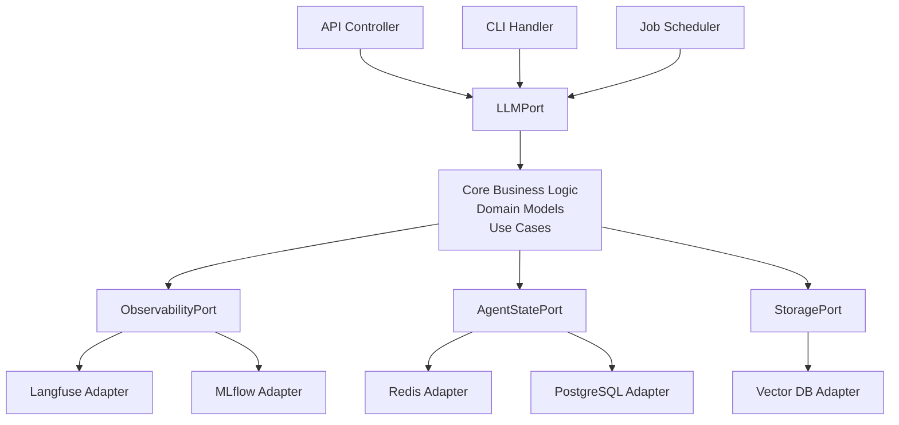

Created: 2026-02-20 10:00
#note

**Hexagonal Architecture** (also called **Ports and Adapters**) is an architectural pattern that isolates core business logic from external dependencies through well-defined interfaces. The core domain remains independent of implementation details, enabling rapid framework changes without rewriting business logic. This pattern is particularly valuable for AI systems where LLM frameworks, observability tools, and infrastructure components evolve constantly. Rather than tightly coupling an AI agent to LangChain or a specific database, hexagonal architecture allows substitution of these components as better alternatives emerge.

## Concept

Hexagonal architecture organizes a system around a central hexagon representing core business logic, with interfaces called **ports** extending outward. A **port** is an abstract interface defining how the core communicates with the external world. An **adapter** is a concrete implementation that translates between the core and a specific external technology.

**Primary (driving) adapters** initiate interactions with the core—these include API controllers, CLI handlers, and scheduled job triggers. **Secondary (driven) adapters** respond to requests from the core—these include database adapters, LLM providers, and observability integrations.

## Why It Matters for AI Systems

AI frameworks change rapidly. LangChain dominates today but PydanticAI, Anthropic SDK, and other frameworks are production-ready alternatives. With hexagonal architecture, swapping frameworks requires changing a single adapter while core business logic remains untouched. The same applies to observability tools: transitioning from [[Langfuse]] to [[MLflow]] or internal solutions requires adapter changes only. Core agent logic, decision trees, and domain knowledge persist unchanged across infrastructure evolution.

## Structure

A typical hexagonal AI system follows this project organization. The **core/** directory contains domain models (Agent, Task, Message), port definitions (LLMPort, StatePort), and use cases (ExecuteAgent, ProcessFeedback). The **adapters/** directory houses implementations: **llm_adapters/** contains LangChain and PydanticAI implementations, **storage_adapters/** implements database and vector store logic, and **observability_adapters/** manages [[Langfuse]] and [[MLflow]] integrations. The **entrypoints/** directory defines API routes, CLI commands, and scheduled job handlers that translate external requests into core operations.

## Port Definitions

Ports are protocol definitions describing how external systems communicate with the core. The **LLMPort** defines methods for completion requests, streaming responses, and token counting—any LLM provider can implement this interface. The **ObservabilityPort** defines logging, tracing, and metric recording without prescribing which observability platform handles these operations. The **AgentStatePort** abstracts agent persistence, enabling storage in Redis, PostgreSQL, or specialized AI state databases. Each port specifies behavior contracts without implementation details.

## Adapter Implementation

Adapters translate between port interfaces and external technology APIs. A **LangChain adapter** implements LLMPort by accepting core requests, translating them to LangChain's message format, executing the LangChain chain, and returning results in core domain objects. A **PydanticAI adapter** performs identical translation but uses PydanticAI's APIs instead. From the core's perspective, both adapters are interchangeable—the core never knows which LLM framework actually processes requests.

## Dependency Injection

Adapters are instantiated and injected into the core at application startup. Production environments use real adapters (actual LangChain instances, real database connections, actual observability platforms). Testing environments use mock adapters that simulate behavior without external dependencies. This separation enables comprehensive unit testing of core logic without configuring databases or LLM accounts.

## Benefits

| Benefit | Impact |
|---------|--------|
| **Testability** | Core logic tests run without external dependencies using mock adapters |
| **Flexibility** | Swap frameworks, databases, and tools by changing one adapter class |
| **Maintainability** | Core business logic remains stable while infrastructure evolves |
| **Evolution** | Add new adapters for emerging frameworks without modifying core code |
| **Team Velocity** | Different teams own framework adapters independently |

## References

- [Alistair Cockburn - Hexagonal Architecture](https://alistair.cockburn.us/hexagonal-architecture/)
- [Netflix Tech Blog - Ready for changes with Hexagonal Architecture](https://netflixtechblog.com/ready-for-changes-with-hexagonal-architecture-b315ec967749)

#### Tags: #architecture #design_patterns #mlops #ai_agents