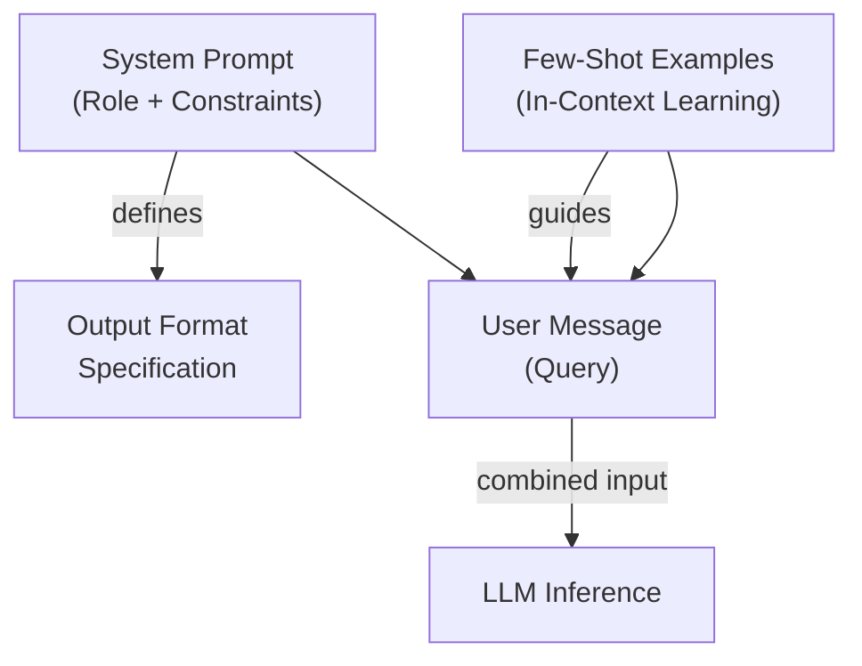

Created: 2026-02-20 10:00
#note

**Prompts as Infrastructure** represents a paradigm shift in large language model operations, treating prompt engineering with the same production rigor applied to traditional software engineering. Rather than embedding prompts as static strings scattered throughout codebases, organizations increasingly recognize that prompts constitute versioned, tested, and deployable artifacts that warrant dedicated lifecycle management. This approach enables reproducibility, auditability, and rapid iteration in generative AI systems.

## The Problem

Prompts embedded as hardcoded strings within application code create significant operational challenges. Changes to prompts leave no audit trail, making it impossible to determine which version produced a particular output or when a regression occurred. Without version control, rolling back to a previous prompt requires code changes and redeploys. Teams lack visibility into prompt performance variations across versions, and debugging issues becomes difficult when no mechanism exists to correlate outputs with their generating prompts. The scattered nature of prompt management prevents knowledge sharing across teams and increases the likelihood of duplicating effort.

## Core Principles

| Principle | Implication |
|-----------|------------|
| **Version Controlled** | Prompts tracked in Git or prompt registries with full history and blame attribution |
| **Tested** | Output format validation, hallucination detection, and regression testing as continuous processes |
| **Monitored** | Per-version quality metrics, error rates, latency, and token costs tracked in production |
| **Deployable** | Promotion from staging to production without code changes; rollback capability via version aliases |

## Prompt Anatomy

A well-structured prompt comprises the system message establishing role and constraints, few-shot examples demonstrating desired behavior, and the user message containing the actual query. Output format specifications ensure structured, parseable responses.

## Storage Approaches

| Approach | Pros | Cons | Recommendation |
|----------|------|------|-----------------|
| Git Files | Version history, code review, no external dependency | Limited querying, manual retrieval, unstructured | Use for archival and CI/CD |
| [[Langfuse]] / [[MLflow]] | Prompt registry, metadata, production deployment | Additional infrastructure, vendor lock-in | Primary for active prompts |
| Hybrid | Best of both: Git for versioning, registry for serving | Increased complexity | Recommended approach |

## Templating Patterns

Prompts should support parameterized templates enabling dynamic content injection without modifying the prompt structure itself. Variables demarcate regions where context-specific information is inserted, typically using delimiters like mustache syntax or dollar-sign notation. Storing parameterized prompts as YAML documents preserves structure while enabling templating engines to resolve variables at runtime. This separation of prompt template from runtime variables maintains prompt reusability and clarity.

## Testing Prompts

Output format testing validates that LLM responses conform to specified schemas using JSON schema validation or parsing assertions. Hallucination detection involves comparing outputs against ground truth or knowledge bases to identify fabricated information. Regression testing establishes baseline outputs for standard inputs, flagging performance degradation when prompt changes are introduced. [[LLM Evaluation]] frameworks provide systematic approaches to quantifying prompt quality across multiple dimensions.

## Versioning Strategy

Prompts should be versioned semantically, with production versions identified through aliases rather than hardcoding version numbers in code. A production alias always points to the current recommended version, while staging aliases enable testing before promotion. Promoting a prompt to production involves updating the alias to reference the new version. Rollback occurs by reverting the alias to a previous version, enabling rapid incident response without code deployment.

## Production Monitoring

Each prompt version requires continuous monitoring across key metrics: quality scores measuring correctness, error rates tracking parsing failures or API issues, latency indicating performance characteristics, and token consumption affecting costs. Dashboards should segment metrics by prompt version enabling rapid identification of degradations. Anomaly detection alerts teams to unexpected behavior changes, facilitating proactive issue resolution before user impact.

## References
1. [Langfuse Prompt Management](https://langfuse.com/docs/prompts)
2. [MLflow Prompt Registry](https://mlflow.org/docs/latest/llms/prompt-registry/index.html)

#### Tags
#mlops #prompts #versioning #llm #genai