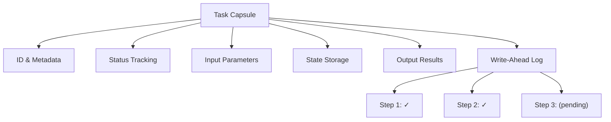
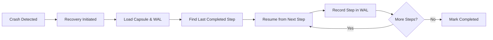

Created: 2026-02-20 10:00
#note

Long-running **[[AI Agents]]** tasks face inherent reliability challenges. When a task crashes mid-execution due to server failure, network timeouts, or resource exhaustion, the entire computation is lost. Without durability guarantees, the system must restart from the beginning, wasting compute resources and potentially leaving the application in an inconsistent state. The **Task Capsule Pattern** addresses this challenge by wrapping each task in a durable envelope that survives failures and enables seamless resumable execution.

## The Problem

Agent tasks often involve complex workflows spanning minutes or hours. Each step may interact with external APIs, process large datasets, or perform expensive computations. When failures occur—whether from infrastructure issues or application errors—tasks lack a mechanism to recover gracefully. Naive retry approaches restart from step one, recomputing completed work and potentially triggering duplicate side effects (e.g., sending duplicate emails or creating duplicate database records). The lack of state persistence creates operational fragility and undermines system reliability.

## Concept

The **Task Capsule** is a container that wraps a task with five critical elements: a unique **ID**, **status** (pending, running, completed, failed), **input** parameters, **state** (intermediate results), and **output**. At the core lies a **Write-Ahead Log (WAL)**—an immutable record of each completed step. Before executing step N, the capsule checks the WAL; if step N-1 is recorded, execution resumes at step N. This approach guarantees that no work is duplicated and the system can recover to the exact point of failure.

## Recovery Flow

When a capsule fails, recovery follows a deterministic sequence. The system detects the crash, initiates recovery, and loads the capsule and its associated WAL from durable storage. It then scans the WAL to identify the last successfully completed step, then resumes execution from the subsequent step. This process continues until all steps are recorded in the WAL and the capsule transitions to completed status.

## Implementation Approach

A durable agent framework executes tasks by managing the capsule lifecycle. On startup, the agent loads or creates a capsule, setting its status to **running**. Before executing each step, the agent checks if that step is recorded in the WAL; if present, it skips execution and advances to the next step. After successful execution, the step is recorded in the WAL through a durable write. If any step fails, the capsule status is updated to **failed** with the error message persisted. On restart, the agent recognizes the failure and either retries from the recovery point or alerts operators depending on policy.

## Storage Options

| Storage | Strengths | Weaknesses |
|---------|-----------|-----------|
| **PostgreSQL** | ACID transactions, strong consistency, relational queries | Higher operational overhead, latency |
| **DynamoDB** | Serverless, auto-scaling, global tables | Eventual consistency, higher costs at scale |
| **Redis** | Sub-millisecond latency, simple API | Volatile, requires replication for durability |
| **SQLite** | Zero-ops, embedded, fast | Single-instance only, not distributed |

## Idempotency

Steps must be designed to tolerate re-execution without adverse effects. The **idempotency key** pattern ensures side-effecting operations (emails, API calls, database writes) are safely repeated. Each operation is tagged with a unique **deduplication key** derived from the task ID and step number. External systems (email providers, APIs) check this key before processing; if already seen, the operation is skipped. This prevents duplicate emails or payments while maintaining correctness across failures and retries.

## Related Patterns

The **[[Saga Pattern]]** orchestrates distributed transactions across multiple services using compensating actions to rollback on failure. The **[[Outbox Pattern]]** guarantees reliable event publishing by writing events to a local outbox table atomically with business logic, then publishing asynchronously. **Job Queues** (Celery, RabbitMQ) distribute work across worker nodes, complementing the capsule pattern for massively scalable systems. These patterns often work synergistically with task capsules to build resilient distributed systems.

## References

- [Martin Kleppmann - Designing Data-Intensive Applications](https://dataintensive.net/)
- [AWS - Saga Pattern](https://docs.aws.amazon.com/prescriptive-guidance/latest/modernization-data-persistence/saga-pattern.html)

#### Tags: #mlops #reliability #patterns #ai_agents #architecture