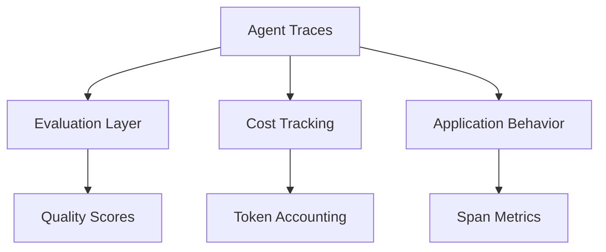

Created: 2026-02-20 10:00
#note

Observability in Large Language Model powered applications is critical for understanding system behavior at production scale. Unlike traditional software systems, LLM applications introduce variability in outputs, non-deterministic latencies, and complex chains of reasoning that span multiple models and external tools. Observability enables teams to diagnose failures, optimize costs, and measure quality in real-time across the entire application lifecycle. Without comprehensive observability, organizations remain blind to performance degradation, unexpected cost spikes, and silent quality regressions that users experience.

## Three-Layer Observability Stack

LLM observability comprises three complementary layers that together provide end-to-end visibility into application behavior and economics.

**Agent Traces** capture structured events representing spans and metrics across the entire request lifecycle. **Evaluation** attaches quality judgments—scores from language model judges or heuristic scorers—to execution traces. **Cost Tracking** aggregates token consumption and compute expenditure for budgeting and resource optimization.

## Key Concepts

| Term | Definition |
|------|-----------|
| **Trace** | Complete record of a single user request from start to finish, containing all nested operations |
| **Span** | Individual operation within a trace, such as an LLM inference, database query, or tool invocation |
| **Generation** | Output produced by an LLM within a span, including tokens, logprobs, and reasoning |
| **Score** | Quantitative evaluation of generation quality, assigned by judges or heuristic evaluators |
| **Dataset** | Curated collection of examples used for reproducible evaluation and regression testing |

## Tool Landscape

| Platform | Strength | Best For |
|----------|----------|----------|
| [[Langfuse]] | Developer-friendly, open-source, strong trace UI | Early-stage teams, cost-conscious organizations |
| Braintrust | Evals-first design, model-based judges | Continuous evaluation, quality assurance |
| [[MLflow]] 3.0+ | Ecosystem integration, experiment tracking | ML teams already using MLflow infrastructure |
| Arize Phoenix | Large-scale analytics, drift detection | Production monitoring at enterprise scale |
| LangSmith | LangChain integration, prompt management | Teams heavily invested in LangChain ecosystem |
| W&B Weave | Experiment tracking, team collaboration | Organizations using Weights & Biases platform |
| OpenLLMetry | Open-source, minimal dependencies | Privacy-conscious teams, on-prem deployment |

## OpenTelemetry for AI

OpenTelemetry emerges as the industry standard for distributed tracing across LLM applications. The OpenTelemetry semantic conventions for generative AI define standardized attribute names and structures that enable interoperability between observability tools. Key conventions include **gen_ai.system** (identifying the AI platform such as OpenAI or Anthropic), **gen_ai.request.model** (the specific model identifier), **gen_ai.usage.input_tokens** (input token count), and **gen_ai.usage.output_tokens** (completion tokens). These conventions allow organizations to migrate between observability platforms without rewriting instrumentation, reducing vendor lock-in and enabling cost-aware tool selection.

## Instrumentation Patterns

**Auto-instrumentation** uses libraries and framework patches to automatically emit traces without modifying application code. Frameworks like LangChain and LlamaIndex provide built-in exporters; patching libraries intercept library calls at runtime to capture spans. This approach minimizes code changes but may miss custom logic outside instrumented libraries.

**Manual instrumentation** requires developers to explicitly create spans and record attributes within application code. While more verbose, manual instrumentation provides precise control over what is captured and allows tracking of business logic, custom tool calls, and application-specific branching. Most production systems employ a hybrid approach: auto-instrumentation for framework operations combined with manual spans for unique application behavior.

## What to Track

| Metric | Purpose | Signal |
|--------|---------|--------|
| **Latency** | Time from request to response | Model delays, infrastructure issues |
| **Token Usage** | Input and output token counts | Cost prediction, quota management |
| **Error Rate** | Proportion of failed requests | Reliability, service health |
| **Quality Scores** | Judge or heuristic assessments | Output correctness, user satisfaction |
| **Tool Call Success** | Agent tool invocation outcomes | Reasoning quality, planning failures |
| **Retry Rate** | Proportion of requests requiring retry | Transient failure patterns, system instability |

## Evaluation Integration

Attaching evaluation scores to traces enables continuous quality assurance without separate evaluation pipelines. After a trace completes, an **offline evaluation framework** can asynchronously compute scores using language model judges, heuristics, or reference-based metrics. Linking scores back to the original trace creates a queryable dataset for debugging regressions, analyzing failure patterns, and comparing model versions. This pattern transforms evaluation from a batch process into a real-time feedback mechanism that surfaces quality issues immediately, enabling rapid iteration on prompts, retrieval strategies, and tool compositions. See [[LLM Evaluation]] for detailed scoring approaches.

## References

- [OpenTelemetry Semantic Conventions for GenAI](https://opentelemetry.io/docs/specs/semconv/gen-ai/)
- [Langfuse Documentation](https://langfuse.com/docs)
- [MLflow LLM Tracing](https://mlflow.org/docs/latest/llms/tracing/index.html)

#### Tags: #mlops #observability #tracing #llm #genai