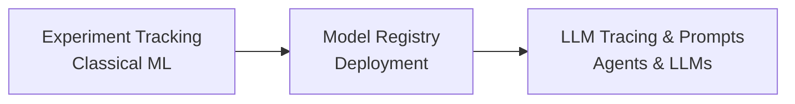

Created: 2026-02-20 10:00
#note

**MLflow** is an open-source platform that manages the complete lifecycle of machine learning and LLM applications. Originally designed for traditional ML experiment tracking and model management, MLflow has evolved significantly with the release of version 3.0 in 2025, which introduced native LLM tracing, a **Prompt Registry**, and first-class support for agentic AI workflows. This evolution positions MLflow as a unified platform spanning from classical supervised learning through advanced LLM applications.

## Scope

MLflow encompasses three primary domains: **classical ML experiment tracking**, **model registry and deployment**, and **LLM tracing and prompt management**. Experiment tracking records metrics, parameters, artifacts, and metadata for reproducibility and comparison. The model registry provides a centralized store for model versions, stage transitions, and deployment orchestration. LLM features added in version 3.0 include distributed tracing of LLM chains, prompt versioning, and native integrations with agent frameworks.

## MLflow 3.0 LLM Features

MLflow 3.0 introduces **native tracing for LLM applications**, capturing spans across chains, tool calls, and agent steps without external instrumentation. The **Prompt Registry** provides versioned, tagged prompt templates with A/B testing capabilities and runtime retrieval. Auto-instrumentation means that calls to popular LLM providers and frameworks are automatically traced, reducing boilerplate code. The platform supports Model Context Protocol (MCP) for dynamic tool discovery and execution. Built-in **LLM-as-judge** evaluation enables rapid quality assessment of model outputs. With integrations for 20+ major frameworks and providers, MLflow accommodates diverse technology stacks. The unification of classical ML and LLM workflows under one platform allows teams to co-manage traditional feature engineering pipelines alongside prompt optimization and fine-tuning experiments.

## Experiment Tracking

Traditional ML experiment tracking in MLflow records each model training run as a discrete experiment. Developers log metrics (accuracy, loss), parameters (learning rate, batch size), artifacts (model files, plots), and tags (dataset version, hyperparameter strategy). The MLflow UI enables side-by-side comparison of runs, filtering by metrics or parameters, and identification of best-performing configurations. This historical record supports reproducibility and accelerates hyperparameter tuning workflows. Metrics are queryable and plottable, facilitating data-driven decisions about model selection and iteration.

## Prompt Registry

The **Prompt Registry** in MLflow 3.0 manages versioned prompt templates as first-class artifacts. Developers define prompts with variable placeholders, commit them with metadata, and retrieve them at runtime by name and optional alias (e.g., "production", "staging"). Each prompt version is immutable and linked to evaluation results and traces that used it. Aliases enable A/B testing where multiple prompt versions are deployed concurrently, with trace instrumentation identifying which version produced each output. This decoupling of prompt iteration from application code deployment accelerates experimentation and facilitates rapid feature engineering for LLM applications.

## Evaluation

MLflow provides the `mlflow.evaluate()` function for systematic model assessment. The workflow accepts a model, dataset, and optional evaluator—either a built-in LLM-as-judge (for tasks like summarization or question-answering) or a custom Python function. For LLM outputs, built-in judges assess relevance, coherence, correctness, or domain-specific criteria using configurable rubrics. Results are logged as metrics tied to the experiment run, creating historical records of model quality over iterations. This integrated evaluation workflow reduces friction in running large-scale quality assessments and enables continuous quality gates in MLOps pipelines.

## Comparison with Alternatives

| Dimension | MLflow | [[Langfuse]] | Braintrust |
|-----------|--------|------------|----------|
| **Experiment Tracking** | Core; ML-focused | Not a focus | Not a focus |
| **LLM Tracing** | Native (v3.0) | First-class | Yes |
| **Prompt Management** | Prompt Registry (v3.0) | Core feature | Minimal |
| **Datasets** | Run artifacts | Built-in; linked to evals | Emphasis on collaborative labeling |
| **Self-hosted** | Yes | Yes (Docker, K8s) | Limited |
| **Model Registry** | Full lifecycle | Not included | Not included |
| **Best Suited For** | Unified ML+LLM pipelines | LLM-specific observability | Collaborative LLM evaluation |

MLflow is optimal for teams managing both classical ML and LLM workloads under unified infrastructure. Langfuse specializes in LLM observability and prompt iteration. Braintrust excels at collaborative human-in-the-loop evaluation.

## References

- [MLflow Documentation](https://mlflow.org/docs/latest/)
- [MLflow 3.0 Announcement](https://mlflow.org/blog/mlflow-3-0)
- [MLflow GitHub](https://github.com/mlflow/mlflow)

#### Tags: #mlops #observability #mlflow #tracing #ml #llm