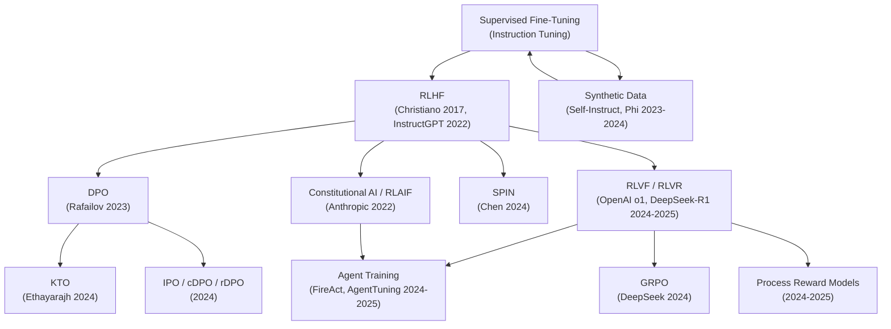

Created: 2026-03-03 10:00
#note

The landscape of LLM post-training has evolved rapidly since 2017, shifting from purely supervised approaches to sophisticated reinforcement learning pipelines that align model behaviour with human preferences, verifiable correctness, and constitutional principles. This note maps the evolution of key training and alignment techniques, from foundational [[RLHF - Reinforcement Learning from Human Feedback]] to the latest paradigms like [[RLVF - Reinforcement Learning from Verifiable Feedback]] and [[GRPO - Group Relative Policy Optimization]], and traces how the field is converging toward hybrid, scalable, and increasingly automated alignment strategies.

## Evolution Timeline

## The Three Eras of LLM Alignment

### Era 1: Supervised Alignment (2018–2022)

The earliest approach to aligning LLMs relied on **supervised fine-tuning (SFT)** — curating high-quality (instruction, output) pairs and training the model to imitate them. [[Instruction Tuning for Large Language Models- A Survey]] covers this paradigm in depth. SFT remains the foundation of every modern alignment pipeline, but it only captures surface-level patterns and cannot teach the model which outputs humans genuinely prefer when multiple valid completions exist.

[[PEFT - Parameter-Efficient Fine-Tuning]] and [[LoRA - Low-Rank Adaptation of LLMs]] made SFT practical for large models by dramatically reducing the number of trainable parameters.

### Era 2: Preference-Based Alignment (2022–2024)

**[[RLHF - Reinforcement Learning from Human Feedback]]** introduced a three-stage pipeline — SFT, reward model training from human comparisons, and PPO policy optimization — that powered ChatGPT and Claude. This era proved that human preference signals could steer models toward helpful, harmless, and honest behaviour far better than SFT alone.

However, RLHF's complexity and cost spawned a wave of alternatives:

- **[[DPO - Direct Preference Optimization]]** (2023) collapsed the three stages into a single classification loss, eliminating the reward model and PPO entirely. DPO became the practical default for many teams by 2024.
- **[[KTO - Kahneman-Tversky Optimization]]** (2024) went further, removing the need for paired preferences — binary good/bad labels suffice, grounded in prospect theory's loss aversion.
- **[[Constitutional AI]]** (Anthropic, 2022) replaced human annotators with AI feedback guided by explicit principles, enabling scalable alignment through RLAIF.
- **[[SPIN - Self-Play Fine-Tuning]]** (2024) used iterative self-play to improve alignment without any new human annotations.

### Era 3: Verifiable and Agentic Alignment (2024–present)

The release of OpenAI's o1 (September 2024) and DeepSeek-R1 (January 2025) marked a paradigm shift: **[[RLVF - Reinforcement Learning from Verifiable Feedback]]** trains models using automatically verifiable reward signals (code execution, math proof checking, format compliance) rather than learned reward models. This approach enables emergent reasoning behaviours — self-reflection, backtracking, dynamic strategy selection — without explicit supervision.

**[[GRPO - Group Relative Policy Optimization]]** eliminates the critic model entirely, using group-based advantage estimation to make RL training memory-efficient and practical at scale. [[Synthetic Data for LLM Training]] has become a critical enabler, with models like Microsoft's Phi-4 trained primarily on synthetic datasets.

**[[Agent Training and Fine-Tuning]]** extends these techniques to multi-step tool-use, planning, and environment interaction, with frameworks like FireAct, AgentTuning, and Agent-R1 pushing toward agentic RL at scale.

## Method Comparison

| Method | Stages | Feedback Type | Reward Model | Key Advantage |
|--------|--------|---------------|--------------|---------------|
| SFT | 1 | Demonstrations | None | Simple, fast |
| [[RLHF - Reinforcement Learning from Human Feedback\|RLHF]] | 3 | Human preferences | Learned | Proven at scale |
| [[DPO - Direct Preference Optimization\|DPO]] | 1 | Paired preferences | Implicit | Simple, efficient |
| [[KTO - Kahneman-Tversky Optimization\|KTO]] | 1 | Binary labels | Implicit | Minimal data needs |
| [[Constitutional AI\|CAI/RLAIF]] | 2 | AI + principles | AI-trained | Scalable, transparent |
| [[SPIN - Self-Play Fine-Tuning\|SPIN]] | Iterative | Self-play | None | No new annotations |
| [[RLVF - Reinforcement Learning from Verifiable Feedback\|RLVF]] | 2 | Verifiable outcomes | Verifier | Emergent reasoning |
| [[GRPO - Group Relative Policy Optimization\|GRPO]] | 2 | Group-relative | None (critic-free) | Memory efficient |

## Current Trends and Future Directions

The field is converging on several themes:

- **Hybrid pipelines** — production systems increasingly combine SFT + DPO/KTO for general alignment with RLVF for reasoning tasks, layering multiple techniques rather than choosing one
- **Verifiable rewards expanding** — RLVF is moving beyond math and code into medical reasoning, chemistry, and knowledge-intensive domains
- **Process rewards** — step-level verification (Process Reward Models) complements outcome-based RLVF, enabling finer-grained credit assignment
- **Inference-time compute** — more resources allocated at test time (chain-of-thought, search, verification) rather than training time
- **Agent-native training** — RL pipelines designed from the ground up for multi-turn tool-use and environment interaction
- **Democratic alignment** — Collective Constitutional AI and stakeholder-driven principle sourcing to reduce bias in alignment
- **Synthetic data loops** — models generating their own training data, with careful curation to avoid model collapse

## References

1. [Christiano et al. 2017 — Deep RL from Human Preferences](https://arxiv.org/abs/1706.03741)
2. [Ouyang et al. 2022 — InstructGPT](https://arxiv.org/abs/2203.02155)
3. [Rafailov et al. 2023 — DPO](https://arxiv.org/abs/2305.18290)
4. [Bai et al. 2022 — Constitutional AI](https://arxiv.org/abs/2212.08073)
5. [DeepSeek-R1 (Nature, 2025)](https://www.nature.com/articles/s41586-025-09422-z)
6. [Ethayarajh et al. 2024 — KTO](https://arxiv.org/abs/2402.01306)
7. [Chen et al. 2024 — SPIN](https://arxiv.org/abs/2401.01335)
8. [Sebastian Raschka — State of LLM Reasoning (2025)](https://magazine.sebastianraschka.com/p/the-state-of-llm-reasoning-model-training)

#### Tags
#llm #alignment #rlhf #fine_tuning #training #rlvf #dpo #nlp #deep_learning
