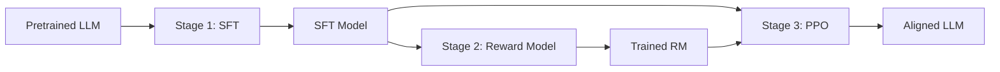

Created: 2026-03-03 10:05
#note

**Reinforcement Learning from Human Feedback (RLHF)** is the foundational alignment technique that trains [[Large Language Models (LLMs)]] to follow human preferences by learning a reward model from human comparisons and optimizing the policy via reinforcement learning. Introduced theoretically by Christiano et al. (2017) and scaled to production by OpenAI's InstructGPT (2022), RLHF powered ChatGPT, Claude, and Gemini, establishing the standard three-stage post-training pipeline that most modern alignment methods either build upon or react against. For the broader landscape, see [[LLM Training and Alignment Evolution]].

## The RLHF Pipeline

The canonical RLHF pipeline consists of three sequential stages:

### Stage 1 — Supervised Fine-Tuning (SFT)

The pretrained LLM is fine-tuned on high-quality demonstration data — curated (instruction, response) pairs that establish basic instruction-following capability and output format. This stage bridges the gap between next-token prediction and user-facing behaviour. Typically 10k–100k examples; quality matters more than quantity. See [[Instruction Tuning for Large Language Models- A Survey]] for a survey of this stage.

### Stage 2 — Reward Model Training

A **reward model (RM)** learns to predict human preferences from comparison data. Annotators are shown pairs of model outputs for the same prompt and rank them. The RM — often the SFT model with a scalar regression head — is trained using the **Bradley-Terry** pairwise preference model:

$\mathcal{L}_{RM} = -\log \sigma(r(x, y_w) - r(x, y_l))$

where $y_w$ is the preferred response and $y_l$ the rejected one. Typically trained for a single epoch on 50k–500k comparison pairs to avoid overfitting.

### Stage 3 — PPO Policy Optimization

The SFT model is fine-tuned using **Proximal Policy Optimization (PPO)** to maximise the learned reward while staying close to the original SFT policy via a KL penalty:

$\mathcal{L}_{PPO} = \mathbb{E}_{x,y \sim \pi_\theta}[r(x,y)] - \beta \cdot D_{KL}(\pi_\theta \| \pi_{ref})$

The KL term prevents **reward hacking** — the model exploiting imperfections in the reward model to achieve high scores without genuinely improving quality. Each iteration samples new outputs, scores them with the RM, estimates advantages via GAE, and updates the policy with clipped gradients.

## Key Papers

- **Christiano et al. (2017)** — [Deep RL from Human Preferences](https://arxiv.org/abs/1706.03741): proved the concept on Atari and MuJoCo tasks using <1% of interactions for human feedback
- **Stiennon et al. (2020)** — [Learning to Summarize from Human Feedback](https://arxiv.org/abs/2009.01325): first successful application to NLP (summarisation), showing a smaller RLHF model outperformed larger SFT models
- **Ouyang et al. (2022)** — [InstructGPT](https://arxiv.org/abs/2203.02155): scaled RLHF to GPT-3, demonstrating that a 1.3B RLHF model could outperform a 175B SFT model on instruction following. This became the blueprint for ChatGPT

## Known Limitations

- **Reward hacking** — the policy finds exploitable loopholes in the reward model (e.g., verbose but shallow responses that score high). Worsens as model capabilities increase
- **Preference inconsistency** — human annotators disagree, introduce biases, and suffer fatigue. A single scalar reward cannot capture pluralistic values
- **Cost and scalability** — collecting high-quality preference data is expensive and slow, creating a bottleneck for iteration speed
- **Reward model overfitting** — the RM memorises training preferences rather than generalising, especially with limited data diversity
- **Objective mismatch** — maximising RM score is a proxy for true human satisfaction; higher reward ≠ better alignment

These limitations drove the development of alternatives: [[DPO - Direct Preference Optimization]] eliminated the reward model and RL entirely, [[Constitutional AI]] replaced human feedback with AI-generated feedback, and [[RLVF - Reinforcement Learning from Verifiable Feedback]] replaced learned rewards with deterministic verifiers.

## Recent Developments (2024–2025)

- **Adoption at scale** — by 2025, ~70% of enterprises use RLHF or DPO (up from ~25% in 2023)
- **RLTHF (Targeted Human Feedback)** — combines LLM-based initial alignment with selective human corrections, achieving full-annotation-level alignment with only 6–7% of the human effort
- **Online iterative RLHF** — continuous feedback collection and real-time model updates for live deployments
- **Infrastructure maturity** — frameworks like OpenRLHF (Ray + vLLM) and TRL (HuggingFace) have made RLHF accessible to smaller teams
- **Hybrid pipelines** — production systems layer RLHF with DPO, RLAIF, and RLVF depending on the task domain

## References

1. [Christiano et al. 2017 — Deep RL from Human Preferences](https://arxiv.org/abs/1706.03741)
2. [Stiennon et al. 2020 — Learning to Summarize from Human Feedback](https://arxiv.org/abs/2009.01325)
3. [Ouyang et al. 2022 — InstructGPT](https://arxiv.org/abs/2203.02155)
4. [HuggingFace RLHF Illustrated](https://huggingface.co/blog/rlhf)
5. [RLHF 101 — CMU ML Blog](https://blog.ml.cmu.edu/2025/06/01/rlhf-101-a-technical-tutorial-on-reinforcement-learning-from-human-feedback/)
6. [RLHF Pipeline Guide — Brenndoerfer](https://mbrenndoerfer.com/writing/rlhf-pipeline-sft-reward-model-ppo-training)
7. [Lee et al. 2023 — RLAIF vs RLHF](https://arxiv.org/abs/2309.00267)

#### Tags
#rlhf #alignment #llm #reinforcement_learning #fine_tuning #training
