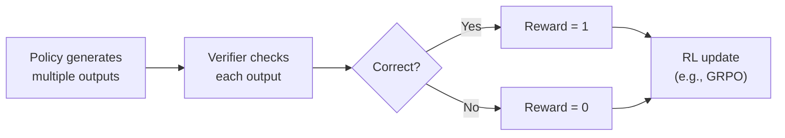

Created: 2026-03-03 10:10
#note

**Reinforcement Learning from Verifiable Feedback (RLVF)** — also called RLVR (Reinforcement Learning with Verifiable Rewards) — is a post-training paradigm that replaces learned reward models with **deterministic verifiers**: code execution, math proof checking, unit tests, format compliance rules, or any other programmatic check that provides an objective binary signal (correct/incorrect). The approach gained prominence with OpenAI's o1 (September 2024) and DeepSeek-R1 (January 2025, published in Nature), which demonstrated that models trained with verifiable rewards develop emergent reasoning behaviours — self-reflection, backtracking, and dynamic strategy selection — without explicit supervision. RLVF is a central piece of the [[LLM Training and Alignment Evolution]].

## Core Concept

The key distinction from [[RLHF - Reinforcement Learning from Human Feedback]]:

| Aspect | RLHF | RLVF |
|--------|------|------|
| **Reward source** | Human preferences (subjective) | Automated verification (objective) |
| **Reward model** | Learned neural network | Deterministic verifier |
| **Signal type** | Relative (A > B) | Binary (correct / incorrect) |
| **Bias risk** | High — annotator subjectivity | Low — verification is deterministic |
| **Best for** | Tone, style, safety, helpfulness | Correctness, reasoning, tool-use |

RLVF works because many important capabilities — mathematical reasoning, code generation, logical deduction, tool-use success — have **objectively verifiable** outcomes. Instead of asking a human "which answer is better?", RLVF runs the code, checks the proof, or validates the API response.

## Key Milestones

- **OpenAI o1 / o1-mini (September 2024)** — first production models using RLVF at scale, with process supervision for extended reasoning chains. Demonstrated massive improvements on math and coding benchmarks
- **DeepSeek-R1 (January 2025)** — showed that reasoning can emerge from pure RL (no SFT) using only accuracy rewards + format rewards. The "R1-Zero" variant, trained without any supervised data, naturally developed self-verification and exploration behaviours. Used [[GRPO - Group Relative Policy Optimization]] as the RL algorithm. Published in [Nature](https://www.nature.com/articles/s41586-025-09422-z)
- **DeepSeek-Math (2024)** — earlier work that introduced GRPO and demonstrated RLVF for mathematical reasoning (GSM8K: 82.9% → 88.2%, MATH: 46.8% → 51.7%)

## Process Rewards vs Outcome Rewards

A key research axis within RLVF is the granularity of verification:

**Outcome Reward Models (ORMs)** assign a single score after the final answer. Simple and cheap, but provide sparse feedback — the model cannot localise which reasoning step went wrong. Used in basic RLVF setups.

**Process Reward Models (PRMs)** score each intermediate reasoning step. They enable finer-grained credit assignment and allow the model to backtrack from errors mid-chain. Recent insight: a process reward can be interpreted as the change in probability of reaching the correct final answer before and after a given step.

**Hybrid approaches (2025)** tie process rewards to final outcomes — "conditional reward modelling" — ensuring step-level feedback stays calibrated to actual correctness. See [Scaling Automated Process Verifiers (ICLR 2025)](https://proceedings.iclr.cc/paper_files/paper/2025/file/98711dea460bdefe0e651ca23ec98ba2-Paper-Conference.pdf).

## Applications

- **Mathematics** — exact answer verification, formal proof integration (HERMES interleaves LLM reasoning with Lean verification)
- **Coding** — unit test execution, compilation checking, functional correctness
- **Agentic systems** — tool-call success/failure verification, multi-step plan validation. See [[Agent Training and Fine-Tuning]]
- **Expanding domains (2025–2026)** — medical reasoning (Med-RLVR), chemistry, physics, instruction-following format compliance, and knowledge-intensive tasks

## Open Problems

- **The verifier problem** — building reliable verifiers for open-ended domains (creative writing, nuanced reasoning) where no objective ground truth exists
- **Credit assignment in long traces** — efficiently propagating reward signal through extended chain-of-thought reasoning
- **Capability vs correctness** — debate over whether RLVF genuinely expands model reasoning or merely polishes existing capabilities learned during pretraining
- **Shortcut learning** — binary rewards do not prevent degenerate solutions; models may find exploits that pass verifiers without real reasoning
- **Knowledge-intensive verification** — extending RLVF to tasks requiring external knowledge (retrieval, knowledge graphs)

## Connection to Other Methods

RLVF is often combined with other techniques in production pipelines: [[RLHF - Reinforcement Learning from Human Feedback]] for subjective quality, [[DPO - Direct Preference Optimization]] for general preference alignment, and [[Constitutional AI]] for safety. The RL algorithm of choice is typically [[GRPO - Group Relative Policy Optimization]] (critic-free, memory-efficient) rather than PPO. [[Synthetic Data for LLM Training]] often provides the training prompts for RLVF pipelines.

## References

1. [DeepSeek-R1 — Nature (2025)](https://www.nature.com/articles/s41586-025-09422-z)
2. [DeepSeek-R1 — arXiv](https://arxiv.org/abs/2501.12948)
3. [DeepSeek-Math — arXiv](https://arxiv.org/abs/2402.03300)
4. [OpenAI — Improving Mathematical Reasoning with Process Supervision](https://openai.org/index/improving-mathematical-reasoning-with-process-supervision/)
5. [Survey of Process Reward Models — arXiv](https://arxiv.org/abs/2510.08049)
6. [RLVR Beyond Math and Code — Subhadip Mitra (2026)](https://subhadipmitra.com/blog/2026/rlvr-beyond-math-code/)
7. [Sebastian Raschka — State of LLM Reasoning (2025)](https://magazine.sebastianraschka.com/p/the-state-of-llm-reasoning-model-training)
8. [Label Studio — RLVR Overview](https://labelstud.io/blog/reinforcement-learning-from-verifiable-rewards/)

#### Tags
#rlvf #rlvr #alignment #llm #reinforcement_learning #reasoning #training
