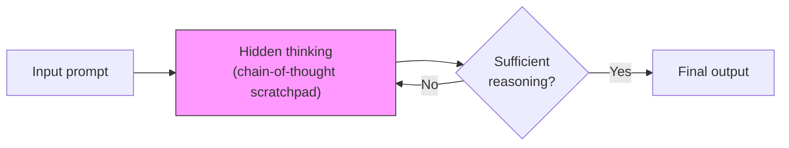

Created: 2026-03-04 14:00
#note

**Reasoning LLMs** (also called Large Reasoning Models, LRMs) are language models trained to perform extended multi-step reasoning before producing a final answer, allocating additional compute at inference time rather than relying on a single forward pass. The paradigm shift began with OpenAI's o1 (September 2024) and was consolidated by DeepSeek-R1 (January 2025), which demonstrated that reasoning behaviours — self-reflection, backtracking, dynamic strategy selection — emerge from pure reinforcement learning with verifiable rewards. Unlike standard LLMs that answer immediately, reasoning models "think" through an internal chain-of-thought scratchpad, trading latency and cost for substantially higher accuracy on complex tasks. This note covers the training, inference, and practical usage differences; for the security implications, see [[Security of Reasoning Models]].

## Training Differences

### Standard LLMs

The canonical post-training pipeline for standard LLMs follows: **Pretraining** (next-token prediction on massive corpora) → **SFT** (instruction tuning on curated examples) → **Alignment** ([[RLHF - Reinforcement Learning from Human Feedback]] or [[DPO - Direct Preference Optimization]]). The model learns to produce fluent, helpful responses in a single pass. See [[LLM Training and Alignment Evolution]] for the full landscape.

### Reasoning Models — RL-First Training

Reasoning models take a fundamentally different path where reasoning emerges as a behaviour from the training process itself, not from explicit supervision.

**DeepSeek-R1-Zero (pure RL, no SFT):**
- Trained exclusively with [[RLVF - Reinforcement Learning from Verifiable Feedback]] using [[GRPO - Group Relative Policy Optimization]]
- Only signal: accuracy rewards (did the final answer match the ground truth?)
- No supervised fine-tuning seed, no demonstrations of reasoning
- Result: self-reflection, exploration, and verification behaviours emerged spontaneously
- AIME 2024: 15.6% → 71% accuracy (86.7% with majority voting)

**DeepSeek-R1 (full pipeline):**
- Two SFT stages as seeds for reasoning and non-reasoning capabilities
- Two RL stages: first for discovering improved reasoning patterns, second for alignment with human preferences
- Still uses GRPO with verifiable rewards as the core training algorithm

**OpenAI o1/o3:**
- Large-scale RL teaching the model to hone its chain of thought
- Model learns to: refine strategies, recognise mistakes, break hard steps into simpler components, try alternative approaches when current one fails
- o3 scales RL training compute further → increased train-time compute directly boosts inference-time reasoning ability

**Why GRPO over PPO:**

| Aspect | [[GRPO - Group Relative Policy Optimization\|GRPO]] | PPO |
|--------|------|-----|
| **Critic model** | Eliminated | Required (same size as policy) |
| **Advantage computation** | Group statistics from sampled outputs | Single critic value estimate |
| **Memory overhead** | ~50% less | Baseline |
| **Best for** | RLVF with verifiable rewards | RLHF with learned reward models |

**Why not Process Reward Models?** DeepSeek-R1 opted against PRMs despite years of research on them. PRMs show good ability to rerank top-N responses and assist in guided search, but advantages are limited compared to computational overhead during large-scale RL. Simple accuracy rewards proved sufficient to produce emergent reasoning.

## Inference-Time Compute (Test-Time Scaling)

The defining characteristic of reasoning models is **inference-time scaling** — the ability to spend more compute "thinking" at test time, with accuracy improving as a predictable function of thinking budget.

### How It Works

Standard models: input → single forward pass → output.

Reasoning models: input → generate hidden "thinking tokens" (internal scratchpad) → explore problem, backtrack, verify intermediate steps → produce final output informed by reasoning.

### Scaling Law

Performance follows a **logarithmic** relationship with thinking tokens: accuracy improves at a constant rate with the log of test-time compute. Doubling the thinking budget gives a fixed improvement, with diminishing returns. This has been observed consistently across o1, Claude, and R1.

### Cost and Latency

| Metric | Reasoning model | Standard model |
|--------|----------------|----------------|
| **Cost** | 10–74x higher | Baseline |
| **Latency** | 3–10x slower | Baseline |
| **Accuracy (complex tasks)** | 20–40% better | Baseline |
| **Accuracy (simple tasks)** | Same or worse | Baseline |

DeepSeek-R1 matches o1 performance at roughly 70% lower cost, primarily through GRPO's memory efficiency and architectural optimisations.

## The Thinking Mode Toggle

A common misconception is that enabling "thinking" switches to a different model. In reality, **it is the same model with different inference-time behaviour**.

### Anthropic — Extended Thinking (budget_tokens)

Claude's extended thinking is controlled via the `thinking` parameter:

- **Minimum budget:** 1,024 tokens
- **Maximum budget:** 128,000 tokens (API)
- Budget controls how many hidden reasoning tokens the model generates before the final output
- Same model weights — toggling thinking on/off changes inference behaviour, not the model
- Accuracy improves logarithmically with budget; start low and increase incrementally

### OpenAI — reasoning_effort

OpenAI's o1/o3 models use a `reasoning_effort` parameter:

- **Low:** prunes reasoning paths early, sub-second responses for short prompts
- **Medium:** default balance, roughly 3x longer than Low
- **High:** explores multiple reasoning branches, enables backtracking and internal verification, several seconds or more

### What Happens Technically

When thinking is enabled, the model generates special "thinking tokens" (hidden from the user) as an internal scratchpad. When disabled, it goes straight to final output generation. All weights and parameters remain identical — the toggle controls whether the model activates its trained reasoning capability and how much compute it allocates to it. API calls can switch modes dynamically without model reloading.

## When to Use Reasoning vs Standard Models

### Reasoning Models Excel At

- **Multi-step STEM problems** — mathematical proofs, physics, chemistry, engineering design
- **Complex code generation and review** — system design, bug detection in large codebases, algorithm optimisation. o1 can reliably detect minor codebase changes missed by human review
- **Planning with constraints** — scheduling, resource allocation, competing requirements
- **Logical reasoning** — argument evaluation, hypothesis testing, multi-step deduction
- **Tasks with verifiable answers** — where "thinking harder" measurably improves correctness

### Standard Models Are Better For

- **Creative writing and brainstorming** — extended thinking can hurt performance by up to 36% on creative tasks (overthinking intuitive work reduces quality, like humans)
- **Simple classification and Q&A** — sentiment analysis, topic classification, factual retrieval — no benefit from multi-step reasoning
- **Real-time applications** — live chat, pair programming, customer service — latency matters more than marginal accuracy
- **Speed-critical tasks** — text formatting, data extraction, simple rephrasing

### Practical Heuristic

If the task has a **verifiable answer** and benefits from "thinking harder," use reasoning mode. If it is about **fluency, creativity, or speed**, standard mode is better or equivalent. For budget-constrained settings, use standard models by default and reserve reasoning for critical paths.

## Connection to Training Methods

Reasoning models sit at the convergence of several techniques covered in this vault:

- [[RLVF - Reinforcement Learning from Verifiable Feedback]] — the reward paradigm that makes reasoning training practical
- [[GRPO - Group Relative Policy Optimization]] — the memory-efficient RL algorithm that enables training at scale
- [[Synthetic Data for LLM Training]] — reasoning traces from strong models are distilled into smaller models (R1 distillation into Llama/Qwen)
- [[Agent Training and Fine-Tuning]] — agentic reasoning extends inference-time compute to multi-turn tool use

## References

1. [DeepSeek-R1 — Nature (2025)](https://www.nature.com/articles/s41586-025-09422-z)
2. [OpenAI — Learning to Reason with LLMs](https://openai.com/index/learning-to-reason-with-llms/)
3. [Anthropic — Visible Extended Thinking](https://www.anthropic.com/news/visible-extended-thinking)
4. [Demystifying Reasoning Models — Cameron Wolfe](https://cameronrwolfe.substack.com/p/demystifying-reasoning-models)
5. [Understanding Reasoning LLMs — Sebastian Raschka](https://magazine.sebastianraschka.com/p/understanding-reasoning-llms)
6. [Building with Extended Thinking — Claude API](https://platform.claude.com/docs/en/build-with-claude/extended-thinking)
7. [OpenAI Reasoning Models API](https://developers.openai.com/api/docs/guides/reasoning/)
8. [Test-Time Compute Scaling — HuggingFace](https://huggingface.co/blog/Kseniase/testtimecompute)
9. [Inference Scaling Laws — OpenReview](https://openreview.net/forum?id=VNckp7JEHn)

#### Tags
#llm #reasoning #inference #training #rlvf #grpo #test_time_compute #deep_learning
