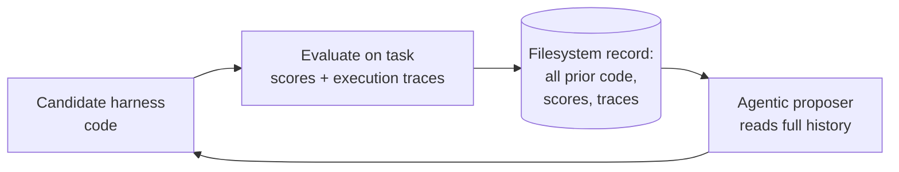

Created: 2026-06-09 11:20
#paper

Lee et al. (2026, Stanford IRIS Lab) introduce **Meta-Harness**, an outer-loop system that automatically searches over the *code* of an LLM application's harness. The framing is the same one that motivates [[Harness Engineering]]: a system's performance depends not only on model weights but on its harness — the code deciding what information to store, retrieve, and present to the model at each step. Harnesses are still written largely by hand, and the authors argue that existing text/prompt optimisers are poorly suited to tuning them because they *compress feedback too aggressively*. Meta-Harness's central move is to give its optimiser richer access to prior experience instead.

**Note:** this is a useful companion to [[Synthesizing Multi-Agent Harnesses for Vulnerability Discovery|AgentFlow]]. Both papers treat the harness, not the model, as the design variable and both reject coarse pass/fail feedback — but they search different objects. AgentFlow optimises a *multi-agent* harness encoded as a typed graph (roles, prompts, tools, topology, coordination); Meta-Harness optimises harness *code* for largely single-agent applications (context management, retrieval, coding loops). Read together they bracket the emerging "harness as a search problem" direction.

## Main idea

Meta-Harness runs an **agentic proposer** in an outer loop. Rather than seeing only a scalar score from each trial, the proposer accesses, through a filesystem, the full record of every prior candidate: its source code, its scores, and its execution traces. It uses that accumulated history to propose the next harness edit, evaluates it, and appends the result to the record. The key design claim is that *not* compressing feedback — letting the optimiser read raw traces and prior code — is what makes automated harness engineering work, where aggressive feedback compression (typical of text optimisers) fails.

## Results

Tested across three deliberately different settings to argue generality, with evidence of cross-model transfer.

| Setting | Result |
|---------|--------|
| Online text classification | **+7.7 points** over a state-of-the-art context-management system, while using **4× fewer** context tokens |
| Retrieval-augmented math reasoning | A single discovered harness improves accuracy on **200 IMO-level problems by +4.7 points** on average across **five held-out models** |
| Agentic coding (TerminalBench-2) | Discovered harnesses **surpass the best hand-engineered baselines**; reported as top among Haiku 4.5 agents (~37.6% pass) and second among Opus 4.6 agents (~76.4%) |

Notable takeaways:

- The math result is the strongest generality signal: one harness, tuned once, transfers across five unseen models -> the harness is capturing reusable problem-solving structure, not overfitting one model.
- The classification result couples a quality gain with a 4× token *reduction*, i.e. the optimiser found a cheaper *and* better context strategy — relevant to cost-aware harness design.
- Beating hand-engineered baselines on TerminalBench-2 mirrors AgentFlow's leaderboard result on the same benchmark, from a different optimisation angle.

## Ideas for future works

- **Code search vs. graph search** — combining Meta-Harness's full-trace code optimisation with AgentFlow's typed-graph structural search would let one loop edit both *what the code does* and *how agents are wired*. The respective cheap filters (Meta-Harness's trace history; AgentFlow's structural validation) are complementary.
- **Transfer as a first-class goal** — the five-model math transfer suggests measuring harnesses by how well a frozen discovered harness generalises, echoing the frozen-harness transfer claim of the concurrent AHE work. A transfer benchmark for harnesses would be valuable.
- **Cost-accounting of the outer loop** — as with AgentFlow, the economics (optimiser tokens spent per point of gain) are the missing column; richer-feedback search is presumably more expensive per step than compressed-feedback baselines.
- **Connection to [[Context Constraints for AI Agents|context engineering]]** — Meta-Harness essentially automates context engineering; the discovered context strategies are worth inspecting for transferable human-usable patterns.

Limitations noted or implied:

- "Richer access to prior experience" assumes the task exposes informative traces; opaque or poorly instrumented tasks may not benefit (the same telemetry dependence AgentFlow has).
- Results are reported as benchmark deltas; there is no human-effort baseline quantifying how much hand-engineering the discovered harnesses replace.
- The agentic proposer is itself an LLM system with its own (un-optimised) harness — a mild regress the paper does not dwell on.

## In deep

The paper's contribution is less a new algorithm than a *reframing of the feedback channel*. Prior text optimisers (in the DSPy lineage — Khattab is an author) tend to distil each trial into a compact natural-language lesson before proposing the next change. Meta-Harness argues that for harness code this throws away exactly the signal that matters, and instead persists the entire history — code, scores, traces — to a filesystem the proposer can read freely. This is the same instinct as good debugging: keep the full evidence, attribute the failure precisely, then edit. It also aligns with the broader lesson from [[Harness Middleware Techniques]] that [[LLM Observability|tracing]] is the feedback signal for harness improvement; Meta-Harness simply makes that signal machine-consumable in an automated loop.

The practical implication for builders is that an observability layer rich enough for a human to debug a harness is also the substrate an automated optimiser needs. Investment in trace capture pays twice: once for human harness engineering, once for eventual automated search.

## References

1. [Paper — arXiv:2603.28052](https://arxiv.org/abs/2603.28052)
2. [HTML version](https://arxiv.org/html/2603.28052v1)
3. Authors: Yoonho Lee, Roshen Nair, Qizheng Zhang, Kangwook Lee, Omar Khattab, Chelsea Finn (submitted 30 Mar 2026)
4. [TerminalBench-2 leaderboard](https://www.tbench.ai/)

## Code

1. [stanford-iris-lab/meta-harness](https://github.com/stanford-iris-lab/meta-harness) — reference code

## Related Topics

[[Harness Engineering]], [[Synthesizing Multi-Agent Harnesses for Vulnerability Discovery]], [[Harness Middleware Techniques]], [[Harness Engineering Resources]], [[Building an Agent Harness from Scratch]], [[Context Constraints for AI Agents]], [[LLM Observability]]

#### Tags
#agentic_ai #agents #harness_engineering #harness_synthesis #llm #context_engineering #mlops #llm_evaluation
