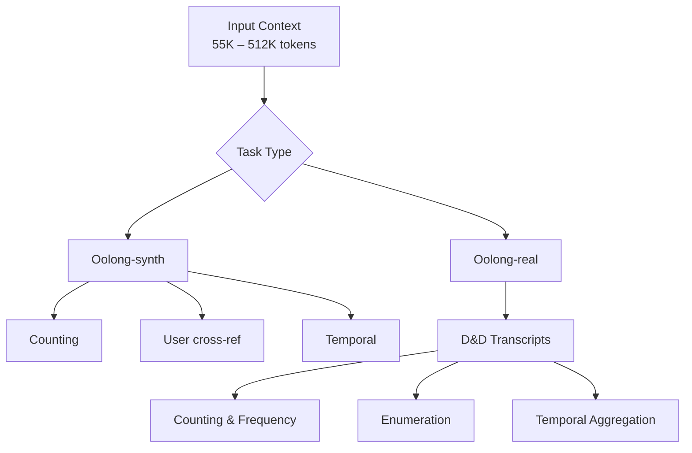

Created: 2026-02-23 14:30
#paper

Oolong (Bertsch et al., 2025) is a benchmark for evaluating **long-context reasoning and aggregation** in [[Large Language Models (LLMs)]]. The key argument is that existing long-context evals (needle-in-a-haystack and similar) mostly test retrieval from isolated sections -> models can ignore most of the context as noise. Oolong instead requires analysing every chunk of text and then aggregating the results to answer distributional questions. Even frontier models (GPT-5, Claude Sonnet 4, Gemini 2.5 Pro) score below 50% accuracy at 128K tokens.

## Main idea

Current benchmarks let models get away with sparse attention over the context. Oolong forces dense reasoning: every token is potentially relevant, there is no "haystack" to skip.

Two task sets:
- **Oolong-synth** — synthetic tasks from existing in-context learning datasets, easily ablatable. Models must implicitly label examples and reason over distributional properties (counting, user-specific patterns, temporal changes)
- **Oolong-real** — questions over real-world D&D campaign transcripts (Critical Role). Campaigns span dozens of episodes (4-5h each) -> counting events, enumerating occurrences, tracking character actions, temporal reasoning

**Key insight from ablations:** the bottleneck is identification and aggregation, not labelling. Providing gold labels for each example only improves accuracy by 0.79 to 10.9 points -> the hard part is locating relevant spans across the full context and combining them correctly.

## Results

No model exceeds 50% accuracy at 128K on either split. 20-30 point accuracy drop from 55K to 175K across all models.

Model ranking at 128K: GPT-5 > o3 > GPT-5-mini > Claude Sonnet 4.

- **Gemini 2.5 Pro** starts strong but collapses to below-random by 256K due to exceeding max output tokens during reasoning (the API returns nothing if the limit is hit)
- **DeepSeek R1** does well on Oolong-real but struggles on synth -> different failure modes for synthetic vs naturalistic aggregation
- **Claude Sonnet 4** relatively stronger on numerical reasoning and comparisons
- Temporal questions are hardest across all models

Common failure modes on real data:
- Token-budget exhaustion
- Speaker confusion (pronouns, aliases)
- Misordered enumeration in dense interleaving
- Over-aggregation / hallucination on counts

Scoring: exact match for categorical answers, partial credit ($0.75^{|y - \hat{y}|}$) for numerical answers.

## Ideas for future works

- **Learned chunk-prioritisation** — focus computation on promising segments instead of processing everything. Connects to [[RAG]] re-ranking ideas
- **Aggregation-explicit training** — fine-tuning that explicitly rewards correct long-range aggregation instead of hoping it emerges from next-token prediction
- **Hierarchical reasoning** — multi-pass: first pass labels, second pass aggregates. Could use [[AI Agents]] or chain-of-thought decomposition
- **Eval frameworks for "thinking" models** — the Gemini failure (output limit exceeded during reasoning) shows we need evals that account for computational overhead of extended reasoning

Limitations:
- Oolong-real only covers one domain (D&D). Would be interesting to see legal, financial, or intelligence analysis tasks
- Only proprietary frontier models tested in depth; open-weight models might close the gap
- No comparison against [[RAG]] or tool-use baselines -> a retrieval pipeline with structured extraction might outperform raw long-context processing significantly
- Static single-pass evaluation only, no iterative refinement

## In deep

Oolong-synth is built from existing in-context learning datasets. Each input has many labelled examples, the model must implicitly classify them and reason over the distribution. Three question types:
- **Counting** — label distribution stats (most frequent, count per class). Trivial if distribution is given, hard when you have to classify first
- **User** — cross-reference labels with user IDs -> filter + aggregate simultaneously
- **Temporal** — distribution changes before/after a date or between periods

Oolong-real uses Critical Role transcripts with multiple conversation layers (out-of-character, rules, in-character, narration). Questions need tracking across episodes.

The most significant finding: gold labels barely help -> the challenge is not per-example classification but rather finding relevant spans in a massive context and aggregating correctly. This means improving classification or retrieval precision alone will not solve long-context reasoning.

**Note:** this connects to the broader question of whether scaling context windows is the right approach vs. [[RAG]]-style retrieval + reasoning decomposition. See also [[LLM Evaluation]] for evaluation frameworks.

## References
1. [Paper](https://arxiv.org/abs/2511.02817)
2. [OpenReview](https://openreview.net/forum?id=lrDr6dmXOX)
3. [GitHub](https://github.com/abertsch72/oolong)
4. [HuggingFace datasets](https://huggingface.co/oolongbench)

## Code
1. [Evaluation harness](https://github.com/abertsch72/oolong)

#### Tags
#llm #evaluation #benchmark #long_context #aggregation #reasoning #nlp
