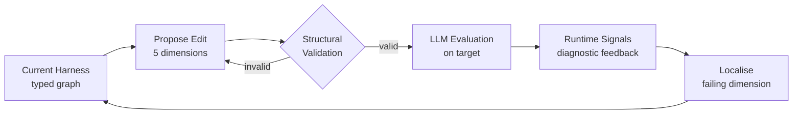

Created: 2026-04-24 14:34
#paper

Liu et al. (2026) introduce **AgentFlow**, a system that automates the synthesis of multi-agent harnesses for LLM-driven vulnerability discovery. The core observation is that, when the underlying language model is held fixed, swapping the harness alone can move success rates by several-fold on public agent benchmarks -> the harness is the real design variable, not the model. Existing harness optimisers only search a narrow slice of the design space and rely on coarse pass/fail feedback, which gives no diagnostic signal about why a trial failed. AgentFlow addresses both limitations through a typed graph DSL and a feedback-driven outer loop that reads runtime signals from the target program itself.

**Note:** the paper matters for [[AI Agent Security]] in two directions. Defensively, it shows that agentic systems discovering real [[Vulnerabilities in LLM-base applications]]-style bugs in 35M-line C++ codebases is now a practical reality, not a lab curiosity. Offensively, it demonstrates that harness design — not model capability — is becoming the binding constraint on automated [[Penetration Testing]].

## Main idea

A multi-agent **harness** is the program that pins down which agent roles exist, how they pass information, which tools each may call, and how retries are coordinated. AgentFlow represents every harness as a program in a **typed graph DSL**: nodes are agents, edges are dataflow or retry links, and five harness dimensions each map to a first-class editable field:

- **Agent roles** — which specialised agents exist and what each is responsible for
- **Message templates / prompts** — the instructions and context passed to each agent
- **Tool bindings** — which external tools each agent can invoke
- **Communication topology** — how agents exchange information (who talks to whom)
- **Coordination protocol** — how retries, handoffs, and termination are managed

The outer loop proposes candidate harness edits, validates them structurally, dispatches survivors to LLM evaluation, and uses runtime signals to diagnose which dimension caused the failure.

The cheap **structural validation** is what makes the search tractable. Before spending tokens on an LLM run, a well-formedness check verifies that every template variable resolves to a declared agent output or feedback channel, that every edge connects declared agents, and that the graph is connected. Malformed candidates are discarded for free -> the expensive evaluator only sees programs that can actually run.

## Results

State-of-the-art performance on two very different targets: an agent benchmark and a real-world codebase.

| Target | Model | Result |
|--------|-------|--------|
| TerminalBench-2 (89 tasks, snapshot 2026-04-17) | Claude Opus 4.6 | **84.3%** — top Claude Opus 4.6 entry on the public leaderboard |
| Google Chrome (~35M lines of C/C++) | Kimi K2.5 (open-weight) | **10 zero-day vulnerabilities**, incl. 2 Critical sandbox-escape CVEs (CVE-2026-5280, CVE-2026-6297) |

Notable takeaways:

- The same synthesis loop transfers across a proprietary frontier model (Claude Opus 4.6) and an open-weight model (Kimi K2.5) -> the harness is genuinely model-agnostic in practice
- Sandbox-escape CVEs in Chrome are among the highest-severity class of browser bugs. Reaching them with a synthesised harness driven by an open-weight LLM is a significant capability signal
- The feedback-driven loop outperforms flat pass/fail optimisers precisely because it can attribute failures to specific harness dimensions rather than blindly perturbing the whole program

## Ideas for future works

- **Defender-side harness synthesis** — the same loop could optimise harnesses for [[Red teaming in GenAI]] or [[Static Code Analysis]] review agents, not just offence. A defensive mirror of AgentFlow is a natural next step
- **Transferability across codebases** — how well does a harness tuned on Chrome generalise to WebKit or the Linux kernel? If harnesses transfer, we get reusable artefacts; if not, synthesis must run per-target
- **Cost accounting** — the paper reports success rates but the economics of the outer loop (tokens per discovered CVE) matter for anyone trying to reproduce this. A full cost-per-bug table would be valuable
- **Integration with [[Task Capsule Pattern]] and [[Hexagonal Architecture]]** — AgentFlow's typed graph DSL is close in spirit to agentic-system architectural patterns the vault already covers. A harness DSL that compiles down to task capsules would give both searchability and clean deployment
- **Adversarial robustness of the harness itself** — if an attacker knows the harness template, can they craft inputs that exploit the coordination protocol (e.g. [[Prompt Injection]] into one agent to hijack the others)? Offensive tools need defensive analysis too
- **Benchmarks beyond Chrome** — Chrome is a single, very specific target. Running AgentFlow on a range of codebases (kernels, cryptographic libraries, blockchain contracts) would establish whether 10 zero-days is the expected yield or a one-off

Limitations noted or implied:

- Only two LLMs reported in depth (Claude Opus 4.6, Kimi K2.5). Harness-model interactions may differ sharply with other frontier or smaller models
- The search space, even after type-checking, remains huge -> results depend on the initial seed harness and the edit-proposal distribution
- Runtime-signal diagnosis assumes the target program exposes enough observable structure (logs, coverage, crash traces). Closed-source targets or ones with poor telemetry may not benefit
- No human-baseline comparison: 10 zero-days in Chrome is striking, but the paper does not quantify how many auditor-hours this replaces

## In deep

The novelty sits at two levels. First, the DSL **unifies** what prior work fragmented. Earlier harness optimisers specialised in one dimension — some only rewrote prompts, others only tweaked the communication topology, others only swapped tools. AgentFlow's typed graph lets a single edit cross dimensions (e.g. add a new agent role and wire it into the topology and grant it a tool in one step) and keeps the whole program type-checkable.

Second, the **feedback-driven outer loop** replaces pass/fail signals with something closer to a program-analysis loop. The evaluator produces runtime signals — which tool call hung, which template variable came out empty, which agent output was never consumed downstream — and a diagnosis step localises the likely failing dimension. The next edit is proposed against that dimension instead of perturbing the whole graph. This is the structural reason the loop converges faster than black-box search.

**Note:** this is the same pattern good [[Threat Modeling]] uses -> attribute a failure to a component before mutating the system. The paper essentially imports software-engineering debugging discipline into harness search.

On the evaluation side, the Chrome result is the more striking of the two. TerminalBench-2 is a benchmark designed to be beatable by well-tuned agents; hitting 84.3% is strong but expected for a state-of-the-art harness. Ten zero-days in ~35M lines of production C/C++, with two of them Critical sandbox escapes (CVE-2026-5280 and CVE-2026-6297), is a different category of result. It confirms that LLM-agent systems, once properly wired, can complement rather than merely supplement traditional fuzzers and human auditors on mature, heavily-reviewed codebases.

The practical lesson for [[MCP Protocol]]-based and [[Agentic AI Frameworks]] work: harness design should be treated as a first-class search problem with a proper type system, not as a configuration file. This aligns with the direction taken in the [[Evaluating AGENTS.md - Are Repository-Level Context Files Helpful for Coding Agents]] paper — the harness and its context artefacts are where most of the engineering leverage now lives, not in the base model.

## References

1. [Paper — arXiv:2604.20801](https://arxiv.org/abs/2604.20801)
2. [HTML version](https://arxiv.org/html/2604.20801v1)
3. [TerminalBench-2 leaderboard](https://www.tbench.ai/)
4. [CVE-2026-5280 — NVD](https://nvd.nist.gov/vuln/detail/CVE-2026-5280)

## Code

1. Official repository not released at the time of writing — check the paper's arXiv page for updates

#### Tags

#agentic_ai #agents #multi_agent_systems #aisecurity #vulnerability_discovery #llm #cve #cybersecurity #harness_synthesis
